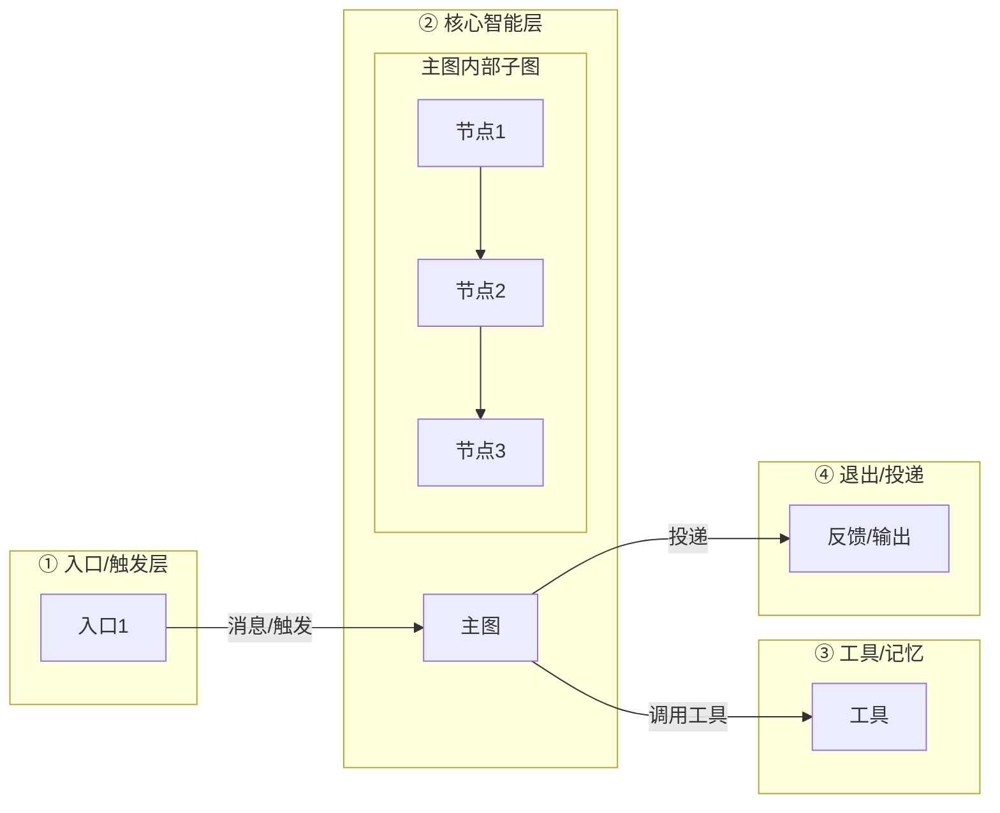

# 代码架构走查与架构图生成 (codemap)

把「深入理解代码 → 生成架构图」固化成同一条可复用流水线，保证每次产出的图**有细节、有逻辑、有全局视野**，且每个节点都能回溯到真实源码——而非手绘示意。

## 何时使用

- 用户要求理解一个 app/包/模块的代码结构，产出架构图或流程图
- 用户要求"走查代码"、"画一下这个项目的结构/依赖/数据流"
- 用户要为一个新模块补 doc/技术文档里的架构图

## 核心原则（避免"瞎编图"）

1. **先读代码，后画图**。任何节点/连线必须以真实源码为据。未核实的细节宁可留白，不可臆造。
2. **多路并行理解**——不要自己串行翻文件，避免只见局部。分包委托给 Explore 子代理。
3. **两层结构**——总图给"全局视野"（几大模块 + 层间数据流），下钻给"细节"（每模块内部真实节点）。
4. **风格统一**——复用本 skill 的 mermaid 骨架，配色/连线/标注保持一致。
5. **焦点明确**——全图只突出 1~2 个枢纽（如主 graph 或核心反馈闭环），其余用中性色。

## 流程

### Step 1 — 项目结构与入口摸底（自己快速做）

先直接列目录、读入口，建立第一印象，用于分派子代理时给出准确路径。

```powershell
# 列业务代码根（替换为真实 src/ 路径）
Get-ChildItem <src_dir> -Directory | Select Name
# 读入口：__main__.py / cli.py / main.py / graph.py 顶层 def/class
Select-String -Path <src_dir>\*.py -Pattern "^\s*(def|class) " | ForEach-Object { $_.Line.Trim() }
```

产出：一份"模块名 → 文件"初表，供 Step 2 分派。

### Step 2 — 多路并行 Explore（核心，≤3 子代理同时）

按依赖面拆 **3 路通用分法**（任何项目都适用），每路自查一路。首轮固定 3 路、绝不并行第 4 个；只有等三路全部返回后，才允许开第二轮深挖，且第二轮仍串行 ≤3：

| 路 | 查什么（通用） | 回报 |
|----|----------------|------|
| 入口/触发 | 所有对外入口：前端/CLI/调度/定时任务/脚本/重启 | 每个入口 → 调用核心编排的哪条边 |
| 核心编排 | 主状态机/命令编排/主干流程 + 上下文构造 + 外部服务调用 + 全局状态 | 主干拓扑（节点间走向）+ 如何组输入/上下文 |
| 功能·依赖·出口 | 功能模块集合、共享依赖、记忆/存储、反馈闭环、输出投递、外接数据源 | 每个功能/依赖/出口的真实入口函数与数据流方向 |

> 以 withlanggraph 为例即为：①入口（QQ/调度/CLI/补跑）②核心（graph 主图、context、LLM、state）③工具·记忆·反馈·投递·langTrack。换项目时按上面三列"通用"含义套用即可。

每个子代理 prompt 模板：

```
你是一个只读代码探索代理。请分析 <app> 的 <这一路>，用二分法定位真实结构。
不要改动任何文件。请回报：
1) 本路所有顶层模块/类/关键函数（精确到符号名 + 文件路径）
2) 它们之间的调用/数据流方向（谁 → 谁）
3) 核心枢纽点（如主编排 / 唯一出口）
控制在 400 词内，用要点列表。
```

#### 冲突裁决规则
多路回报对同一模块归属或数据流方向矛盾时：
1. 一律以实际读到的**源码签名为准**，不做推断；
2. 读不到的归属关系标"待核实"，不臆断；
3. 仍存分歧的节点/边，把它单独捞出向用户确认一次，别擅自定。

### Step 3 — 汇总结点清单（自己综合）

把 3 路结果合并成**两层清单**：

- **总层**：几大功能层（建议 4~6 层 subgraph），每层一个名字 + 一句话职责
- **分层层**：每层内部的下钻节点（真实符号名 + 文件 + 一句话）
- **层间数据流** 与 **层内节点流转**：明确每条边的源→目标 + 语义（消息/数据/调用/触发）

约束：每层最多 4~8 个内部节点；超过就归并（如把很多工具归成 7~9 类）。所有节点必须能回溯到 Step 2 回报的符号。

**层级切分与全图 1~2 个焦点，先与用户确认一次再成稿**，不要默认模型自定，避免返工。

### Step 4 — 生成两层 mermaid（参照架构骨架）

用统一骨架，例（完整版见 `docs/architecture-flow.mmd` 参照）：



风格约定：
- 节点名 = `真实符号名 <br/> <code>文件.py</code>` + 一句话职责
- 模块 subgraph 用 `direction TB`；数据子系统用 `direction LR` 表现四段链
- 连线：层间 `-- "语义" -->`；内部流转 `A --> B --> C`
- 顶部注释标注「总/分结构 + 依据源码」

#### 配色与节点语义规范（编辑级，吸收 diagram-design 取舍）

**比"多色好看"更优先的三条原则：**

1. **强调色只给 1–2 个焦点**。全图唯一强色（默认强调橙）只落到核心枢纽 / 核心闭环（如 `process` 的 reAct 循环、反馈闭环）。其余节点一律中性语义——强调色给到 5 个节点就等于没有焦点。焦点实线加粗；边界/闭环用强调橙**虚线**。
2. **模块区分 = 「容器淡底色 + 节点白底同色描边」**。每模块保留一色的辨识，但容器用低饱和浅底、内部节点白底同色（模块色）描边，不做满屏彩色填充。
3. **节点按语义分档**：状态/存储 = 淡墨灰底；步骤/后端 = 白底模块色描边；异步/写回连线 = 虚线；上述焦点/边界用强调橙。

> 附带编辑级习惯：无阴影（用边框分区）；圆角 ≤8px 或不要；箭头标注要与线分离、不糊线；**能删则删**——密度目标约 4/10，两两总一起出现的节点就合并成一个。

**可直接复用的 mermaid 语义色模板**（语义 token 一次定好，换项目只改色源 hex 即可）：

```mermaid
flowchart LR
    %% ---- 语义 token: 焦点=强调橙 | 状态=淡墨灰 | 其余=模块白底同色描边 ----
    classDef mod0 fill:#ffffff,stroke:#1E88E5,color:#0D47A1      %% 模块蓝
    classDef mod1 fill:#ffffff,stroke:#66BB6A,color:#1B5E20       %% 模块绿
    classDef mod2 fill:#ffffff,stroke:#8E24AA,color:#4A148C      %% 模块紫
    classDef mod3 fill:#ffffff,stroke:#F9A825,color:#E65100       %% 模块橙
    classDef mod4 fill:#ffffff,stroke:#00ACC1,color:#006064       %% 模块青
    classDef mod5 fill:#ffffff,stroke:#EC407A,color:#880E4F      %% 模块粉
    classDef state fill:#f3f4f6,stroke:#2D3142,color:#2D3142     %% 状态/存储 淡墨灰
    classDef focus fill:#FFF3E0,stroke:#EB6C36,stroke-width:2.5px,color:#B33900  %% 焦点(仅1-2个)
    classDef bnd   fill:#ffffff,stroke:#EB6C36,stroke-width:1.5px,stroke-dasharray:5 4,color:#B33900  %% 边界/闭环

    %% 容器底色: 低饱和淡背景, 只作模块分界
    style S1 fill:#EBF3FB,stroke:#1E88E5,stroke-width:1.5px
    style S2 fill:#F6FAF5,stroke:#43A047,stroke-width:1.5px
    %% ... 每模块一个 style; 嵌套子图用更浅底色

    %% 归组: 用 class 批量挂, 不要对每个节点单写 style(便于换肤)
    class 节点A,节点B mod0
```

落地文件：`apps/<app>/docs/architecture-flow.mmd`；若画的是共享包，则为 `packages/<pkg>/docs/architecture-flow.mmd`（命名保持一致）。

### Step 5 — 可选交付

- **交互式 walkthrough HTML**：`apps/<app>/docs/walkthrough-<app>.html`，总览真 SVG 可点击节点 → 跳下方模块明细卡
- **同步 tech 文档**：若涉数据流/接口，tech 引用**全应用架构图**时只加相对链接指向 `architecture-flow.mmd`（如 `[architecture-flow.mmd](./architecture-flow.mmd)`），不得把这份架构图复制进 tech 维护（对齐仓库 R5 单一真源）。但 tech 各小节**自己的**机制/接口流程图不在此列，可正常内嵌
- **ROADMAP 执行记录**：按仓库规则补一段

### Step 6 — 子代理复审（成稿前必做，不是可选项）

图生成后、提交前，**起一个只读子代理独立审视整份图**，不要自说自话地宣布完成。审视角聚焦"准确 + 该补的细节"，让它用**源码对照**而非泛泛而谈：

```text
你是一个只读图审代理。请核对架构图 <app>/docs/architecture-flow.mmd 是否准确。
方法: 把图上每个节点/连线与真实源码符号逐一对照(二分定位到符号/文件路径),
回报分三档:
  VERIFIED —— 与源码一致
  UNVERIFIED —— 图上画了但源码找不到对应签名(疑似虚构)
  MISSING —— 源码里是关键枢纽,但图漏画了(建议补充的细节)
另单独列: 有没有该补进去的关键细节(被漏掉的核心链路/读方出口/依赖)。
不要修改任何文件。控制在 350 词内,用要点列表。
```

处理复审结论：
- **UNVERIFIED** 一律删掉或改画成真实结构，不许保留虚构节点。
- **MISSING** 里确属架构关键的信息，补进图；纯外围细节可用可不画，标注一下即可。
- 复审有明显分歧时，把该节点单独捞出同用户确认。

> 若项目规模小、图本身就是手画简单的，可跳过子代理、由自己对照源码走一遍同样三档自检并记录结论。

## 验收清单（自检后才算完成）

- [ ] 每一个 mermaid 节点都能回溯到真实源码符号（不许有编造）
- [ ] 层间与层内连线都标注了语义
- [ ] 有总图全局视野 + 每模块下钻细节，两者都存在（不是只有一张大杂烩）
- [ ] 全图真正焦点 ≤2（强调橙只落核心枢纽/闭环，不是"重要节点都上色"）
- [ ] 模块区分用「容器淡底色 + 节点白底同色描边」，无满屏彩色填充
- [ ] 异步/写回连线用虚线；状态/存储节点用淡墨灰
- [ ] 工具多时已归并，没有密到不可读
- [ ] 已起子代理按 Step 6 复审，UNVERIFIED 已清、关键 MISSING 已补
- [ ] 产出落盘（.mmd 必交付；交互 HTML / tech 同步按需）

## 参照产物

- `apps/withlanggraph/docs/architecture-flow.mmd` — 总图+下钻两层 mermaid 之作
- `apps/withlanggraph/docs/walkthrough-withlanggraph.html` — 交互总→分 walkthrough

## 边界

- 本 skill 负责**理解与构图**，不做代码改动。
- 产出为纯文档（.mmd / HTML / tech-doc），**不触发 R7 的 ruff+pytest 门禁**；提交走 `docs(<app>)` 格式（R4），并按 R5 同步 ROADMAP / tech 文档。
- **不盲目触发**：只画单个文件、微模块，不值得多路并行拉起子代理时，直接手画或走 Markdown 即可，不要大材小用。
- **委托机制**：Step 2 通过当前可用的子代理/探索代理拉起多路并行；确定委托工具后，把本 skill 的 Step 2 表格作为分派 prompt 的主体。
- 不臆造接口：读不到签名的归属关系宁可标"待核实"。
- 规模收敛：若 3 路 + 第二轮串行深挖后仍然过大，先停下来向用户确认范围（拆子包单独出图，或缩小聚焦面），不要硬画一张塞满的图。