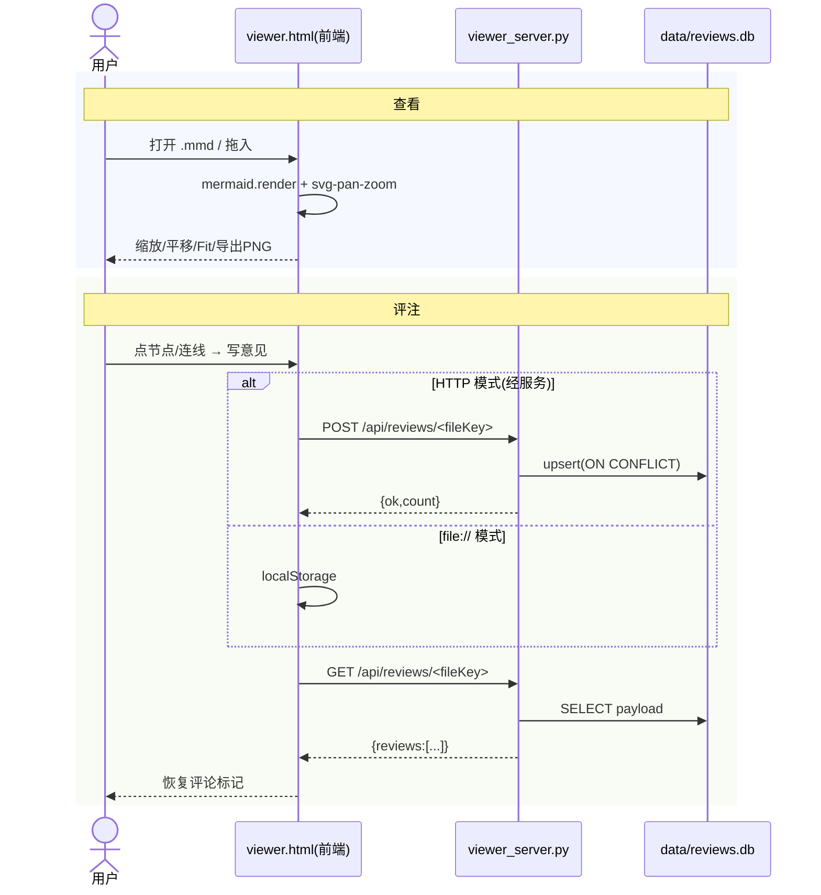

# mermaid-viewer 技术文档

本地离线 `mermaid .mmd` 查看 + 评审工具。纯标准库 + 原生 JS + 本地 vendor，不联网，仅绑 loopback。

- 应用级架构图（单一真源）：[`./architecture-flow.mmd`](./architecture-flow.mmd)
- 包级约定：`../../AGENTS.md` → [`apps/mermaid-viewer/AGENTS.md`](../AGENTS.md)

## 1. 架构总览

三层：**前端 viewer.html** → **HTTP 服务 viewer_server.py** → **SQLite 评论库 data/reviews.db**。静态文件直接由同服务承载（docroot=仓库根），无独立后端。

## 2. 数据流

**查看闭环**：
```
用户打开 viewer.html
  → js 加载本地 vendor/mermaid.min.js + svg-pan-zoom.min.js
  → 打开/拖入 .mmd → mermaid.render() → svg-pan-zoom 绑定（缩放/平移/Fit）
  → 可导出 PNG（取 clean svg 光栅化）；可导出评审标记
```

**评论闭环**：
```
用户在图上点节点/连线 → 弹出框写意见
  → localStorage 暂存 +（HTTP 模式）POST /api/reviews/<fileKey> → SQLite upsert
  → 重新打开时 GET /api/reviews/<fileKey> 拉回服务端权威数据
```

<details>
<summary>查看/评审时序图（mermaid）</summary>



</details>

## 3. 接口（HTTP API）

| 方法 | 路径 | 请求体 | 响应 | 说明 |
|------|------|--------|------|------|
| GET | `/api/reviews/<fileKey>` | — | `{"reviews": [...]}` | 取某文件的评论（无则空数组） |
| POST | `/api/reviews/<fileKey>` | `{"reviews": [...]}` | `{"ok":true,"count":n}` | upsert 该文件评论（fileKey 为主键，冲突更新） |
| GET | 任意静态路径 | — | 文件内容 | docroot=仓库根，`translate_path` 防路径逃逸 |

`fileKey` 由前端取打开文件名；评论为 JSON 数组，持久化为单行 JSON 存 `payload` 列。`updated_at` 默认东八（`datetime('now','+8 hours')`）。

## 4. 数据模型（SQLite）

单表 `reviews`：

| 列 | 类型 | 说明 |
|----|------|------|
| `file_key` | TEXT PRIMARY KEY | 文件名（唯一），upsert 冲突键 |
| `payload` | TEXT NOT NULL | 评论数组的 JSON 序列化 |
| `updated_at` | TEXT | 默认 `datetime('now','+8 hours')`，冲突时更新 |

非破坏性 schema（首次访问自动建表），无 PRAGMA user_version / 迁移函数需求（单表幂等 upsert，符合 R6 默认幂等）。

## 5. 安全边界

- 服务仅绑 `127.0.0.1`（loopback）
- `translate_path` 对解析后的路径做 realpath 前缀校验，防 `..` 逃逸出仓库根
- 无写接口对文件系统开放（POST 仅写 SQLite 评论库）
- docroot 为仓库根 → HTTP 静态服务可读取全仓文件，属已知暴露面（单机 loopback 场景可接受；不改 docroot 需评估）