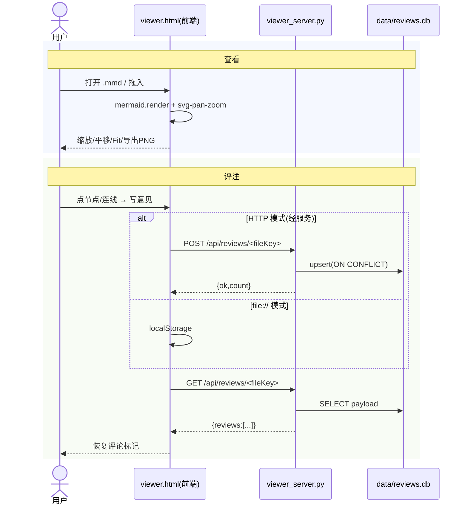

# mermaid-viewer 技术文档

本地离线 `mermaid .mmd` 查看 + 评审工具。纯标准库 + 原生 JS + 本地 vendor，不联网。默认绑 loopback；需手机/局域网访问时显式 `--host 0.0.0.0`。

- 应用级架构图（单一真源）：[`./architecture-flow.mmd`](./architecture-flow.mmd)
- 包级约定：`../../AGENTS.md` → [`apps/mermaid-viewer/AGENTS.md`](../AGENTS.md)

## 1. 架构总览

三层：**前端 viewer.html** → **HTTP 服务 viewer_server.py** → **SQLite 评论库 data/reviews.db**。静态文件直接由同服务承载（docroot=仓库根），无独立后端。

## 2. 数据流

**查看闭环**：
```
用户打开 viewer.html
  → js 加载本地 vendor/mermaid.min.js + svg-pan-zoom.min.js
  → 打开/拖入 .mmd → mermaid.render() → svg-pan-zoom 绑定（缩放/平移/Fit）
  → 可导出 PNG（取 clean svg 光栅化）；可导出评审标记
```

**从电脑加载（手机/局域网场景）**：前端打开弹层时 `GET /api/mmds` 拉取全仓 mermaid 源文件（`.mmd/.mermaid`）相对路径列表（服务端 `scan_mmds(ROOT)` 递归扫描，跳过 `.git/node_modules/vendor/data/__pycache__` 等目录；**排除 `.txt` 等非图文件**，避免干扰列表），填充到下拉框选择；选中后 `fetch('/'+path)` 拉取并 `render(path, txt)`，`fileKey` 记为相对路径（复用同一评论主子键）。另保留手输路径输入框与地址栏深链 `?file=<相对路径>`（手输/深链仍允许 `.txt`，仅扫描列表过滤）。

**评论闭环**：
```
用户在图上点节点/连线 → 弹出框写意见
  → localStorage 暂存 +（HTTP 模式）POST /api/reviews/<fileKey> → SQLite upsert
  → 重新打开时 GET /api/reviews/<fileKey> 拉回服务端权威数据
```

**评论锚点与 LLM 修复提示**：
- 锚点格式统一为「`节点 符号ID（行 N）`」「`容器 符号ID（行 N）`」或「`连线 源码行原文（行 N）`」。符号 ID 与行号由前端 `parseSymbols()` 对 .mmd 源码逐行解析得出（节点/子图定义行、带 label 的连线行）；**不再使用 mermaid 渲染后的 SVG DOM id**（形如 `flowchart-RC-2`，对定位源码无意义）。连线锚点按 label 归一化匹配（忽略 `<br/>`、引号与空白），故点击边标签能命中源码行。
- 「一键复制 LLM 修复提示词」导出时会把历史遗留旧锚点（DOM id / 纯 label）归一化为「符号+行号」，每条意见附**源码行原文**；提示词要求 LLM 区分理解性疑问（先答机制，再仅改该处 label 文案）与明确改图要求，未被点名处一律保持原样。
- 导出提示词的解析/归一化逻辑验证：`tests/check_prompt_logic.js`（`node tests/check_prompt_logic.js`），对真实 .mmd 断言符号→行号映射与导出格式。

<details>
<summary>查看/评审时序图（mermaid）</summary>


```mermaid
sequenceDiagram
    actor U as 用户
    participant V as viewer.html(前端)
    participant S as viewer_server.py
    participant DB as data/reviews.db

    rect rgba(225,235,255,0.35)
    Note over U,DB: 查看
    U->>V: 打开 .mmd / 拖入
    V->>V: mermaid.render + svg-pan-zoom
    V-->>U: 缩放/平移/Fit/导出PNG
    end

    rect rgba(235,245,225,0.35)
    Note over U,DB: 评注
    U->>V: 点节点/连线 → 写意见
    alt HTTP 模式(经服务)
        V->>S: POST /api/reviews/<fileKey>
        S->>DB: upsert(ON CONFLICT)
        S-->>V: {ok,count}
    else file:// 模式
        V->>V: localStorage
    end
    V->>S: GET /api/reviews/<fileKey>
    S->>DB: SELECT payload
    S-->>V: {reviews:[...]}
    V-->>U: 恢复评论标记
    end
```

</details>

## 3. 接口（HTTP API）

| 方法 | 路径 | 请求体 | 响应 | 说明 |
|------|------|--------|------|------|
| GET | `/api/reviews/<fileKey>` | — | `{"reviews": [...]}` | 取某文件的评论（无则空数组） |
| POST | `/api/reviews/<fileKey>` | `{"reviews": [...]}` | `{"ok":true,"count":n}` | upsert 该文件评论（fileKey 为主键，冲突更新） |
| GET | `/api/mmds` | — | `{"mmds": [...]}` | 扫描仓库根的 `.mmd/.mermaid` 相对路径列表（供下拉选择，排除非图文件） |
| GET | 任意静态路径 | — | 文件内容 | docroot=仓库根，`translate_path` 防路径逃逸 |

`fileKey` 由前端取打开文件名；评论为 JSON 数组，持久化为单行 JSON 存 `payload` 列。`updated_at` 默认东八（`datetime('now','+8 hours')`）。

## 4. 数据模型（SQLite）

单表 `reviews`：

| 列 | 类型 | 说明 |
|----|------|------|
| `file_key` | TEXT PRIMARY KEY | 文件名（唯一），upsert 冲突键 |
| `payload` | TEXT NOT NULL | 评论数组的 JSON 序列化 |
| `updated_at` | TEXT | 默认 `datetime('now','+8 hours')`，冲突时更新 |

非破坏性 schema（首次访问自动建表），无 PRAGMA user_version / 迁移函数需求（单表幂等 upsert，符合 R6 默认幂等）。

## 5. 安全边界

- 服务默认绑 `127.0.0.1`（loopback）；`--host 0.0.0.0` 时监听所有网卡（供手机/局域网访问，需同网信任环境）。`_lan_ip()` 用 UDP connect 探测本机默认网卡 IP，不发真实流量
- `translate_path` 对解析后的路径做 realpath 前缀校验，防 `..` 逃逸出仓库根
- 无写接口对文件系统开放（POST 仅写 SQLite 评论库）
- docroot 为仓库根 → HTTP 静态服务可读取全仓文件，属已知暴露面。绑 loopback 时限于本机可接受；**一旦 `--host 0.0.0.0` 暴露到局域网，意味着同网任意设备可读全仓文件与评论库，属高风险，仅限可信 WiFi 场景临时开启，用毕切回 loopback**