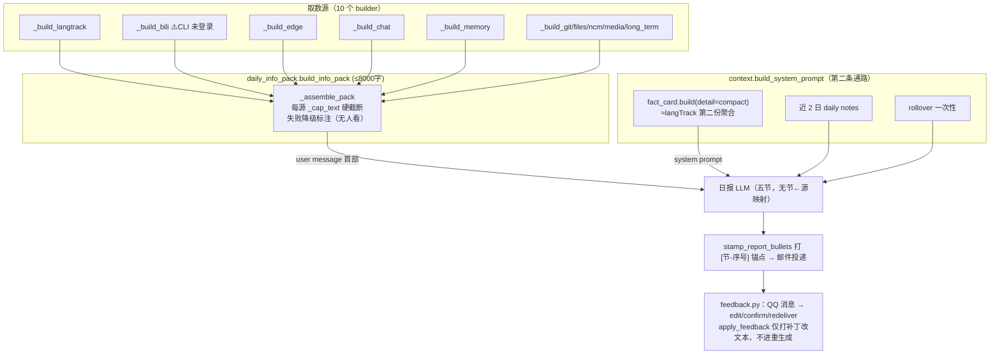
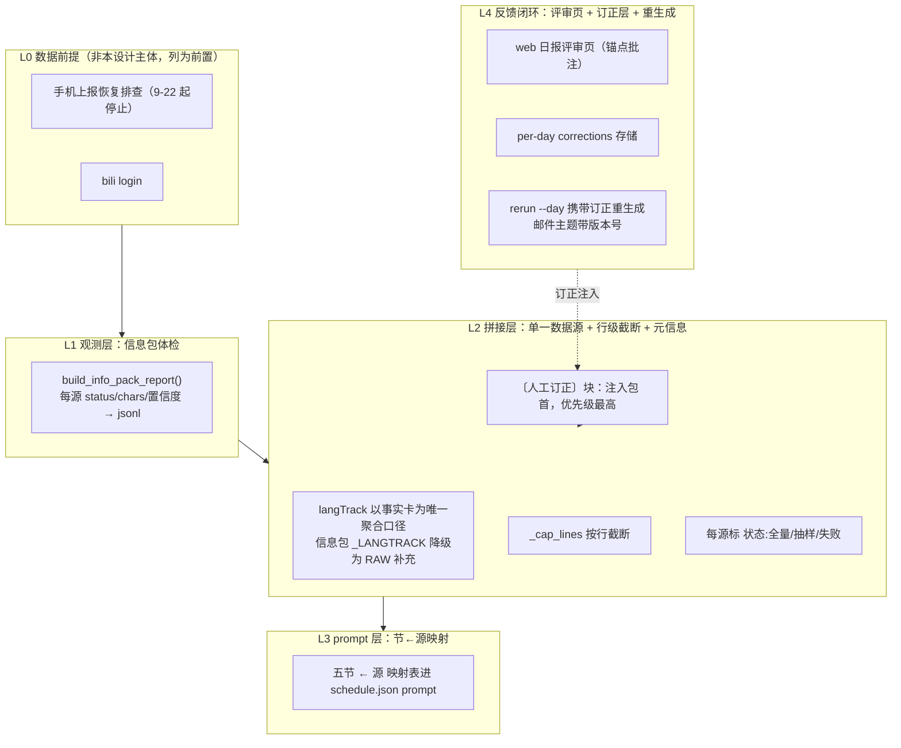

# 日报链路重设计（设计稿 v0.1，待评审）

> 状态：**草案**——评审通过后按 R4 拆步实施，每步独立提交并走 R5 三处同步。
> 范围：`apps/withlanggraph` 日报生成链路（数据前提 → 信息包 → prompt → 投递 → 反馈 → 重生成）。
> 目标：日报信息利用率提升、给 LLM 的输入去冗余、建立"人工订正 → 重生成"闭环。

---

## 1. 背景与问题定义

用户对最近日报的三点不满，经代码走查定位到结构根因：

| # | 表象 | 结构根因 |
|---|------|---------|
| P1 | 日报内容不满意，很多信息没用上，画像不准 | 五节结构与 10 个信息源之间**无显式映射**，模型自选素材偏向好写的 CHAT/GIT；部分源本身空/失败（手机上报 9-22 起停止、bili CLI 未登录），无人感知 |
| P2 | 拼接流程不清晰，给 LLM 的内容冗余 | **langTrack 数据走两条独立通路进 LLM**：信息包 `_build_langtrack`（daily_info_pack.py:164）与 system prompt 事实卡 compact（context.py）各一份聚合口径，无协调；`_MEMORY` 与近 2 日 daily notes / rollover 职责重叠 |
| P3 | 需要人工修正日报的入口，结合回复重生成 | `feedback.py` 已有锚点/订正/重发全套，但 **`apply_feedback` 只对已发文本打补丁**；`rerun --day` 重生成时信息包**不知道人工订正**（无订正层）；反馈入口只有 QQ 消息，无 web 入口 |

### 现状数据流（as-is）



### 问题点标注

1. **双通路无协调**：langTrack 进 LLM 两次（信息包 + 事实卡），聚合口径不同，浪费预算且可能互相矛盾。
2. **`_cap_text` 按字符硬切**：可把 bullet 切成断头，模型拿到残缺信息反而误读。
3. **失败静默**：每源失败有标注但无观测出口，"信息没用上"与"根本没进包"无法区分。
4. **订正不闭环**：人工订正只改已投递文本，重生成（rerun）从零开始，同样的错误会再犯。

---

## 2. 设计总览（to-be）

一条链四层，每层独立可验收、独立提交：



---

## 3. 分层设计

### 3.1 L1 观测层：信息包体检

**改动**：`daily_info_pack.py` 新增结构化报告，`build_info_pack` 内部复用它。

```python
# daily_info_pack.py 新增（签名示意）
@dataclass
class SourceStat:
    key: str            # "_CHAT" 等
    status: str         # "ok" | "empty" | "failed" | "missing_data"
    chars: int          # 截断后字符数
    note: str           # 失败原因 / 空因 / "已截断 N 行"

def build_info_pack_report(date: str, cfg: Config) -> tuple[str, list[SourceStat]]:
    """返回 (pack 文本, 每源状态)。build_info_pack 改为包装本函数，行为不变。"""
```

**落盘**：`scheduler.run_job` 在 daily job 成功后把 `SourceStat` 列表追加写 `data/logs/info_pack_health.jsonl`（R11 数据目录，一行 = 一次日报，字段：`date, job, sources[{key,status,chars,note}], total_chars, budget, created_at`）。

**不做**（二期再说）：dev-console 页面可视化。jsonl 先行，人肉可查。

**验收**：跑一次 rerun，jsonl 落 10 条 source 记录；`_build_bili` 未登录时 status=`missing_data` 而非静默。

### 3.2 L2 拼接层：单一数据源原则

**注入物职责表**（重构后每条通路只干一件事，此表同步进 tech 文档）：

| 注入物 | 通路 | 内容 | 职责边界 |
|--------|------|------|---------|
| 〔人工订正〕 | user message 首块 | per-day corrections | 该日人工确认事实，**最高优先级** |
| 〔当日信息包〕 | user message | 10 源原始信号 | 事实卡的**细维度补充**，不含聚合结论 |
| 事实卡 compact | system prompt | langTrack 聚合（daily_stats/stays/trips…） | langTrack **唯一聚合口径** |
| 近 2 日 daily notes | system prompt | 笔记原文 | 跨日对比基准 |
| rollover | system prompt（一次性） | onboard pack | 清除后不再现 |

**具体改动**：

1. `_build_langtrack` → `_build_langtrack_raw`：只输出事实卡没有的细维度（时段×应用 top、解锁节奏、audio_env 等原始事件侧信号），头部固定注明"聚合口径见事实卡，勿重复解读聚合结论"。`fact_card` compact 若缺某细维度，补进 fact_card 而不是在信息包加第二份聚合。
2. `_cap_text` → `_cap_lines(text, max_chars)`：按行累积截断，行末优先；被截断时尾部追加"（已截断，完整数据可调 langTrack_stats 等）"。所有 10 个 caps 沿用，数值不变。
3. 每源 header 附状态元信息：`〔CHAT｜状态:全量〕` / `〔BILI｜状态:失败:CLI 未登录〕`，让模型知道哪些源可信、哪些别脑补。
4. `PACK_BUDGET`（8000 字）不变；预算分配优先级：人工订正 > CHAT > LANGTRACK_RAW > 其余源（实现为 `_assemble_pack` 的顺序即优先级，超预算从尾部源开始压缩）。

**验收**：同一日 rerun 两次，事实卡与信息包对同一 langTrack 事实无两份聚合数字；pytest 中 info pack 相关用例补"状态元信息存在"断言。

### 3.3 L3 prompt 层：节←源映射

只动 `config/schedule.json` 的 daily-report prompt，不动五节结构：

1. 步骤 3 的五条线下各挂来源清单：
   - 今日状态线 ← LANGTRACK_RAW + CHAT
   - 兴趣连线 ← BILI + EDGE + NCM + MEDIA（至少引 1 条长期画像对照，沿用现有规则）
   - 微变化 ← 近 2 日笔记 + 前日日报 + LANGTRACK_RAW 细维度
   - 情绪/动力线 ← CHAT 摘录优先 + GIT/FILES 佐证
   - 战略动向 ← GIT + 长期画像
2. 信息包头部消费指令追加一条："10 个源中每个**非空且非失败**的源，至少被正文消费一次；确无可用信息的源在处理说明里点名跳过原因"（该要求写进邮件正文之外，避免污染正文——落点为 daily note 归档节）。
3. `start_long_term_update` 给触发清单（新兴趣苗头/关键决策/偏好修正/投入模式变化，沿用原语义），并要求引用佐证源。

**验收**：连续 3 天日报，信息包体检 jsonl 中 status=ok 的源在正文或归档说明中均可回溯（人工抽查）。

### 3.4 L4 反馈闭环（本设计核心）

#### 3.4.1 当日订正层（corrections）

**存储**：`data/feedback/corrections/{YYYY-MM-DD}.json`（沿用 feedback.py `_pending_file` 的文件模式；数据量小，不上 sqlite，规避 R6 迁移成本）：

```json
[
  {
    "id": "c-20261003-01",
    "anchor": "[工作日志-2]",
    "kind": "fact",
    "text": "当天下午去了朝阳大悦城，手机记录漏了",
    "status": "active",
    "created_at": "2026-10-03 21:00:00",
    "updated_at": "2026-10-03 21:00:00"
  }
]
```

- `kind`: `fact`（事实订正，进重生成）/ `pref`（偏好反馈，另存 `data/feedback/preferences.json`，进画像与模板层，见 3.4.3）。
- `status`: `active` / `superseded`（同锚点新订正覆盖旧的，旧的置 superseded 不删除）。
- 时间字段满足 R6 精神（东八区、首写/最近更新）。

**注入**：`scheduler._build_job_prompt`（daily job 分支）在读 `build_info_pack` 之前读 corrections，装配为信息包第一个块：

```
〔人工订正·2026-10-03〕以下为人工确认的事实，优先级高于一切自动数据源：
- [工作日志-2] 当天下午去了朝阳大悦城，手机记录漏了
```

**关键性质**：rerun 与定时 run 走同一 `_build_job_prompt`，订正自动生效；实时 QQ 对话不读 corrections（只服务日报链路）。

**与现有 `apply_feedback` 的关系**：保留现行为（立即打补丁改已发文本 + 确认/重发），新增 `record_correction(cfg, date, anchor, kind, text)` 落盘订正层；`analyze_feedback` 识别出的订正**同时**走两路——补丁（用户马上看到修正版）+ corrections（下次重生成不再犯错）。

#### 3.4.2 web 日报评审页（入口）

**形态**：仿 mermaid-viewer 评审页模式，新增 `gacore/review_server.py`（FastAPI），dev-console `services.json` 注册为受管服务。

- `GET /review/{date}`：渲染该日已投递日报（读 `feedback.load_delivered` / `logs/scheduled` 存档），`[节-序号]` 锚点渲染为可点击角标。
- 点锚点 → 侧栏批注框 → 选"事实订正 / 偏好反馈" → `POST /api/corrections`（调 `record_correction`）。
- `POST /api/rerun`（body: `{date, email: bool}`）：后台线程调 `run_job(for_day=date, deliver=email)`，页面轮询展示新版本；同日多次重生成主题标记 `（重生成 vN）`，N 从 corrections/存档计数。
- 鉴权沿用 dev-console 惯例（本机/局域网，POST 需 token）。

**不做的**：邮件 IMAP 回信通路（成本高、解析脆）。邮件正文中仍保留锚点格式，用户可复制锚点到评审页或 QQ。

#### 3.4.3 偏好反馈的去向

`pref` 类反馈进 `data/feedback/preferences.json`，两个消费点：
1. daily-report prompt 组装时注入一段"〔用户偏好〕"块（排版/详略/口吻类）；
2. 明确属于画像类的（兴趣/习惯修正），由模型经 `start_long_term_update` 沉淀，评审页只负责收集。

#### 3.4.4 防重与版本

- 邮件主题：首投 `[gacore] daily-report · {date}`，重生成 `[gacore] daily-report · {date}（重生成 v2）`（现 `(补跑)` 标记升级为版本号，含 v1=首投）。
- 旧版本不作废处理，仅在正文头部加一行"本版为 vN 重生成，依据：M 条人工订正"。

---

## 4. 影响面与 R5 同步点

| 改动 | 代码 | tech 文档 | 架构图 |
|------|------|-----------|--------|
| L1 体检 | daily_info_pack.py / scheduler.py | langTrack-tech §数据流 补 jsonl 出口 | info pack 节点补 report 出口 |
| L2 拼接 | daily_info_pack.py / context.py | langTrack-tech §5.3 / daily_info_pack 章节 | 信息包与事实卡连线方向调整 |
| L3 prompt | config/schedule.json | tech 日报 prompt 小节 | 无 |
| L4 闭环 | feedback.py / scheduler.py / review_server.py（新） | tech 新增"反馈与重生成"节 | 新增 corrections 存储 + review_server 节点 + rerun 数据流 |

架构图改动走 codemap skill 走查后落盘，不手改。全量 pytest 必须保持全绿（修测试的改动与本次重构分开提交，避免混线）。

---

## 5. 排期（两天）

| 时段 | 内容 | 提交 |
|------|------|------|
| D1 上午 | L0 前置：手机上报恢复排查；L1 体检层 | fix(langTrack) + feat(daily) |
| D1 下午 | L2 拼接层：去重/元信息/行级截断 | refactor(daily) |
| D2 上午 | L4：corrections 存储 + record_correction + 注入 + rerun 闭环 | feat(feedback,scheduler) |
| D2 下午 | L4：web 评审页；L3 prompt 节←源映射；偏好层 | feat(review) + docs 同步 |

## 6. 验收总标准

1. `uv run --all-packages pytest` 全绿；全量时长不受本设计劣化（新增用例均为纯单测）。
2. 信息包体检 jsonl：每日 10 源状态可查，bili 未登录可见。
3. 同一 langTrack 事实在 LLM 输入中只出现一份聚合数字。
4. 在评审页对某日日报做一条事实订正 → rerun → 新版日报正文体现该事实且主题带 vN；QQ 端锚点订正行为不回归。
5. 三处文档同步无失真（R5），架构图节点全部可回溯源码。

---

## 7. 开放问题（评审时拍板）

| # | 问题 | 备选 | 倾向 |
|---|------|------|------|
| Q1 | `_LANGTRACK` 移除还是降级为 RAW 补充？ | A. 整体移除，细维度并入事实卡 / B. 降级为 RAW 只留细维度 | **B**（事实卡保持聚合职责，不动 fact_card 接口，改动小） |
| Q2 | 评审页挂载位置 | A. 独立 `gacore/review_server.py`（新端口，dev-console 受管）/ B. 复用 langTrack server(8000) 加路由 | **A**（职责清晰；langTrack server 只管采集质量） |
| Q3 | corrections 存储 | A. per-day JSON 文件 / B. sqlite 表（走 R6 迁移） | **A**（量小、与 pending 同模式；日订正 <10 条） |
| Q4 | 偏好反馈即时生效还是攒批？ | A. 即时注入次日日报 / B. 攒 N 条后人工确认 | **A**（先跑通闭环，攒批是过度设计） |
| Q5 | QQ 端订正与评审页订正并存，以谁为准？ | A. 都写 corrections，superseded 规则去重 / B. QQ 只读 | **A**（双入口同存储，无主从） |
| Q6 | 事实订正要不要反哺 langTrack 数据本身（如补 events）？ | A. 只进 corrections 层 / B. 也写回 events 表 | **A**（原始数据保持不可变审计立场，订正属解释层） |
