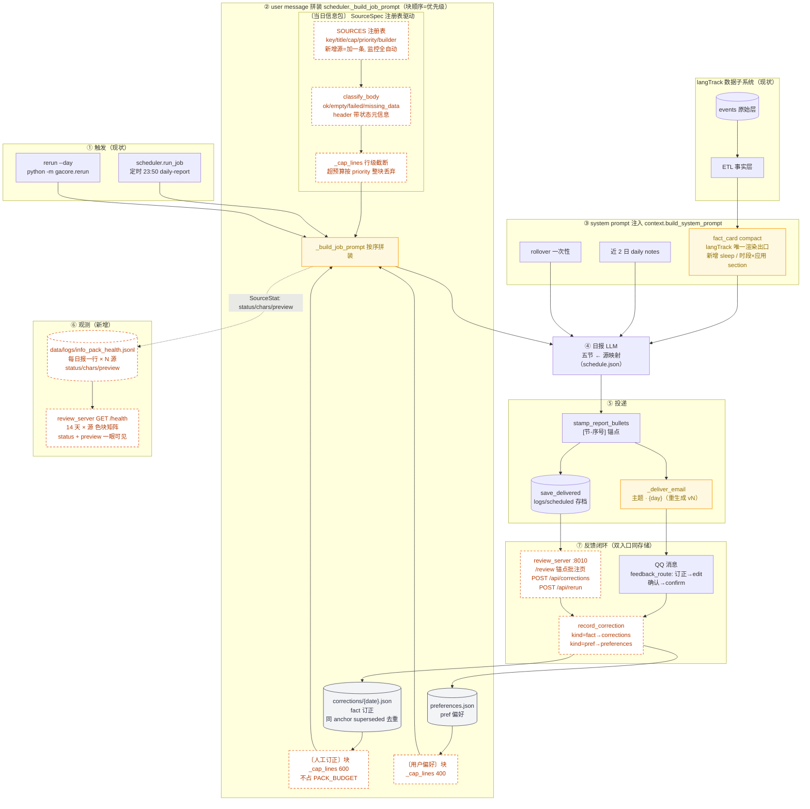
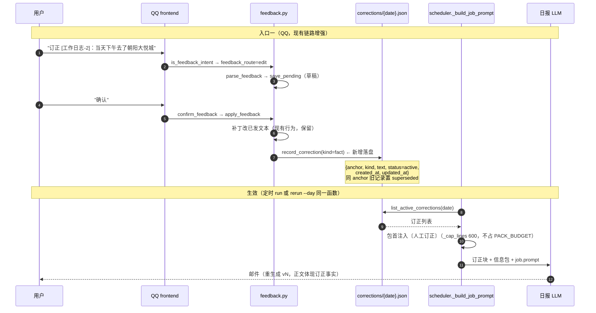
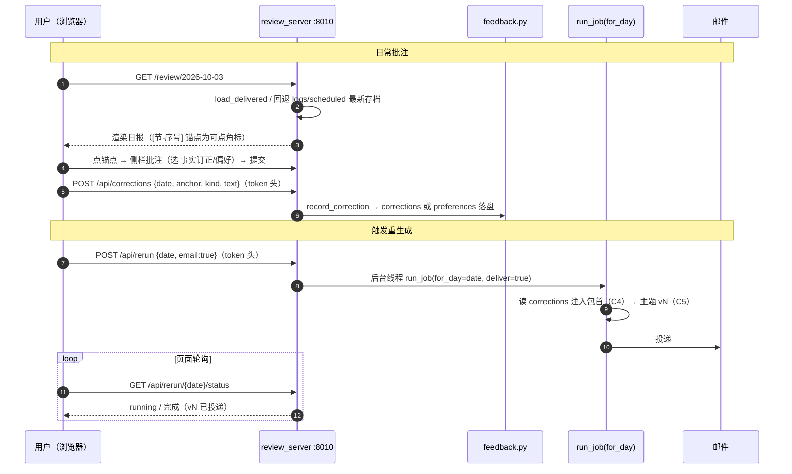
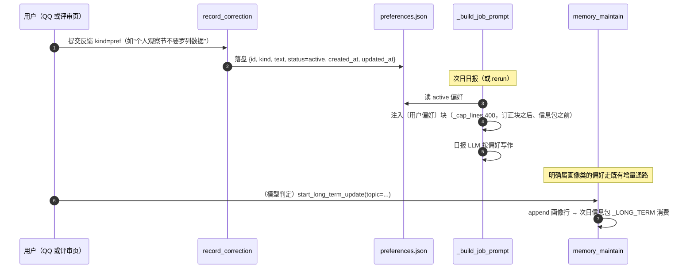

# 日报链路重设计 v3（设计稿 v0.3，评审中）

> 评审进展：Q2~Q6 已定稿（2026-10-03，Q2=A 独立 review_server、Q3=A per-day JSON、Q4=A 偏好即时生效、Q5=A 双入口同存储、Q6=A 订正不写回 events）。**Q1 凭 C2 实测证据改为推荐 A′（删除信息包 langTrack 块、细维度并入 fact_card compact），待确认。**
> C1 按评审意见改为"注册表内聚接口 + dashboard 可视化"：新增源零改动获得监控。
> 每个改动项固定五段：**现状（代码事实）→ 改成什么样 → 怎么改 → 为什么 → 怎么观测**。
> 谱系外的两个数据前提（不属本设计，但决定其上限）：手机上报 9-22 起停止（langTrack-roadmap 待办）、bili CLI 未登录（ROADMAP 待办）。

---

## 0. 目标态全景图（日报子系统，实施完成后的形态）

> 图例：**虚线橙 `plan`** = 本设计新增（实施前在真源图中不存在，不可回溯源码）；**黄底 `mod`** = 现有节点但行为修改；其余为现状节点。本图仅存于设计稿（R5 豁免）；`architecture-flow.mmd`（真源图）**不提前改**，随 S1~S6 每步实施增量更新（见 §0.1），S6 完成时真源图与本图收敛。



### 0.1 与 architecture-flow.mmd（真源图）的同步策略

1. **真源图不提前改**：R5 要求每个节点可回溯真实源码符号；未实施的节点写进去就是污染（codemap 走查全是 MISSING）。
2. **每步增量**：S1~S6 每个实施提交**必须包含** `architecture-flow.mmd` 的对应增量（新增节点/改边），且经 codemap 走查（清 UNVERIFIED、补 MISSING）后才落盘——不允许手改了事。
3. **收敛校验（S6）**：S6 完成时做一次全图走查，确认真源图 = 本图去掉 plan 虚线（所有节点可回溯源码），并在 ROADMAP 记录收敛完成。
4. **防遗忘**：本设计稿入库留痕（docs 提交）+ 实施顺序表 S6 为独立行 + 会话记忆持久化（跨会话提醒）。

---

## C1 信息包体检（观测层：注册表内聚 + dashboard 可视化）

**现状（代码事实）**
- `build_info_pack`（daily_info_pack.py:568）内部维护两个**平行手写清单**：builders 列表（:574-585，10 个 `(key, 函数)`）和 caps dict（:581-590）——新增一个源要同时改两处，漏一处就是静默 bug。
- 异常时往包里写 `该源失败：{exc}`（:600-606）；正常但无数据时 builder 返回空 body，`_assemble_pack`（:540）`if not body.strip(): continue` **直接跳过、不留任何痕迹**。
- 唯一运行时观测是 scheduler 的 `info_pack_chars` 一条日志。"哪些源进了包、哪些空了、哪些坏了、模型实际看到了什么"，事后全部无法回答。
- 失败/空数据的表达依赖各 builder 手写的文案约定（`- 该源失败：` / `- 该日无…`），没有机器可读的出口。

**改成什么样**
- **SourceSpec 注册表**：把 10 个源的"声明"收拢为一处——
  ```python
  @dataclass(frozen=True)
  class SourceSpec:
      key: str            # "_CHAT"，jsonl/监控用
      title: str          # "〔对话·当日 QQ 摘录〕"，包内标题
      cap: int            # 行级截断上限
      priority: int       # 预算熔断顺序，越小越保
      builder: Callable[[str, Config], tuple[str, str]]
  SOURCES: Final[tuple[SourceSpec, ...]] = (_LONG_TERM, _CHAT, ...)
  ```
  `build_info_pack_report` 遍历注册表装配 + 产出 `SourceStat{key, status, chars, note, preview}`。**新增一个源 = 在注册表加一条 SourceSpec，监控/健康页/预算熔断/状态元信息全部自动生效，检测代码零改动。**
- **状态分类内聚为一个函数**：`classify_body(body) -> (status, note)`——空 body→`empty`；以 `- 该源失败：` 开头→`failed`（note=原因）；含"该日无/未登录/无数据"标注行→`missing_data`；否则 `ok`。现有 10 个 builder 的输出已天然符合该约定，分类函数是唯一约定执行点。
- **preview 字段**：SourceStat 增加块文本前 200 字，jsonl 落盘——健康页能直接看到"模型当时看到了什么"。
- **落盘**：`scheduler.run_job` daily job 结束时追加 `data/logs/info_pack_health.jsonl`（R11），一行 = 一次日报：`{ts, date, job, trigger, total_chars, budget, correction_chars, sources:[{key,status,chars,note,preview}]}`，best-effort 不阻塞投递。
- **dashboard**：review_server（C6，:8010）新增 `GET /health` 源体检页——最近 14 天 × 源的矩阵：色块（绿 ok / 黄 empty / 红 failed / 灰 missing_data）+ chars + preview + note，**一眼可见每个源的"数据"（preview）与"数据质量"（status）**。

**怎么改**
1. daily_info_pack.py：定义 SourceSpec 与 SOURCES 注册表（现有 10 源逐条迁入，删除平行 caps dict）；新增 `classify_body`、`build_info_pack_report`；`build_info_pack` 改薄包装，对外返回值一字不变。
2. scheduler.py：`_write_pack_health()` 落 jsonl（全 try/except）。
3. 新测试 `tests/test_source_registry.py`（结构性，注册表驱动）：遍历 SOURCES 断言——每个 key 唯一、cap>0、**每个 builder 的失败输出遵循 sentinel 约定**（mock 失败路径后以 `- 该源失败：` 开头），防新增源破坏分类；`test_info_pack_report.py` 覆盖 status 分类与 jsonl 行。

**为什么**
"信息没用上"（模型问题）与"根本没进包"（数据问题）目前不可区分；且观测若不是注册表驱动，每加一个源就要同步改监控，必然腐化（本次评审明确要求内聚）。preview 让 dashboard 从"状态灯"升级为"可回看模型输入"。

**怎么观测**
- 自动：test_source_registry（注册表遍历，天然覆盖未来新增源）+ test_info_pack_report。
- 运行时：`type data\logs\info_pack_health.jsonl | tail -1` 每日一行、10 源齐全；bili 未登录当日 missing_data 可见。
- 人工：打开 `http://127.0.0.1:8010/health`，14 天矩阵一眼扫完；rerun 一次核对 `trigger=rerun` 行。

---

## C2 langTrack 双通路去重（Q1 重议：证据与 A′ 方案，待确认）

**现状（代码事实）——两条通路是"同源不同渲染出口"，不是两个数据源**
- 通路A：`_build_langtrack`（daily_info_pack.py:164）→ 调 `langTrack_stats(day)`（langTrack_tools.py）→ 底层就是 `fact_card.build()` 经 `_map_card_to_stats`（:271，"字段全量透传，只增不减"）→ 手挑 7 个字段渲染成 6 行 bullet（cap 800 字，实际约 100 字）。
- 通路B：`context.build_system_prompt`（context.py:246-248）注入 `fact_card.build(detail="compact")` 的 `render_compact()`——fact_card 内部 7 个 section builder（`_SECTION_BUILDERS`，fact_card.py:1041-1049：水位线/时间线/当前状态/停留/手机累计/通知/系统标记）+ **600 字预算、整段纳入或省略**（`_pack_compact`，:1043 起）。

**实测对照（2026-09-28，真实库）**

| 通路A（信息包，进 user message） | 通路B（fact_card compact，进 system prompt） |
|---|---|
| - 当日屏幕时长：**3.5h** | 手机累计：屏幕 **3.5h** · 解锁 **6** · 切换 274 · 哔哩哔哩 1.4h / 微信 0.7h |
| - 解锁 **6 次** | 通知累计：276 条 · 点击 **93 条** · 来源 微信/飞书/时钟 |
| - 点击通知 **93 条** | 今日轨迹：南京市雨外幼儿园 00:00-23:02 |
| - 睡眠信号：未见熬夜信号 | 停留累计：其他 23.0h |
| - App 活跃 Top：哔哩哔哩， 微信， 抖音， 小红书， 淘宝 | 系统标记：#off_schedule |

字段级判定：

| 字段 | A | B | 判定 |
|------|---|---|------|
| 屏幕时长 / 解锁 / 通知点击 | ✔ | ✔ | **逐字重复** |
| App 活跃 | 5 个名单无时长 | Top2 带时长 | A 是 B 的退化版 |
| 睡眠信号 / 作息窗口 | ✔ | ✘ | **A 独有** |
| 时段×应用 | ✔ | ✘ | **A 独有** |
| 轨迹 / 停留 / 当前位置 / 切换数 / 通知总数与来源 / 系统标记 | ✘ | ✔ | B 独有 |

**改成什么样（A′，建议取代 v0.2 的 B 案）**
- **删除 `_build_langtrack`**（注册表中去掉该 SourceSpec）。
- fact_card 新增两个纯读 section builder：`_build_sleep_section`（睡眠信号/作息窗口，priority≈45）、`_build_time_app_section`（时段×应用 Top4，priority≈55），走既有 `_pack_compact` 整段预算机制；compact 预算 600→900 字（现用量约 150 字，余量充足）。
- 结果：langTrack 在 LLM 输入中只剩**一个渲染出口**（fact_card compact），单一预算、单一口径；信息包少一个源、少 800 字 cap。

**怎么改**
1. fact_card.py：新增 2 个 section builder + 预算调整；`test_langTrack_fact_card` 补两 section 断言。
2. daily_info_pack.py：注册表移除 `_LANGTRACK`；`_LANGTRACK_FN`/`_fmt_sleep_window`/`_app_label` 等仅被它使用的辅助函数一并清理。
3. C7 的节←源映射表中"LANGTRACK_RAW"改为"生活事实卡（手机细维度 section）"。

**为什么**
证据显示重复的不是数据而是**渲染出口**：A 的 5 行里 3 行半是 B 的逐字子集，A 的独立价值只有睡眠与时段×应用两项。原 B 案（降级 RAW）的前提"不动 fact_card 接口"不成立——fact_card 本就是 section-builder 插槽架构，加 section 与删 builder 工作量相当，但单出口永久消灭"同一事实两种口径"的协调成本（与 C1 内聚思路一致）。

**怎么观测**
- 自动：fact_card 两新 section 的单测；`_map_card_to_stats` 透传断言不回归（langTrack_stats 工具链仍可用）。
- 运行时：jsonl 的 sources 不再出现 `_LANGTRACK`；system prompt 注入日志中 compact_chars 增至 ~300 字内。
- 人工：rerun 后把 system prompt 事实卡与信息包并排看，手机数据只出现一次且含睡眠/时段×应用。

> ⚠️ 本项为 v0.3 新结论（推翻 v0.2 的 Q1=B），依据如上实测对照，**待确认后进入实施**。

---

## C3 行级截断 + 状态元信息（L2）

**现状（代码事实）**
- `_cap_text`（:533）按**字符**硬切，会把 bullet 切成断头，模型把残缺行当完整事实读。
- 每源 header 只有标题（`〔CHAT〕`），模型不知道该源是全量、抽样还是降级产物。
- `_assemble_pack`（:540）超总预算时对尾部块"再切一刀"（`seg[:remain-1]+"…"`），同样产生断头。

**改成什么样**
- `_cap_text` → `_cap_lines(body, cap)`：按行累积、行末截停，截断时尾部加"（已截断 N 行，完整数据可经 langTrack_stats / search_daily 补查）"。
- 每源 header 带状态（值来自 C1 classify）：`〔CHAT｜状态:全量〕`、`〔BILI｜状态:失败:CLI 未登录〕`。
- `_assemble_pack` 超预算改为**整块丢弃**尾部低优先级块（按 SourceSpec.priority），最后一块放不下才 `_cap_lines`；优先级顺序进注册表声明（C4 订正块恒在包首、不占 PACK_BUDGET）。

**怎么改**
1. daily_info_pack.py：新增 `_cap_lines`，装配循环改注册表驱动；`_assemble_pack` 熔断逻辑重写为丢块。
2. 测试：20 行 body 断言行完整 + 尾注存在；超预算断言低优先级块整块消失且无半行。

**为什么**
截断的两个目的（省预算、不断章）可同时满足；状态元信息让模型学会"失败源跳过、抽样源保守表述"，直接服务画像准确性。

**怎么观测**
- 自动：新增单测。
- 运行时：jsonl sources[].note 含 `truncated=N`；抽查实包无半行。

---

## C4 人工订正层（Q3=A / Q5=A / Q6=A，本设计核心）

**现状（代码事实）**
- 订正链路已存在但止步于"打补丁"：QQ 消息 → `feedback_route`（feedback.py:121）→ `parse_feedback`（:257）→ pending 草稿（`logs/feedback_pending.jsonl`，:103）→ `confirm_feedback`（:511）→ `apply_feedback`（:371）改 `load_delivered` 文本，**不重投、更不进重生成**。
- `rerun --day`（rerun.py:66）重生成时 `_build_job_prompt`（scheduler.py:318）只注入 `build_info_pack`，人工订正不在场，同样的错误会原样再犯。

**改成什么样（含全链路时序）**



- 存储（Q3）：`data/feedback/corrections/{YYYY-MM-DD}.json`，元素 `{id, anchor, kind: fact|pref, text, status: active|superseded, created_at, updated_at}`（R6 精神：东八区、首写/最近更新）。
- 双入口（Q5）：QQ 与评审页（C6）都调 `record_correction`，同存储、superseded 去重、无主从。
- 不写回 events（Q6）：订正属解释层，原始数据不可变审计；fact_card/ETL 零改动。
- 实时 QQ 对话不读 corrections（只服务日报链路）。

**怎么改**
1. feedback.py：新增 `record_correction / list_active_corrections`（含 supersede）。
2. scheduler.py：`_build_job_prompt` daily 分支包首拼订正块。
3. `apply_feedback` 末尾挂 `record_correction`（失败仅告警，不破坏现有补丁流）。
4. 测试：record→注入断言；同 anchor 二次订正 superseded 断言；apply_feedback 双路断言。

**为什么**
"结合日报回复 → 重新生成"的骨架（feedback + rerun）都在，缺的就是"人工输入进重生成上下文"这一块——它是补录"这个月发生了但手机没记到的事"的唯一通道。文件而非 sqlite：日订正 <10 条、与 pending 同模式，规避 R6 迁移成本。

**怎么观测**
- 自动：新增单测。
- 运行时：订正后 `type data\feedback\corrections\{date}.json` 可见 → rerun → 邮件正文含该事实；jsonl 的 `correction_chars` 记录注入量。

---

## C5 邮件主题版本号

**现状（代码事实）**
- `_deliver_email`（scheduler.py:832）主题：`day_label = f"{for_day}（补跑）" if for_day != today else today`（:885）。补跑只有无版本概念的"（补跑）"标记，同日重生成多次后收件人无法分辨哪封是最新。

**改成什么样**
- 主题：首投 `{prefix} {job.name} · {date}`；第 N 次重生成 `{prefix} {job.name} · {date}（重生成 vN）`（N≥2，取代"（补跑）"）。
- 正文头部加重生成说明行："本版为 vN 重生成，依据 M 条人工订正"（首投无此行）。

**怎么改**
- `_deliver_email` 新增 `_rerun_version(cfg, job, for_day)`：按日过滤 `logs/scheduled/{job}_*` 存档计数。
- 测试：现有 `test_rerun_subject_carries_for_day` / `test_same_day_rerun_subject_has_no_marker` 扩展 v2/v3 断言。

**为什么**
C4 落地后重生成成为常规操作而非抢救手段，版本号是"哪版是当前真相"的最低成本标识。

**怎么观测**
- 自动：主题单测。运行时：同日连跑两次 rerun，主题分别为 v2、v3。

---

## C6 web 日报评审页（Q2=A：独立 review_server）

**现状（代码事实）**
- 反馈入口只有 QQ 消息（frontends/qq.py → feedback.py）；邮件正文已打 `[节-序号]` 锚点（`stamp_report_bullets`，feedback.py:320；`save_delivered` :346 存档），但看邮件时无处下钩；无 IMAP 收件通路。
- 仓库已有两个 web 先例：langTrack dashboard（FastAPI，`gacore/langTrack/server.py:150`）与 mermaid-viewer 评审页（锚点批注交互模式）；dev-console 已支持"打开"按钮（frontend 字段）。

**改成什么样（含交互时序）**



- 页面清单：`GET /review/{date}` 评审页、`GET /health` 源体检页（C1）、`GET /api/corrections/{date}`、`POST /api/corrections`、`POST /api/rerun`、`GET /api/rerun/{date}/status`。
- 鉴权沿用 dev-console 惯例：GET 公开（本机/局域网），POST 需 token 请求头（`.env.example` 补 `REVIEW_TOKEN=`，R9）。
- **不做的**：IMAP 邮件回信通路（解析脆、成本高）。

**怎么改**
1. 新建 `gacore/review_server.py`（FastAPI，复用 langTrack server 骨架）+ 单文件 HTML（仿 mermaid-viewer public 风格）。
2. dev-console `services.json` 注册（pythonw、`--host 0.0.0.0 --port 8010`、`frontend: http://127.0.0.1:8010/review`）。
3. 测试：FastAPI TestClient 覆盖 corrections/rerun API（C4 测试底座复用）；页面人工验收。

**为什么**
Q2 定独立服务：langTrack server 职责是采集质量，日报评审是 gacore 主链路职责，混挂会放大 8000 端口停机影响面；独立端口让 dev-console 启停粒度干净。网页贴着"看日报 → 批注 → 重生成"的自然流，比 QQ 记格式门槛低。

**怎么观测**
- dev-console 卡片"打开"直达；验收链：批注 → corrections 落盘 → 点重生成 → 邮件 vN——整条链不离开浏览器。

---

## C7 prompt 节←源映射（L3，只动 schedule.json）

**现状（代码事实）**
- daily-report prompt（config/schedule.json）五节与源**无显式映射**；步骤 3 只说"按画像五线组织"，模型自选素材，实测偏向 CHAT/GIT。
- 已有硬规则"禁止回查取数工具"——副作用是空源/失败源成为模型盲区。
- `start_long_term_update` 仅"仅当有信号时调用"一句，无触发清单。

**改成什么样**
1. 步骤 3 五条线各挂来源清单（C2 定稿后 LANGTRACK_RAW 改为"生活事实卡·手机细维度 section"）：
   - 今日状态线 ← 事实卡手机/睡眠 section + CHAT
   - 兴趣连线 ← BILI + EDGE + NCM + MEDIA（沿用"至少引 1 条长期画像对照"）
   - 微变化 ← 近 2 日笔记 + 前日日报 + 事实卡细维度
   - 情绪/动力线 ← CHAT 摘录优先 + GIT/FILES 佐证
   - 战略动向 ← GIT + 长期画像
2. 信息包头部消费指令（`_instruction_head`，:86）追加："状态为 ok 的源至少被正文消费一次；empty/failed 源在 daily note 归档节点名跳过原因（不进邮件正文）"。
3. `start_long_term_update` 触发清单：新兴趣苗头 / 关键决策 / 偏好修正 / 投入模式变化，须引用佐证源。

**怎么改**
- 改 schedule.json prompt + `_instruction_head` 文案；`ConvertFrom-Json` 校验。

**为什么**
prompt 是软约束，但"给结构化消费清单"远比"写好点"有效；消费审计落归档节而非邮件正文，避免五节结构被机制说明污染。

**怎么观测**
- 连续 3 天日报对照 jsonl，ok 源消费覆盖率 100%（正文或归档说明）；BILI 恢复后兴趣连线节出现 B 站信号。

---

## C8 偏好反馈层（Q4=A：即时生效）

**现状（代码事实）**
- 无偏好收集通路：`apply_feedback` 的订正全部按事实文本处理；排版/详略/口吻类反馈无处沉淀，只能硬编码改 schedule.json prompt。

**改成什么样（含分流时序）**



- `record_correction(kind="pref")` 与 fact 同函数入口、不同存储（`data/feedback/preferences.json`，status: active/archived，可人工清理）。
- 偏好块位置：订正块之后、信息包之前；`_cap_lines(400)`。

**怎么改**
1. feedback.py：preferences 读写（同 corrections 模式）。
2. `record_correction` 按 kind 分路由。
3. `_build_job_prompt` 注入。
4. 测试：pref 落盘 + 注入断言。

**为什么**
Q4 定即时生效：先跑通闭环，攒批是过度设计；单文件量小，随时人工清理。

**怎么观测**
- 自动：单测。运行时：提交一条偏好 → 次日日报风格变化；`type data\feedback\preferences.json` 可查。

---

## 实施顺序与提交切分（R4）

| 步骤 | 内容 | 提交 | 依赖 |
|------|------|------|------|
| S0 | 前置：手机上报恢复排查 / bili login | fix(langTrack)（视根因） | 无 |
| S1 | C1 体检层（注册表 + jsonl + preview） | feat(daily): SourceSpec 注册表 + build_info_pack_report | 无 |
| S2 | C2(A′ 待确认)+C3 拼接层 | refactor(daily,fact_card): 单渲染出口 + 行级截断 + 元信息 | S1 |
| S3 | C4+C5 订正层与版本号 | feat(feedback,scheduler) | 无（可与 S2 并行） |
| S4 | C6 评审页（/review + /health） | feat(review_server) | S1（health 读 jsonl）、S3（corrections API） |
| S5 | C7+C8 prompt 与偏好层 | feat(daily): schedule.json + 偏好注入 | S2 |
| S6 | R5 三处同步：ROADMAP / tech（新增"反馈与重生成"节、fact_card section 变更）/ 架构图收敛校验（真源图 = §0 目标态去 plan 虚线，codemap 全图走查） | docs(withlanggraph) | 全部 |

> 架构图纪律（§0.1）：architecture-flow.mmd 的增量**随 S1~S5 每个实施提交同步落盘**（codemap 走查），不得攒到 S6 一次性手改；S6 只做收敛校验。

测试纪律：本设计与"修慢测试"的改动分开提交，不混线；每步全量 pytest 全绿，新增用例全部纯单测。

## 验收总标准

1. `uv run --all-packages pytest` 全绿；全量时长不受本设计劣化。
2. `:8010/health` 一页可见 14 天 × 每源状态色块 + preview（数据本体）+ note；jsonl 每日一行、注册表新增源自动入列。
3. langTrack 事实在 LLM 输入中只有一个渲染出口（C2 A′）。
4. 评审页批注 → corrections/preferences 落盘 → rerun → 邮件 vN 且正文体现订正与偏好；QQ 端锚点订正行为不回归。
5. 连续 3 天日报，ok 源消费覆盖率 100%（正文或归档说明）。
6. R5 三处同步无失真，架构图节点全部可回溯源码。
