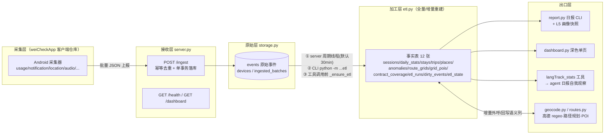
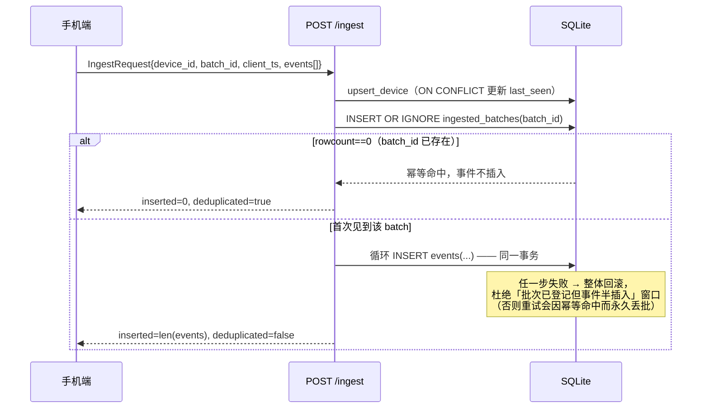
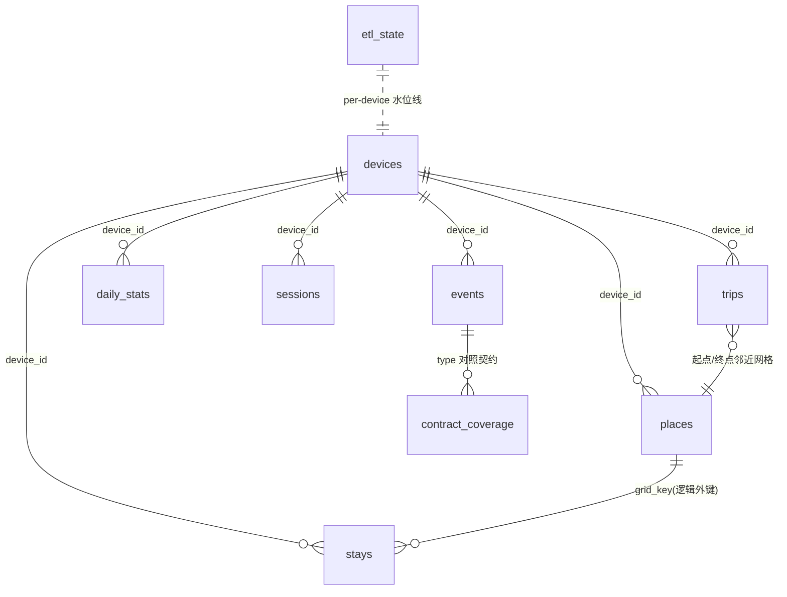
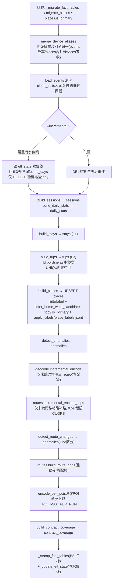

---
AIGC:
    Label: "1"
    ContentProducer: 001191440300708461136T1XGW3
    ProduceID: 74fca65fe87f9b5d6900c56ec5512fbd_d5ed12689df211f1a238525400e6dd8f
    ReservedCode1: 7OkeOvHSPtHrnQgFX3nPtNGkii9rKsVrbSy9olOIgJsZE/Ocl2Rza6Bi6lj9+0YHdUlvKYGrrDI77Rkyxujygp4pwnGzkhl7Aie02RXb7t3m16jZ9M4Z34SIXfi6rnnJqsmnmJm98jLg6Xrkf2y21me2uaTS1eofGLLvgEX+cAVn9yFAtXTZF1BPwlo=
    ContentPropagator: 001191440300708461136T1XGW3
    PropagateID: 74fca65fe87f9b5d6900c56ec5512fbd_d5ed12689df211f1a238525400e6dd8f
    ReservedCode2: 7OkeOvHSPtHrnQgFX3nPtNGkii9rKsVrbSy9olOIgJsZE/Ocl2Rza6Bi6lj9+0YHdUlvKYGrrDI77Rkyxujygp4pwnGzkhl7Aie02RXb7t3m16jZ9M4Z34SIXfi6rnnJqsmnmJm98jLg6Xrkf2y21me2uaTS1eofGLLvgEX+cAVn9yFAtXTZF1BPwlo=
---

# langTrack 技术实现参考 v2（字段·来源·消费链路）

> **v2 说明**：在 v1（langTrack-tech.md）全部技术内容之上一字不删地做**加法**——每个关键字段补上「从哪来 / 被谁读 / 读了影响什么输出」的完整消费链路。v1 里只写"用途"的地方，v2 改为讲清字段的一生：**哪个 ETL 步骤产出它 → 哪条出口链路（report / persona / dashboard / langTrack_stats / agent 日报）消费它 → 驱动什么判断、影响哪行输出**。
> 配套文档：数据链路总览与工作日志见 [`langTrack-roadmap.md`](langTrack-roadmap.md)；ETL 清洗规则细节见 [`etl-cleaning-guide.md`](etl-cleaning-guide.md)。
> 生成日期：2026-08-22，基于 ETL_VERSION `1.0.0`（`etl.py:159`）。

---

## 1. 端到端数据流总览



**分层职责一句话**：客户端只采集上报；服务端 `/ingest` 只做"校验+幂等落库"；`etl.py` 把原始 events 加工成事实表；出口层全部**只读事实表**，不反向写采集数据。

**v2 补一句全局消费认知**：事实表是中间地带——**左半边被 etl 写，右半边被报告/画像/仪表盘/agent 读**。下面每一张表我们都标上「谁在读」，字段解释也从"存了什么"升级为"被用来干什么"。

---

## 2. HTTP 接口（`server.py:76-107`）

| 方法 | 路径 | 参数 | 响应 | 说明 |
|---|---|---|---|---|
| GET | `/health` | — | `{"status":"ok"}` | 存活探针 |
| POST | `/ingest` | body=`IngestRequest` | `{"status":"ok","inserted":N,"deduplicated":bool}` | 幂等：`batch_id` 重复时返回 `{"status":"ok","inserted":0,"deduplicated":true}` |
| GET | `/dashboard` | `?day=YYYY-MM-DD`（可选） | `text/html` | 深色单页仪表盘，调 `render_dashboard_html(conn, day)`（`dashboard.py:237`），每次请求新开只读连接 |

### 2.1 幂等与事务语义（`storage.ingest_batch`, storage.py:89-115）



关键点：
- `type` **不做枚举限制**（`schemas.py:1-3`）：客户端持续扩展新类型，服务端按 JSON 原文落库，分析层自行区分——契约符合性由 A① 的 `contract_coverage` 表事后校验，而非入库拦截。
- 后台周期 ETL：FastAPI lifespan 起 daemon 线程（`server.py:61-73`），间隔 `LANGTRACK_ETL_INTERVAL_SECONDS`（默认 1800s）、单次超时 `LANGTRACK_ETL_TIMEOUT_SECONDS`（默认 120s）；以 `subprocess` 方式跑 `python -m gacore.langTrack.etl`，失败仅记日志**不阻塞接收**。

### 2.2 启动方式

```powershell
$env:PYTHONPATH = "src"
python -m gacore.langTrack --host 0.0.0.0 --port 8000 --db langTrack.db
```

---

## 3. 请求实体（`schemas.py`）

```python
class Event(BaseModel):
    type: str      # 自由字符串，见 §2.1 关键点
    ts: int        # 毫秒时间戳（客户端时钟）
    data: dict     # 事件原文，服务端不深校验

class IngestRequest(BaseModel):
    device_id: str
    batch_id: str   # 客户端生成的批次号 = 幂等键
    client_ts: int
    events: list[Event]
```

上报示例：

```json
{
  "device_id": "c2b6198c-e879-4bad-aee7-98d227dc9852",
  "batch_id": "b-20260822-001",
  "client_ts": 1755800000000,
  "events": [
    {"type": "session", "ts": 1755800001000,
     "data": {"screen_on": 1, "unlock": 0, "switch": 2}}
  ]
}
```

---

## 4. 数据库表字典

SQLite 单库 `data/langTrack.db`（gitignore）。分两层：**原始层**只追加不改写；**事实层**随 ETL 可重建（除人工标注外）。

### 4.1 原始层（`storage.py _SCHEMA`, L8-34）

> 唯一事实来源。这一层只有采集端写入、ETL 只读，**没有任何出口层直接读原始层**——所有报告都从事实层出，原始层是"无论如何不动的原稿"。消费链路：原始层 →（输入）→ 事实层。

#### devices — 设备登记

| 字段 | 类型 | 用途 |
|---|---|---|
| device_id | TEXT PK | 设备唯一标识 |
| first_seen / last_seen | INTEGER | 首次/最近上报毫秒时间戳；`upsert_device` ON CONFLICT 刷新 last_seen |

#### ingested_batches — 批次账本（幂等的根基）

| 字段 | 类型 | 用途 |
|---|---|---|
| batch_id | TEXT PK | 客户端批次号；重复即判重（§2.1 幂等命中的判据） |
| device_id / received_at | TEXT / INTEGER | 归属设备 / 服务端收到时刻(ms) |

#### events — 原始事件（唯一事实来源，ETL 的输入）

| 字段 | 类型 | 用途 |
|---|---|---|
| id | INTEGER PK AUTOINCREMENT | 行号 |
| device_id / ts / type | TEXT / INTEGER / TEXT NOT NULL | 设备 / 毫秒时间戳 / 事件类型（自由串） |
| **payload** | TEXT NOT NULL | **JSON 原文字符串**。注意列名是 `payload` 不是 `data`（历史踩坑 #2，写 SQL 前先 PRAGMA 确认） |
| received_at | INTEGER | 服务端接收时刻(ms)，区别于客户端 `ts` |

**v2 · 消费链路**：`events.payload` 是整条链路的**唯一原料**——ETL 的 `load_events` 读出后 JSON 解包，按 `type` 分发到 build_sessions / build_daily_stats / build_stays / build_trips / detect_anomalies / geocode / routes 各构建函数；`events.ts` 决定事件归属哪一天（东八区 `_TZ_CST` 归日），`received_at` 只用于运营排查（延迟诊断），不进入任何业务计算。

索引：`idx_events_device_ts(device_id, ts)`。

旧库迁移：`_add_timestamp_columns`（storage.py:37-59）对三张表补 `created_at/updated_at` 并用各自业务时间列回填东八区可读时间。

### 4.2 事实层（`etl.py _SCHEMA`, L163-516）

公共约定：事实表带 `etl_version` + `created_at`/`updated_at`（东八区），由 B8 `_stamp_fact_tables`（etl.py:1136）统一打标，其自然时间列映射：

| 表 | 自然时间列 | 表 | 自然时间列 |
|---|---|---|---|
| sessions | start_ms | places | first_seen |
| stays / trips | start_ts | anomalies | ts |
| daily_stats / route_grids | day（非毫秒） | grid_pois | queried_at |

#### sessions — 前台 App 会话（B 重建核心表）

> **谁在读**：`dashboard.py`（当日各 App 使用柱状）+ `persona.py`（`night_owl` 深夜会话占比、`peak_segment` 时段峰值）。

| 字段 | 用途 | v2 · 来源与消费 |
|---|---|---|
| device_id, day | 设备 + 东八区归属日 | 来源：events 按 `_TZ_CST` 归日 |
| pkg, app, activity | 包名 / 显示名 / Activity | 消费：`app`（显示名）喂给 persona 分类聚合与 dashboard 展示；`activity` 供细粒度分析 |
| start_ms, end_ms, duration_ms | 会话起止与时长 | 消费：`duration_ms` 汇总为 `daily_stats.total_screen_ms`；persona `night_owl` 统计 23:00-05:00 的会话 duration 占比（≥25% → 夜猫子） |

索引 `idx_sessions_day/pkg`；构建函数 `build_sessions(events)`。

#### daily_stats — 天粒度聚合（画像主输入）

> **谁在读**：`persona.py`（screen_health / category_usage / rhythm）、`report.py`（屏幕节、通知节）、`langTrack_stats` 工具的 `screen_ms / top_apps / notification / unlock_count` 等字段。**v2 重点表**，凡画像/日报里出现的数字，源头基本都是这张表。

PK `(device_id, day)`（B2 修正；`device_id DEFAULT 'unknown'` 兼容旧库行）。

| 字段 | 用途 | v2 · 消费与决策 |
|---|---|---|
| total_screen_ms | 当日屏幕总时长 | persona `screen_health`：`avg_total_ms`/`avg_hours` 直接取它；并判 `heavy_user`（单日 >5h `_DEFAULT_HEAVY_MS` 且窗口内 ≥60% 天数 `_DEFAULT_HEAVY_FRAC`）；report 屏幕节输出 "今日屏幕 XhYm" |
| app_ranking_json | App 时长排行 JSON 数组 `[{"app","ms"},...]` | persona `category_usage` 分类聚合逐条消费（按 `app` 映射到 `app_categories.json` 大类，未登录 → uncategorized）；`langTrack_stats.top_apps` 取前 8 |
| notification_count / notification_clicked | 通知数 / 点击数 | report 通知节 + `langTrack_stats.notification_count/clicked` |
| top_notification_apps_json | 通知 Top 应用 | report 通知节的"哪个 App 最爱发通知"叙事 |
| screen_on/off_count, unlock_count, switch_count | 亮灭屏 / 解锁 / 切换次数 | `langTrack_stats.unlock_count/switch_count` 直接透出；persona 无直接消费 |
| location_count, audio_clip_count | 定位点数 / 音频片段数 | `langTrack_stats.location_count`；`audio_clip_count` 与 sleep_signal 的样本量评估相关 |

#### stays — L1 停驻点

> **谁在读**：`places` 构建（按 grid_key 归并）、`persona.routine`（家/公司停驻天数）、report 地点节。**消费链**：stays 是"在哪待过"的证据，只往下游喂，不直接出界面。

`build_stays(events)` 产出；索引 day/device。

| 字段 | 用途 | v2 · 来源与消费 |
|---|---|---|
| start_ts, end_ts, duration_ms | 停驻起止 | 来源：events `location` 点按时间聚类；消费：`duration_ms` 参与 places 的 visit_count/时常统计与「待得最久=家/公司」推断 |
| center_lat/lon, min/max_lat/lon | 中心与包围盒 | 消费：center 作为 places 的初始 lat/lon；包围盒供离群点判定 |
| n_points, radius_m | 参与点数 / 弥散半径 | 消费：radius_m 衡量停驻"散不散"，异常大的半径会被压置信度 |
| grid_key | 网格键 = 与 places 关联的外键（逻辑外键） | **v2 关键**：来源：由 center 坐标量化成网格 ID；消费：places 用 `ON CONFLICT(device_id, grid_key)` 做 UPSERT 累加统计——**同一个 grid_key 的多次停留累计成同一个常驻点**，这是"去重为地点"的关键 |
| day | 东八区归属日（`_TZ_CST` 显式时区归日） | 消费：日报按日切地点 |

#### trips — L3 移动段（相邻停驻点之间的 gap）

> **谁在读**：`routes.build_route_grids`（通勤带）、`detect_route_changes`（换路线检测）、persona `commute_stable`（通勤稳定性）。**消费链**：trips 是"怎么动的"证据，专供移动/通勤语义，不参与屏幕与画像主维度。

`routes.build_trips(events, stays)`（routes.py:64-130）：双阈值过滤 `duration ≥ TRIP_MIN_DURATION_MS(60s)` 且 haversine 距离 `≥ TRIP_MIN_DIST_M(300m)`；无采样点用前后停驻中心兜底。

| 字段 | 用途 | v2 · 来源与消费 |
|---|---|---|
| 起止/距离组 | start/end_ts, duration_ms, start/end_lat/lon, dist_m, n_points, day | 消费：`dist_m`/`duration_ms` → persona `commute_stable`（窗口内 trips ≥3 段 → 通勤稳定）|
| polyline, route_key, route_mode, route_encoded_at | 高德路径规划结果缓存四件套；ETL 全量重建时按 `UNIQUE(device_id,start_ts,end_ts)` 带回旧值，**避免重复烧配额**（etl.py:1285-1309） | **v2 关键**：`route_key` = 路径指纹。消费：`detect_route_changes` 比较**同一起终点** trip 的 `route_key`，不一致 → 写入 `anomalies`（kind=route_change）→ 日报"通勤路线变了"叙事；`polyline` 喂给 `build_route_grids` 网格量化成通勤带 |

#### places — 常驻点（唯一"半人工"状态的事实表）

> **谁在读**：persona `routine`（作息规律）、report 地点节、`langTrack_stats.places`（按 visit_count 前 4）、`label_places` 人工确认 CLI、L5 画像快照。**v2 重点表**：家/公司语义全在这张表，且字段间有严格的"候选 → 确认 → 定型 → 影响判断"的逻辑链。

UPSERT 保标签：`ON CONFLICT(device_id, grid_key)` 只更新统计并保留 label（etl.py:1312-1326）；人工确认的「家/公司」持久化在 `data/place_labels.json`，每次 ETL 末尾 `apply_labels` 恢复（踩坑 #4 的解法）。

| 字段 | 用途 | v2 · 来源与消费 |
|---|---|---|
| grid_key, lat/lon, first_seen, last_seen, visit_count | 网格身份与到访统计 | 来源：stays 按 grid_key 归并累加；消费：`visit_count` 决定 `langTrack_stats.places` 的 top4 排序 |
| label | 家 / 公司 / 未知（用户确认值，ETL 不覆盖） | **v2 消费链**：ETL 永不覆盖 → `label_places` 确认后写入 → `place_labels.json` 持久化 → 每次 ETL 末尾 `apply_labels` 恢复 → persona `routine` 数"家停驻 ≥3 天 且 公司停驻 ≥3 天"判作息规律 → report 输出"院/公司"地点叙事 |
| is_primary | 自动标记 top2 主常驻点 | 消费：persona `routine` 圈定"候选的家/公司"范围（只看 top2） |
| address, poi, district, township, business_area, poi_type | L2 regeo 语义回填 | 来源：`geocode.incremental_encode`（仅未编码点 regeo，省配额）；消费：report/画像展示"去哪了"的语义名（有 label 显 label、无 label 有 poi 显 poi 名、皆无显[未知]——poi 落库但 label 优先） |
| poi_l1/l2/l3, poi_signal, poi_fallback, matched_level | P1-2 POI 三级语义（大类;中类;细类）+ 名称硬信号 + 无 POI 兜底描述 | 消费：画像场景分布的语义标签层级（poi_l1/l2/l3 逐级降级），`poi_signal` 为名称硬匹配信号提升可信度 |
| behavior | 行为语义 | 消费：report 叙事里"在干嘛"的定性描述 |
| candidate_label, confidence_home/work | L1 家/公司**置信度候选**（未确认前不污染 label） | **v2 最关键的决策链**：来源：`infer_home_work_candidates`（etl.py）按停留规律打分；消费：`confidence_home`/`confidence_work` 记录"猜得准不准"——**未确认前只进候选、不进 label**（防误判污染）；`label_places` 人工确认时才把候选升级为正式 label | 
| geocoded_at | 最近一次 regeo 编码时刻（增量编码依据） | 消费：`incremental_encode` 只补 `geocoded_at` 为空/过旧的点，避免重复耗配额 |

#### contract_coverage — A① 契约覆盖校验

> **谁在读**：`langTrack_stats.coverage` 字段（tools:234-253，status≠ok 的行），供 agent 日报自我观察"哪些事件类型缺失/停滞"。人类排障读表。

`build_contract_coverage(conn)`（etl.py:980-1036）全量重建：`SELECT type,COUNT(*),MAX(ts) FROM events GROUP BY type` 对照 `contract.EXPECTED_EVENT_TYPES`。

| 字段 | 用途 | v2 · 消费与决策 |
|---|---|---|
| type | PK，事件类型 | — |
| expected / consumed / desc | 是否期望(1) / ETL 消费度(true·partial·false，仅展示) / 中文说明 | 消费：诊断"这个类型虽然采了但 ETL 没用上"（consumed=false 是优化线索） |
| arrived / event_count / last_seen_ts | 是否到达 / 到达次数 / 最近到达时刻 | 消费：`last_seen_ts` 距今长短参与 status 判定（stale） |
| status | `ok`(7 天内到达) / `stale`(超 STALE_DAYS=7 天) / `missing`(契约有实际无) / `unexpected`(实际有契约无) | **决策**：`langTrack_stats.coverage` 命中 status≠ok 的行 → agent 日报自我观察里指出"XX 类型没上报了"；人类据此修客户端 |

#### etl_state — B1 增量水位线

> **谁在读**：`etl.py --incremental`（读水位线定 affected_days）。

`device_id PK, last_event_ts, last_run_at`；成功重建后写入 per-device 最大事件 ts（etl.py:1187-1201）；`--incremental` 时以此为锚回看 3 天确定受影响日集合。

#### etl_runs — B5 运行血缘

> **谁在读**：运维/排障人工查询；故障自查。

每次运行一行：`version/mode(full|incremental)/device_id/affected_days/status/git_rev/rows_daily/sessions/stays`。

#### dirty_events — B4 脏事件隔离区

> **谁在读**：排障查询；`--purge` 时先清异常再重建。

schema 校验不过的事件落此处（type/raw/reason），**不进 events 主流程、不崩 ETL**。

#### anomalies — P1-3 异常叙事

> **谁在读**：`report.py`（日报"有情况"叙事段）、L5 画像快照。

打破规律的新地点/事件（`UNIQUE(day,kind,grid_key)`），供日报叙事；路线变化事件复用本表（`kind` 区分，如 route_change 由 `detect_route_changes` 写入，来源是 trips.route_key 比对）。

#### route_grids / grid_pois — 通勤带与沿途 POI

> **谁在读**：report 通勤/移动叙事、dashboard 地图块。**消费链**：trips.polyline → route_grids（免费网格带）→ grid_pois（高德 around 缓存）→ 通勤路线周边语义。

`route_grids` PK`(device_id,day,grid_lat,grid_lon)`：`trips.polyline` 网格量化后的高频经过网格（纯本地零配额）；`grid_pois` PK`(grid_lat,grid_lon)`：每网格一条周边 POI 缓存（高德 around 约 100 次/日，低频克制）。

### 4.3 表关系



**v2 · 表间数据怎么"用起来"（从读方的视角）**：

| 读方（出口） | 直接读哪些表 | 产出 |
|---|---|---|
| report.py | daily_stats / places / anomalies / trips / route_grids / grid_pois / contract_coverage | 日报文字：屏幕？应用？熬夜？去哪？通勤变没变？ |
| persona.py | daily_stats / sessions / stays / places / trips | 七日画像：category_usage / screen_health / rhythm / routine / traits / card |
| dashboard.py | sessions / daily_stats / contract_coverage / dirty_events | 深色单页仪表盘 |
| langTrack_stats 工具 | daily_stats / places / contract_coverage / persona | agent 日报自我观察的 JSON |

---

## 5. 出口实体（消费侧契约）

### 5.1 LangTrackDayStats TypedDict（`tools/langTrack_tools.py:112-144`）

agent 工具 `langTrack_stats(day)` 的返回结构（gacore 主 agent 日报自我观察的数据源）：

| 字段 | 类型 | 来源与用途 | v2 · 下游消费 |
|---|---|---|---|
| day | str | 查询日（默认今天） | agent 日报的日期锚点 |
| available | bool | 当日 daily_stats 无行 → False | agent 决定"今天没数据，不拟报告" |
| screen_ms / screen_hours | int/float | total_screen_ms 及小时换算 | agent 日报的屏幕使用句子 |
| top_apps | list[dict] | app_ranking_json 前 8 | agent 日报"最常打开 XX" |
| notification_count / clicked | int | 当日通知量 | agent 判断"今天被通知轰炸了吗" |
| unlock_count / switch_count / location_count | int | 解锁/切换/定位 | agent 描述"身体力行"程度 |
| places | list[dict] | places 按 visit_count 前 4 `{label,visits}` | agent 日报"今天去了哪（家/公司/…）" |
| sleep_signal | str | 凌晨 00-05 点 audio_env 样本 >5 → "疑似熬夜"，否则"未见熬夜信号"（tools:218-232） | agent 日报熬夜提醒句 |
| coverage | list[dict] | contract_coverage 中 status≠ok 的行（缺失/停滞/未登记），旧库无此表时降级为空（tools:234-253） | agent 自我观察"哪些类型没数据了" |
| persona | dict | §5.2 七日画像（tools:283） | agent 日报可引用画像描述 |

调用前置：`_ensure_etl()` 先跑一遍 ETL 保证读到最新（tools:80-106，失败不阻塞）。

### 5.2 persona.build() 返回结构（`persona.py:147-551`）

纯读聚合，不动 ETL 不加表（C1 外挂式）；`conn`/`db_path` 二选一，`device_id=None` 时全量读（旧库无 device_id 列自动退化）：

```python
{
  "device_id": str|None, "days": 7, "available": bool,
  "category_usage": [ {"category","ms","hours","pct"} ],  # 按 ms 降序
  "uncategorized":  [app 名...],          # 提示需补 app_categories.json
  "screen_health": {"avg_total_ms","avg_hours","trend":"up|down|flat",
                    "heavy_user":bool,"heavy_days":int,"note"},
  "rhythm":       {"segments":{时段:ms}, "night_pct":float,
                   "night_owl":bool, "peak_segment":str|None},
  "routine":      {"regular":bool,"work_start":"HH:MM|None",
                   "commute_stable":bool,"home_days","work_days","note"},
  "traits":       [特征短语...], "card": "一句话画像。",
}
```

**v2 · 每个画像判定背后读的是哪个字段（判定阈值，persona.py:69-77 等）**：

| 维度 | 规则 | v2 · 底层数据字段 |
|---|---|---|
| 重度屏幕 | 单日 >5h（`_DEFAULT_HEAVY_MS`），且窗口内 ≥60% 天数（`_DEFAULT_HEAVY_FRAC`）→ heavy_user | `daily_stats.total_screen_ms` 逐日比对 |
| 屏幕趋势 | 今日 vs 其余天均值偏差 >±10% → up/down，否则 flat | `daily_stats.total_screen_ms` 日环比 |
| 夜猫子 | 深夜+凌晨(23:00-05:00)会话占比 ≥25% | `sessions.duration_ms` 按时段聚合 |
| 作息规律 | 家停驻 ≥3 天 且 公司停驻 ≥3 天 | `places.label`=家/公司 的 `daily_stats` 天数累计（经 stays→places） |
| 通勤稳定 | 窗口内 trips ≥3 段 | `trips` 行数 |
| 时段分桶 | `_SEGMENTS`：凌晨0-5/上午5-11/午后11-14/下午14-18/晚上18-23/深夜23-24（东八区，与 report 一致） | `sessions.start_ms` 归桶累加 |

分类映射：`data/app_categories.json`（gitignore，显示名→大类）覆盖代码内置 `_DEFAULT_CATEGORIES` 兜底（persona.py:87-101），未登录 app 归"其他"并进 `uncategorized`。

### 5.3 采集契约 EXPECTED_EVENT_TYPES（`contract.py:11-33`）

18 个期望类型 × consumed（`true`=ETL 消费 / `partial`=部分 / `false`=仅采集）：

usage、session、notification、location、audio_env、audio_clip、accel(false)、snapshot(partial)、screen_content、clipboard、input、media、bt_device、battery、network、app_lifecycle、call、sms。`STALE_DAYS=7`。

契约由人维护：客户端新增/废弃类型时显式更新此文件，ETL 校验产出 unexpected/missing。

---

## 6. ETL 流程详解（`etl.run`, etl.py:1204-1409）



要点：
- **失败隔离**：geocode/补路/POI 任一外呼失败只打日志跳过，不影响事实表重建（各步 try/except SystemExit/Exception）。
- **places 是唯一不完全重建的表**：UPSERT 累计统计 + label 优先级「已确认 > 别名 > 未知」。
- CLI：`python -m gacore.langTrack.etl [--db PATH] [--purge] [--no-geocode] [--no-route] [--no-poi] [--incremental]`（etl.py:1412-1423）；`--purge` 先清理异常事件再重建。
- 三种触发：server 周期线程（§2.1）/ 手动 CLI / `langTrack_stats` 调用前 `_ensure_etl()`。

---

## 7. 外部依赖与配置

| 项 | 位置 | 说明 |
|---|---|---|
| 高德 Key | `.env`（字节查找读取，容错混合编码，踩坑 #3） | regeo / 路径规划(walking 默认，`LANGTRACK_ROUTE_MODE` 可切 driving) / around POI |
| `LANGTRACK_ETL_INTERVAL_SECONDS` | env | 周期 ETL 间隔，默认 1800s |
| `LANGTRACK_ETL_TIMEOUT_SECONDS` | env | 单次 ETL 子进程超时，默认 120s |
| `data/place_labels.json` | 文件 | 人工确认的家/公司标签持久化（ETL 重跑恢复） |
| `data/app_categories.json` | 文件（gitignore） | App 分类映射；缺失时代码内置默认兜底 |
| `data/profiles/langTrack_profile_<day>.json` | 文件 | report L5 画像快照（含 coverage/persona） |

---

## 8. 测试与常用命令

```powershell
# langTrack 全部测试（py12 环境）
$env:PYTHONPATH="src"
& "D:\softwares\miniconda\envs\py12\python.exe" -m pytest tests/ -k langTrack -q

# ETL / 报告 / 地理编码 / 标签确认
python -m gacore.langTrack.etl --purge
python -m gacore.langTrack.report --day 2026-08-22
python -m gacore.langTrack.geocode
python -m gacore.langTrack.label_places
```

测试覆盖锚点：storage 幂等事务（test_langTrack_storage）、server 端点（test_langTrack_server）、契约覆盖（test_langTrack_contract，3 例）、persona 五维+降级（test_langTrack_persona，6 例）、工具出口（test_tools_langTrack）。

---

## 9. 核心链路字段流转示例（v2 新增）

> 前面是"字段字典"，这一节是"字段的一生"——挑 4 条最难懂的链路，用带具体数值的例子看字段怎么一步步串成最终输出。所有示例均为说明用合理取值，非真实数据。

### 9.1 屏幕使用：一条 usage 事件如何变成日报里"重度使用"这句话

```
① events 原始行（来源）
   {type:"usage", ts:1755800001000, data:{screen_on:1, unlock:1, package:"com.tencent.mm", ...}}
   →（同日多条 usage 按 app 拼接 gap）
② sessions（事实表，build_sessions 产出）
   pkg=com.tencent.mm, app=微信, start_ms=1755800001000, end_ms=..., duration_ms=720000(12min)
   →（当日全部 session duration 汇总）
③ daily_stats（事实表，build_daily_stats 产出）
   day=2026-08-22, total_screen_ms=22320000(6h12m), unlock_count=42,
   app_ranking_json=[{"app":"微信","ms":10800000},{"app":"抖音","ms":9000000},...]
   →（persona 读 daily_stats）
④ persona.screen_health
   avg_total_ms 取窗口 7 天 total_screen_ms 均值；heavy_user 判「单日>5h 且 ≥60% 天数」
   → 今日 6h12m > 5h → heavy_days 达标 → heavy_user=true
   trend：今日 vs 其余天均值偏差 >±10% → up
⑤ report 屏幕节 → 输出句子
   「今天屏幕用了 6小时12分，比前几天多，属于重度使用」
```

产出物明确标注字段来源：`6小时12分`=`daily_stats.total_screen_ms`；`重度使用`=`persona.screen_health.heavy_user`；`比前几天多`=`screen_health.trend`。

### 9.2 家/公司识别：candidate_label 一路升级到画像 routine

```
① daily_stats（前端输入） + stays（位置证据）
   stays: grid_key=g_1212, 工作日 20:30-07:30 高频停驻，center 靠近某住宅区
   grid_key=g_3434, 工作日 09:00-18:30 高频停驻
② build_places → UPSERT places（按 grid_key 归并）
   两个网格各自 first/last_seen、visit_count 递增；lat/lon/address 等 regeo 回填
③ infer_home_work_candidates（来源函数）
   按停留规律打分 → grid_key=g_1212: confidence_home=0.82, confidence_work=0.05
                    → grid_key=g_3434: confidence_home=0.03, confidence_work=0.78
   写入 candidate_label（g_1212="home", g_3434="work"）
   ⚠️ 此时 label 仍是"未知"，候选不污染正式 label（防误判）
④ label_places 人工确认（或确认脚本）
   船长确认 g_1212=家 → label="home"，写入 data/place_labels.json
⑤ 每次 ETL 末尾 apply_labels 恢复 label（重跑不丢人工结论）
   is_primary 自动标记 top2
⑥ persona.routine 读取
   home_days = 窗口内 label=家 的天数(≥3?) 且 work_days(≥3?) → regular=true
→ 画像输出 「作息规律：家和公司两点一线」
```

### 9.3 通勤换路线：route_key 指纹怎么触发"路线变了"

```
① trips（事实表，build_trips 产出）
   家(grid_key=g_1212) → 公司(grid_key=g_3434)，每天 08:05 一条，dist_m≈12000
   incremental_encode_trips 补路成功 → polyline=<坐标串>, route_key="v2#a1b2c3", route_encoded_at=...
② route_grids（build_route_grids 产出，纯本地）
   trips.polyline 网格量化 → 高频经过网格集合（零配额免费算）
③ detect_route_changes 比对
   今天同一起终点 trips.route_key="v2#d4e5f6" ≠ 昨天"v2#a1b2c3" → 通则(路线指纹不一致)
   → 写 anomalies：kind="route_change", day=today, grid_key=g_1212~
④ report 移动叙事 → 输出句子
   「今天通勤走的线路和平时不一样」
```

### 9.4 数据健康自检：contract_coverage 怎么让 agent 发现自己"瞎了"

```
① events（GROUP BY type 统计）+ contract.EXPECTED_EVENT_TYPES（契约）
   build_contract_coverage 重建：type=location 的 last_seen_ts 距今已 9 天
② contract_coverage 行
   type=location, arrived=1, event_count=312, last_seen_ts=9天前, status=stale（>STALE_DAYS=7）
③ langTrack_stats.coverage 读 status≠ok 的行（tools:234-253）
   coverage=[{type:"location", status:"stale", ...}]
④ agent 日报自我观察 → 输出
   「今天没收到 location 上报，位置类数据已停滞 9 天，建议检查采集端权限/开关」
```

---

## 附录：常见"这字段干嘛用的"速查（由 §4/§5 汇总）

| 你想知道的事 | 去读哪个字段 |
|---|---|
| 今天总共刷了多久手机 | `daily_stats.total_screen_ms` |
| 谁最耗时间 / 画像按类统计 | `daily_stats.app_ranking_json`（persona 按大类聚合） |
| 是不是夜猫子 | `sessions.duration_ms`（23-05 点占比，persona `night_owl`） |
| 哪里是家/公司（确认版） | `places.label`（人工确认，ETL 不覆盖） |
| 系统自己猜的家/公司（未确认） | `places.candidate_label` + `confidence_home/work` |
| 哪些地方是常驻点 | `places`（按 grid_key 归并，`visit_count` 排序） |
| 通勤走的什么路线 | `trips.polyline / route_key` + `route_grids` |
| 通勤路线变没变 | `trips.route_key` 跨日比对 + `anomalies(kind=route_change)` |
| 某类事件还上报吗 | `contract_coverage.status` |
| 上次加工到哪天 | `etl_state.last_event_ts`（增量锚点） |
| 这次画像/日报的源头 | 全部最终落到 `events` 原始层（唯一事实来源） |
*（内容由AI生成，仅供参考）*
