---
AIGC:
    Label: "1"
    ContentProducer: 001191440300708461136T1XGW3
    ProduceID: 74fca65fe87f9b5d6900c56ec5512fbd_db9dbeb9a36111f1abe1525400e6dd8f
    ReservedCode1: eFggaz7CdZoePclrVjQ70F+k+f2zSoUNzl5qxPCPAsF7U+6d7n9Hc0dfSVVNuXeU/LONR+uCAhMLu0xrjVb0j486VaXbN5XUrtxpPjAJuulPsB8921tcfYVvg6Rd4e/kuXqhEZT20L5de+VtzFtGq+MQk4zbane5MtasBAqEbndgttxjpx5q1FBsLNs=
    ContentPropagator: 001191440300708461136T1XGW3
    PropagateID: 74fca65fe87f9b5d6900c56ec5512fbd_db9dbeb9a36111f1abe1525400e6dd8f
    ReservedCode2: eFggaz7CdZoePclrVjQ70F+k+f2zSoUNzl5qxPCPAsF7U+6d7n9Hc0dfSVVNuXeU/LONR+uCAhMLu0xrjVb0j486VaXbN5XUrtxpPjAJuulPsB8921tcfYVvg6Rd4e/kuXqhEZT20L5de+VtzFtGq+MQk4zbane5MtasBAqEbndgttxjpx5q1FBsLNs=
---

---
AIGC:
    Label: "1"
    ContentProducer: 001191440300708461136T1XGW3
    ProduceID: 74fca65fe87f9b5d6900c56ec5512fbd_af20f100a1ca11f193c6525400f8a581
    ReservedCode1: rql6zwY3dwnCqhMmahCUF/xWuuLChvsn0bxA3nOwrYjWNIzB5fgd5eqlFmtwLr2A3Q5/L4pQm8lfmDdVBQKunQ443jAoppWB5VQOzKWQTGwIRZDuZORyDZWbyDAFKaSecQQ72Xj/qidS8pMVJK585EYgbqkGWv8PAdKMtXmQD0Xoub52EFeDPh5KxnE=
    ContentPropagator: 001191440300708461136T1XGW3
    PropagateID: 74fca65fe87f9b5d6900c56ec5512fbd_af20f100a1ca11f193c6525400f8a581
    ReservedCode2: rql6zwY3dwnCqhMmahCUF/xWuuLChvsn0bxA3nOwrYjWNIzB5fgd5eqlFmtwLr2A3Q5/L4pQm8lfmDdVBQKunQ443jAoppWB5VQOzKWQTGwIRZDuZORyDZWbyDAFKaSecQQ72Xj/qidS8pMVJK585EYgbqkGWv8PAdKMtXmQD0Xoub52EFeDPh5KxnE=
---

---
AIGC:
    Label: "1"
    ContentProducer: 001191440300708461136T1XGW3
    ProduceID: 74fca65fe87f9b5d6900c56ec5512fbd_1b684e9da1bd11f1a413525400287e28
    ReservedCode1: j9epkje1bF1gV8xwktcFG3dCK57A/mxz8dM3RZ9dMfzpW4CMJa7OJ0h1aQcRwdprDav6UUo4w4nLlJrg3fQrgrmChwvMXIOt8gLvh1dOZDL6OgWOBfu40CXDDNBjMuHlNtMpFwjx7aUfZdMv02rIENajiZiI6bZteXDvqvlrCfyYvnduYQ7a2iTMnYA=
    ContentPropagator: 001191440300708461136T1XGW3
    PropagateID: 74fca65fe87f9b5d6900c56ec5512fbd_1b684e9da1bd11f1a413525400287e28
    ReservedCode2: j9epkje1bF1gV8xwktcFG3dCK57A/mxz8dM3RZ9dMfzpW4CMJa7OJ0h1aQcRwdprDav6UUo4w4nLlJrg3fQrgrmChwvMXIOt8gLvh1dOZDL6OgWOBfu40CXDDNBjMuHlNtMpFwjx7aUfZdMv02rIENajiZiI6bZteXDvqvlrCfyYvnduYQ7a2iTMnYA=
---

---
AIGC:
    Label: "1"
    ContentProducer: 001191440300708461136T1XGW3
    ProduceID: 74fca65fe87f9b5d6900c56ec5512fbd_2fc5b252a09211f1a65b525400826444
    ReservedCode1: Q8evqcX6LxLq3rS5BCQELYwxLf5grR6XuOWAf1jpzyAXK1YS0g0cXmA3XrYW3KBU02hyUFoCPs5aw0YhC/zUlJ3gLyLjbrDXdClhzIoU+jkp0i3IkvNPIiUQjdmZwq8MS6Z/HeCMaHt28OZE++DIW3NSNCPZocwZYSoHTIsCMSfSFgyh0cbcEs6egPk=
    ContentPropagator: 001191440300708461136T1XGW3
    PropagateID: 74fca65fe87f9b5d6900c56ec5512fbd_2fc5b252a09211f1a65b525400826444
    ReservedCode2: Q8evqcX6LxLq3rS5BCQELYwxLf5grR6XuOWAf1jpzyAXK1YS0g0cXmA3XrYW3KBU02hyUFoCPs5aw0YhC/zUlJ3gLyLjbrDXdClhzIoU+jkp0i3IkvNPIiUQjdmZwq8MS6Z/HeCMaHt28OZE++DIW3NSNCPZocwZYSoHTIsCMSfSFgyh0cbcEs6egPk=
---

# langTrack 技术实现参考（接口 · 实体 · 数据库 · 数据流）

> 本文是 langTrack 服务端的**代码级技术参考**，所有字段/接口/阈值均对照源码（标注 `文件:行号`）。
> 配套文档：数据链路总览与工作日志见 [`langTrack-roadmap.md`](langTrack-roadmap.md)；ETL 清洗规则细节见 [`etl-cleaning-guide.md`](etl-cleaning-guide.md)。
> 生成日期：2026-08-22，基于 ETL_VERSION `1.0.0`（`etl.py:159`）。
> 2026-09-03 更新：位置智能增强 Task 1-11 落地后同步——位置事实 schema 增加 v2（shadow v2 / 迁移审计表）、双坐标边界（`to_amap_coord` 全高德入口统一转换 + `daily_location_quality` 坐标质量观测）、PlaceRef/FactCard 消费侧契约、mermaid 数据流分 v1/v2 双轨。

---

## 1. 端到端数据流总览

> 位置事实自 Task 1-6 起改为 **v1 / v2 双轨**：v1 为既有 per-grid 口径（向后兼容）；v2 为 stays 主导的 canonical 地点口径（shadow 只读验证，待 `--location-activate` 切换）。二者见 §4.4 与 §6。

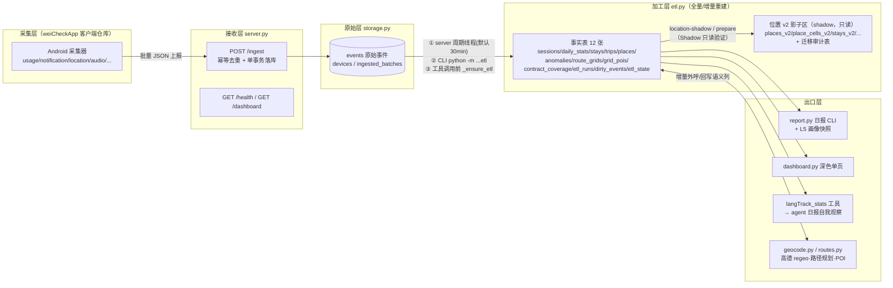

**分层职责一句话**：客户端只采集上报；服务端 `/ingest` 只做"校验+幂等落库"；`etl.py` 把原始 events 加工成事实表；出口层全部**只读事实表**，不反向写采集数据。

---

## 2. HTTP 接口（`server.py:76-107`）

| 方法 | 路径 | 参数 | 响应 | 说明 |
|---|---|---|---|---|
| GET | `/health` | — | `{"status":"ok"}` | 存活探针 |
| GET | `/api/client/version` | — | `{"app_version":"1.N","latest_apk_url":""}` | 客户端版本自查（Task 14）：服务端声明期望客户端版本。请求时读 `data/client_version.json`（存在优先，缺失回退 `server.py` 常量 `_EXPECTED_CLIENT_VERSION`）——该文件由 weiCheckApp `build.ps1` 打包后自动写入，故设置页版本对比随打包自动推进，**无需重启服务端**。客户端 `VersionChecker.kt` 拉取后与 PackageManager `versionName`（`versionName="{major}.{minor}.{buildNumber}"`，如 1.0.1；buildNumber 由 `version.properties` 存储、`build.ps1` 每次构建后递增）对比，设置页「关于」显示「已是最新 / 可更新→vX.X / 检查中」 |
| POST | `/ingest` | body=`IngestRequest` | `{"status":"ok","inserted":N,"deduplicated":bool}` | 幂等：`batch_id` 重复时返回 `{"status":"ok","inserted":0,"deduplicated":true}` |
| GET | `/dashboard` | `?day=YYYY-MM-DD`（可选） | `text/html` | 深色单页仪表盘，调 `render_dashboard_html(conn, day)`（`dashboard.py:237`），每次请求新开只读连接；含「事实审查块」（FactCard 逐项人眼核对，不跑 ETL）；含「生活轨迹 · 时段分布」卡（小时 × 家/公司/其他 30 天矩阵，`spatial_profile._time_space_matrix`，单小时 ≥15 分钟计入、跨午夜 stay 按自然日分摊、无数据不隐藏）、「定位采集明细」卡（当日原始层 location 事件逐点：时间\|最近地点·距离\|精度\|信号源，`_render_location_points`，最近地点按 canonical 地点 WGS84 球面距离最小、显示名走 §2.6）、「当日地图」卡（高德 JS API，`_render_map_card`）与「立即转换 (ETL)」按钮 |
| POST | `/etl/run` | — | `{"status":"started"}` / `{"status":"busy"}` | 异步触发 ETL 子进程；与周期线程共用防重入守卫（Task 12c） |
| GET | `/etl/status` | — | `{"running":bool,"last_finished_at":...,"last_ok":bool}` | ETL 运行状态查询（Task 12c） |
| GET | `/api/map/day` | `?day=` `?device_id=`（均可选） | JSON：`{device_id, points[], stays[], trips[]}` 或 `{error:"ambiguous_device"\|"no_data", ...}` | 地图卡前端数据源（Task 13）。点按 `to_amap_coord` 转 GCJ02；stay 名走 §2.6；trip polyline 已是 GCJ02 原样；device_id 省略时按当日唯一设备解析，多设备返回 candidates |

### 2.1 幂等与事务语义（`storage.ingest_batch`, storage.py:89-115）

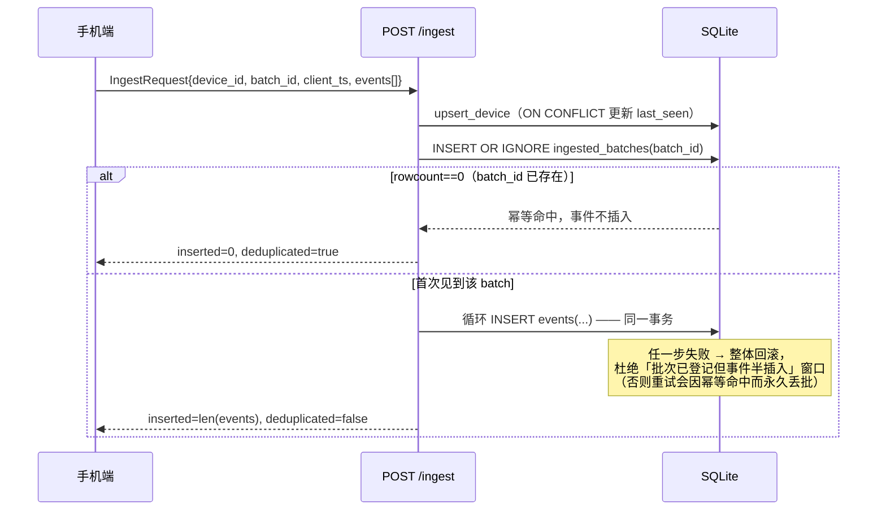

关键点：
- `type` **不做枚举限制**（`schemas.py:1-3`）：客户端持续扩展新类型，服务端按 JSON 原文落库，分析层自行区分——契约符合性由 A① 的 `contract_coverage` 表事后校验，而非入库拦截。
- 后台周期 ETL：FastAPI lifespan 起 daemon 线程（`server.py:61-73`），间隔 `LANGTRACK_ETL_INTERVAL_SECONDS`（默认 1800s）、单次超时 `LANGTRACK_ETL_TIMEOUT_SECONDS`（默认 120s）；以 `subprocess` 方式跑 `python -m gacore.langTrack.etl`，失败仅记日志**不阻塞接收**。

### 2.2 启动方式

```powershell
$env:PYTHONPATH = "src"
python -m gacore.langTrack --host 0.0.0.0 --port 8000 --db langTrack.db
```

---

## 3. 请求实体（`schemas.py`）

```python
class Event(BaseModel):
    type: str      # 自由字符串，见 §2.1 关键点
    ts: int        # 毫秒时间戳（客户端时钟）
    data: dict     # 事件原文，服务端不深校验

class IngestRequest(BaseModel):
    device_id: str
    batch_id: str   # 客户端生成的批次号 = 幂等键
    client_ts: int
    events: list[Event]
```

上报示例：

```json
{
  "device_id": "c2b6198c-e879-4bad-aee7-98d227dc9852",
  "batch_id": "b-20260822-001",
  "client_ts": 1755800000000,
  "events": [
    {"type": "session", "ts": 1755800001000,
     "data": {"screen_on": 1, "unlock": 0, "switch": 2}}
  ]
}
```

---

## 4. 数据库表字典

SQLite 单库 `data/langTrack.db`（gitignore）。分两层：**原始层**只追加不改写；**事实层**随 ETL 可重建（除人工标注外）。

### 4.1 原始层（`storage.py _SCHEMA`, L8-34）

#### devices — 设备登记

| 字段 | 类型 | 用途 |
|---|---|---|
| device_id | TEXT PK | 设备唯一标识 |
| first_seen / last_seen | INTEGER | 首次/最近上报毫秒时间戳；`upsert_device` ON CONFLICT 刷新 last_seen |

#### ingested_batches — 批次账本（幂等的根基）

| 字段 | 类型 | 用途 |
|---|---|---|
| batch_id | TEXT PK | 客户端批次号；重复即判重 |
| device_id / received_at | TEXT / INTEGER | 归属设备 / 服务端收到时刻(ms) |

#### events — 原始事件（唯一事实来源，ETL 的输入）

| 字段 | 类型 | 用途 |
|---|---|---|
| id | INTEGER PK AUTOINCREMENT | 行号 |
| device_id / ts / type | TEXT / INTEGER / TEXT NOT NULL | 设备 / 毫秒时间戳 / 事件类型（自由串） |
| **payload** | TEXT NOT NULL | **JSON 原文字符串**。注意列名是 `payload` 不是 `data`（历史踩坑 #2，写 SQL 前先 PRAGMA 确认） |
| received_at | INTEGER | 服务端接收时刻(ms)，区别于客户端 `ts` |

索引：`idx_events_device_ts(device_id, ts)`。

`music_play` 事件（客户端 `WeiNotificationListener` 从媒体通知拆出，日报「今日常听」消费）payload 字段：
`pkg/app`（包名/显示名）、`title`=歌名、`singer`/`album`（由 `"歌手 - 专辑"` 拆分）、`state`=`playing|paused`、`durationMs`=歌曲总时长（ms，源自媒体通知 `MediaMetadata.METADATA_KEY_DURATION`，读常量非采样；部分播放器不带则 =0 表示未知）；`ts`=客户端 `System.currentTimeMillis`（postTime 切歌不变）。**注意：payload 内无 `ts` 字段**，report 聚合用事件行 `ts`，勿读 payload.ts。

report 侧聚合（`report._listen_music`，返回结构化 dict）——**粗档"听歌时长/时段"口径**：代码先按 `pkg` 分流（`_media_kind`：音乐类 netease/cloudmusic/qqmusic/kugou/kuwo+默认 =**听歌**；视频类 bilibili/douyin/kuaishou/douyutv/huya/youtube =**视频伴音**），再把这些事件按歌合并成 run（同一首歌连续进度事件并入一段，不重复计数），然后：
- `ranking[]`：听歌曲目×次数 Top10，每条含 `window_min` = 该曲"在位近似分钟"（首事件 → 下一首不同歌首事件；当天末首为开区间，用其末事件估算）。
- `singer_top`：常听歌手 Top5（按该歌手名下歌出现次数累计）。
- `sessions[]`：连播段，相邻事件间隔 ≤ `_SESSION_GAP_MS=15min` 判为同一段，含起止 `HH:MM`/歌数/段时长。
- `hour_hist`：当日听歌时段分布（东八区按小时）。
- `video_ranking[]` / `video_count`：**视频伴音**（B站/短视频，单列计数，不进音乐画像）。
口径强调：这是"在位窗口"的非精确估算（暂停挂着不动也算满），供画像看"何时在听/连播多久"；要精确秒数/完整度需客户端后续带 `durationMs`+`positionMs`（细档，未做）。
结果进 L5 画像快照 `profile["music"]`（即 `ranking` 列表，带 window_min；因分流，仅含真正听歌）。
`durationMs`（v1.0.13 起，读媒体会话真实总长；`_listen_music` 目前不消费，保留作后续完整度启发）。日报正文经信息包 `〔今日·听歌与视频伴音〕` 块（`daily_info_pack._build_media`，cap 900）把网易云听歌与 B站视频伴音分开呈现给 LLM。

旧库迁移：`_add_timestamp_columns`（storage.py:37-59）对三张表补 `created_at/updated_at` 并用各自业务时间列回填东八区可读时间。

### 4.2 事实层（`etl.py _SCHEMA`, L163-516）

公共约定：事实表带 `etl_version` + `created_at`/`updated_at`（东八区），由 B8 `_stamp_fact_tables`（etl.py:1136）统一打标，其自然时间列映射：

| 表 | 自然时间列 | 表 | 自然时间列 |
|---|---|---|---|
| sessions | start_ms | places | first_seen |
| stays / trips | start_ts | anomalies | ts |
| daily_stats / route_grids | day（非毫秒） | grid_pois | queried_at |

#### sessions — 前台 App 会话（B 重建核心表）

| 字段 | 用途 |
|---|---|
| device_id, day | 设备 + 东八区归属日 |
| pkg, app, activity | 包名 / 显示名 / Activity |
| start_ms, end_ms, duration_ms | 会话起止与时长 |

索引 `idx_sessions_day/pkg`；构建函数 `build_sessions(events)`。

#### daily_stats — 天粒度聚合（画像主输入）

PK `(device_id, day)`（B2 修正；`device_id DEFAULT 'unknown'` 兼容旧库行）。

| 字段 | 用途 |
|---|---|
| total_screen_ms | 当日屏幕总时长（persona 屏幕健康度、report 屏幕节的来源） |
| app_ranking_json | App 时长排行 JSON 数组 `[{"app","ms"},...]`（persona 分类聚合逐条消费） |
| notification_count / notification_clicked | 通知数 / 点击数 |
| top_notification_apps_json | 通知 Top 应用 |
| screen_on/off_count, unlock_count, switch_count | 亮灭屏 / 解锁 / 切换次数 |
| location_count, audio_clip_count | 定位点数 / 音频片段数 |

#### stays — L1 停驻点

`build_stays(events)` 产出；索引 day/device。

| 字段 | 用途 |
|---|---|
| start_ts, end_ts, duration_ms | 停驻起止 |
| center_lat/lon, min/max_lat/lon | 中心与包围盒 |
| n_points, radius_m | 参与点数 / 弥散半径 |
| grid_key | 网格键 = 与 places 关联的外键（逻辑外键） |
| day | 东八区归属日（`_TZ_CST` 显式时区归日） |

#### trips — L3 移动段（相邻停驻点之间的 gap）

`routes.build_trips(events, stays)`（routes.py:64-130）：双阈值过滤 `duration ≥ TRIP_MIN_DURATION_MS(60s)` 且 haversine 距离 `≥ TRIP_MIN_DIST_M(300m)`；无采样点用前后停驻中心兜底。

| 字段 | 用途 |
|---|---|
| 起止/距离组 | start/end_ts, duration_ms, start/end_lat/lon, dist_m, n_points, day |
| polyline, route_key, route_mode, route_encoded_at | 高德路径规划结果缓存四件套；ETL 全量重建时按 `UNIQUE(device_id,start_ts,end_ts)` 带回旧值，**避免重复烧配额**（etl.py:1285-1309） |

#### places — 常驻点（唯一"半人工"状态的事实表）

UPSERT 保标签：`ON CONFLICT(device_id, grid_key)` 只更新统计并保留 label（etl.py:1312-1326）；人工确认的「家/公司」持久化在 `data/place_labels.json`，每次 ETL 末尾 `apply_labels` 恢复（踩坑 #4 的解法）。

| 字段 | 用途 |
|---|---|
| grid_key, lat/lon, first_seen, last_seen, visit_count | 网格身份与到访统计 |
| label | 家 / 公司 / 未知（用户确认值，ETL 不覆盖） |
| is_primary | 自动标记 top2 主常驻点 |
| address, poi, district, township, business_area, poi_type | L2 regeo 语义回填 |
| poi_l1/l2/l3, poi_signal, poi_fallback, matched_level | P1-2 POI 三级语义（大类;中类;细类）+ 名称硬信号 + 无 POI 兜底描述 |
| behavior | 行为语义 |
| candidate_label, confidence_home/work | L1 家/公司**置信度候选**（未确认前不污染 label） |
| geocoded_at | 最近一次 regeo 编码时刻（增量编码依据） |

#### contract_coverage — A① 契约覆盖校验

`build_contract_coverage(conn)`（etl.py:980-1036）全量重建：`SELECT type,COUNT(*),MAX(ts) FROM events GROUP BY type` 对照 `contract.EXPECTED_EVENT_TYPES`。

| 字段 | 用途 |
|---|---|
| type | PK，事件类型 |
| expected / consumed / desc | 是否期望(1) / ETL 消费度(true·partial·false，仅展示) / 中文说明 |
| arrived / event_count / last_seen_ts | 是否到达 / 到达次数 / 最近到达时刻 |
| status | `ok`(7 天内到达) / `stale`(超 STALE_DAYS=7 天) / `missing`(契约有实际无) / `unexpected`(实际有契约无) |

#### etl_state — B1 增量水位线

`device_id PK, last_event_ts, last_run_at`；成功重建后写入 per-device 最大事件 ts（etl.py:1187-1201）；`--incremental` 时以此为锚回看 3 天确定受影响日集合。

#### etl_runs — B5 运行血缘

每次运行一行：`version/mode(full|incremental)/device_id/affected_days/status/git_rev/rows_daily/sessions/stays`。

#### dirty_events — B4 脏事件隔离区

schema 校验不过的事件落此处（type/raw/reason），**不进 events 主流程、不崩 ETL**。

#### anomalies — P1-3 异常叙事

打破规律的新地点/事件（`UNIQUE(day,kind,grid_key)`），供日报叙事；路线变化事件复用本表（kind 区分）。

#### route_grids / grid_pois — 通勤带与沿途 POI

`route_grids` PK`(device_id,day,grid_lat,grid_lon)`：trips.polyline 网格量化后的高频经过网格（纯本地零配额）；`grid_pois` PK`(grid_lat,grid_lon)`：每网格一条周边 POI 缓存（高德 around 约 100 次/日，低频克制）。

#### shadow v2 全套表（位置智能 Task 1-6，`location_migration.py:105` `SCHEMA_V2`）

仅 `--location-shadow` / `--location-prepare` 时在**只读影子区**构建（`*_v2` 表），影子运行不触碰 v1 事实表；`--location-activate` 校验后才接管正式查询（此前 v1 仍是对外口径）。

| 表 | 用途 |
|---|---|
| stays_v2 / trips_v2 | canonical 停驻/移动段（location_migration.py:148/175，device+时间窗+cluster+gap 组键；起止/中心/包围盒/stays_num/avg_radius 等） |
| places_v2 | canonical 常驻点（location_migration.py:106）：`place_id = sha1(device+join(sorted(member_grids)))[:16]`；**v2 三计数**：`point_count`=聚入地点的驻留采样点数、`visit_count`=canonical 停留段数（总和=stays 数）、`stay_ms`=累计停留时长 |
| place_cells_v2 | 地点 ↔ 代表网格映射（location_migration.py:139，place_id ↔ grid_key） |
| place_tag_conflicts_v2 | 旧标签合并冲突登记（location_migration.py:202，`merge_conflicting_tags` 等，标签置未知待人工处置） |
| anomalies_v2 / route_grids_v2 | anomalies_v2 v2 异常叙事（location_migration.py:213，打破规律的新地点）；**路线变化复用 anomalies(kind=`route_change`)**，非独立表；route_grids_v2 为通勤网格（location_migration.py:232） |
| location_place_mapping / location_migration_issues / location_migration_metrics | **迁移审计三表**（location_migration.py:263/276/289）：旧 place→新 place 映射（`match_reason`/`jaccard`/`distance_m`）、未映射标签 open issue（`unmapped_tag`）、迁移统计（tag_migrated/tag_conflicts/geocode_reused/geocode_invalidated 等）；影子运行按模式构建 `shadow_*` 前缀只读对比表（派生自 SCHEMA_V2，location_migration.py:568-580） |
| etl_runs | v2 影子运行血缘写 v1 `etl_runs` 表（mode=`location_v2_full`，location_migration.py:843-847/1066-1068）；无独立 etl_runs_v2 表 |

#### daily_location_quality — 每日定位质量观测（Task 6，引入 commit 952cda9；Task 7 起纳入 FactCard 契约字段）

`day+device_id` 唯一（11 行实测结果见 Task 10 验收）：`points_total / points_valid / accuracy_known / accuracy_le_50 / accuracy_51_150 / accuracy_gt_150 / observed_half_hour_bins / median_interval_sec / providers_json`（当日 GPS/network 计数分布）。

#### trips 坐标制双列（双坐标边界）

`endpoint_coord_system`（WGS84|GCJ02|unknown，起点/终点实测坐标系）+ `polyline_coord_system`（高德 GCJ02，polyline 所属坐标系）。**约定：落库存实测原始坐标系，高德外呼前统一经 `to_amap_coord(lat,lon,coord_system)` 转为 GCJ02 再调用**（边界见 §6.1）。

### 4.3 表关系

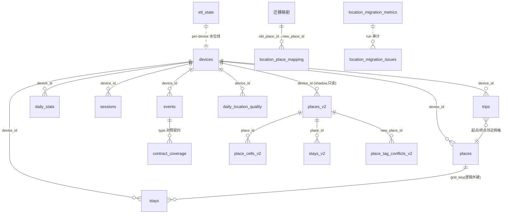

---

## 5. 出口实体（消费侧契约）

### 5.1 LangTrackDayStats TypedDict（`tools/langTrack_tools.py:112-144`）

agent 工具 `langTrack_stats(day)` 的返回结构（gacore 主 agent 日报自我观察的数据源）。2026-08-31 起改由 `fact_card.build(detail="full")` 单一数据源映射（删除了原重复 SQL，见 §5.4），新增 `data_as_of / etl_watermark / current_known / stays / trips / stay_minutes / anomalies` 等公共字段（旧字段全部保留）：

| 字段 | 类型 | 来源与用途 |
|---|---|---|
| day | str | 查询日（默认今天） |
| available | bool | 当日 daily_stats 无行 → False |
| data_as_of / data_as_of_ms / data_as_of_source | str/int/str | 数据实际覆盖到的时刻（区分生成时间 `generated_at`），来源 daily_stats 或 etl_state |
| etl_watermark / etl_watermark_ms | str/int\|None | ETL 水位线（`_update_etl_state` 写入），无 daily_stats 时为 None |
| screen_ms / screen_hours | int/float | total_screen_ms 及小时换算 |
| top_apps | list[dict] | app_ranking_json 前 8 |
| notification_count / clicked / top_notification_apps | int/int/list | 当日通知量及 Top App |
| unlock_count / switch_count / location_count | int | 解锁/切换/定位 |
| places | list[dict] | places 前 4（2026-08-31 起带 device 过滤）`{label,visits,is_primary,address}` |
| current_known | dict\|None | 截止 data_as_of 的最后一段停留（label/since/poi），人现在在哪 |
| stays | list[dict] | 当日停留段（label/start_hhmm/end_hhmm/mins），内嵌 trips |
| trips | list[dict] | 移动段（start/end/dist_m/from_label/to_label） |
| stay_minutes | dict[str,int] | 按 label 聚合停留分钟数 |
| anomalies | list[dict] | 当日异常（覆盖/滞留等）简要 |
| sleep_signal | str | 凌晨 00-05 点 audio_env 样本 >5 → "疑似熬夜"，否则"未见熬夜信号"（tools:218-232） |
| coverage | list[dict] | contract_coverage 中 status≠ok 的行（缺失/停滞/未登记），旧库无此表时降级为空（tools:234-253） |
| persona | dict | §5.2 七日画像（tools:283） |

调用前置：`_ensure_etl()` 先跑一遍 ETL 保证读到最新（tools:80-106，失败不阻塞）。

### 5.2 persona.build() 返回结构（`persona.py:147-551`）

纯读聚合，不动 ETL 不加表（C1 外挂式）；`conn`/`db_path` 二选一，`device_id=None` 时全量读（旧库无 device_id 列自动退化）：

```python
{
  "device_id": str|None, "days": 7, "available": bool,
  "category_usage": [ {"category","ms","hours","pct"} ],  # 按 ms 降序
  "uncategorized":  [app 名...],          # 提示需补 app_categories.json
  "screen_health": {"avg_total_ms","avg_hours","trend":"up|down|flat",
                    "heavy_user":bool,"heavy_days":int,"note"},
  "rhythm":       {"segments":{时段:ms}, "night_pct":float,
                   "night_owl":bool, "peak_segment":str|None},
  "routine":      {"regular":bool,"work_start":"HH:MM|None",
                   "commute_stable":bool,"home_days","work_days","note"},
  "traits":       [特征短语...], "card": "一句话画像。",
}
```

判定阈值（persona.py:69-77 等）：

| 维度 | 规则 |
|---|---|
| 重度屏幕 | 单日 >5h（`_DEFAULT_HEAVY_MS`），且窗口内 ≥60% 天数（`_DEFAULT_HEAVY_FRAC`）→ heavy_user |
| 屏幕趋势 | 今日 vs 其余天均值偏差 >±10% → up/down，否则 flat |
| 夜猫子 | 深夜+凌晨(23:00-05:00)会话占比 ≥25% |
| 作息规律 | 家停驻 ≥3 天 且 公司停驻 ≥3 天 |
| 通勤稳定 | 窗口内 trips ≥3 段 |
| 时段分桶 | `_SEGMENTS`：凌晨0-5/上午5-11/午后11-14/下午14-18/晚上18-23/深夜23-24（东八区，与 report 一致） |

分类映射：`data/app_categories.json`（gitignore，显示名→大类）覆盖代码内置 `_DEFAULT_CATEGORIES` 兜底（persona.py:87-101），未登录 app 归"其他"并进 `uncategorized`。

### 5.3 采集契约 EXPECTED_EVENT_TYPES（`contract.py:11-33`）

19 个期望类型 × consumed（`true`=ETL 消费 / `partial`=部分 / `false`=仅采集）：

usage、session、notification、location、audio_env、audio_clip、accel(false)、snapshot(partial)、screen_content、clipboard、input、media、music_play、bt_device、battery、network、app_lifecycle、call、sms。`STALE_DAYS=7`。

契约由人维护：客户端新增/废弃类型时显式更新此文件，ETL 校验产出 unexpected/missing。

### 5.4 FactCard（`fact_card.py`，2026-08-31 新增）

统一「今日生活事实」的**单一数据源**：`build()` 纯读聚合（零 ETL、零写库），把 daily_stats / stays / trips / places / anomalies / audio_env / contract_coverage 拼成一张事实卡；`render_compact()` 只读渲染压缩文本（双出口：`outlet="prompt"` 注入 system prompt，`outlet="dashboard"` 供审查页）。`langTrack_stats`、dashboard 均消费它，不再各写一份 SQL。

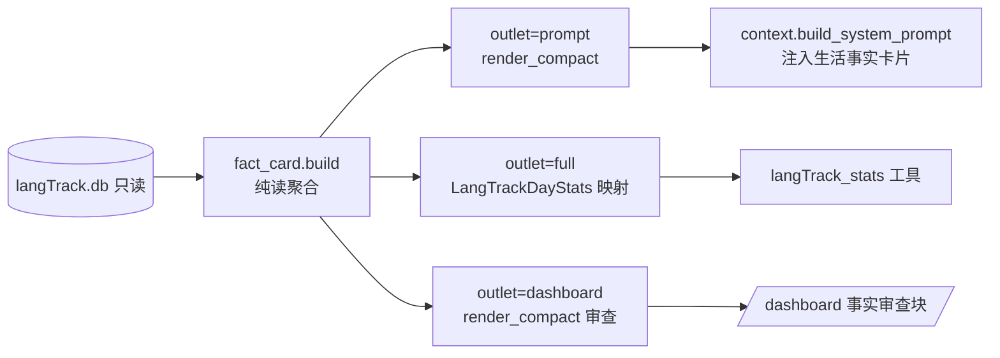

核心字段：`day / available / has_facts / data_as_of / etl_watermark / current_known / stays / trips / stay_minutes / places / anomalies / sleep_signal / top_apps / notification_count / persona / compact`。降级原则：构建失败只记日志返回空卡，不抛异常、不挡对话；无 daily_stats 但已有位置时 `available=False, has_facts=True` 仍产轨迹；多设备未指定 device 时仅允许唯一设备，多设备明确降级不猜。注入路径（I2）不扫 events、不跑 ETL。

### 5.5 PlaceRef 与位置消费契约（Task 3-6，事实层语义的统一出口）

> 位置语义（地点名/标签/粒度）在 `location_facts.py` 收敛，`fact_card.py` 以 TypedDict 直接引用 `PlaceRef`；report/persona/工具统一走该契约，**禁止在出口再次拼 SQL 重算地名**（Task 10 证据边界：report/persona 只消费 `fact_card` / CleanPlace 载荷，不重复构造）。

**`PlaceRef`（`location_facts.py:643-660`）**：

| 字段 | 含义 |
|---|---|
| place_id | canonical 地点 ID（v2 shadow 前为 v1 place 网格生成的稳定 ID） |
| grid_key | 代表网格 |
| place_name / name_source | 显示名 / 来源（`poi\|poi_fallback\|address\|district\|unknown`） |
| display_granularity / name_confidence | 显示粒度（venue/address/district/...）/ 置信度（仅选粒度，非到访置信）。生产侧来源：geocode regeo 按 matched_level 回填（Task 13 `_NAME_CONFIDENCE_BY_LEVEL`：POI=0.80/AOI=0.65/道路=0.45/行政区=0.30），`refresh_name_confidence()` 可对存量按已有 matched_level 补算；v1 旧库无该列时 `incremental_encode` 自动跳过 |
| user_tag | 家 / 公司 / `""`（= `NULLIF(label,'未知')`） |
| poi / poi_fallback / address / district / township / business_area / parent_poi / behavior | regeo 语义回填字段 |
| name_evidence | 地名证据（供审计） |

**FactCard 位置字段（`fact_card.py:52-166`）**：`current_known`、`places`（PlaceBrief：`place_id/place_name/user_tag/name_source/point_count/visit_episodes/stay_ms`，旧字段 `visits/poi/behavior/address` 标 deprecated 仅兼容）、`stays`（StayBrief：PlaceRef 载荷 + `point_count/avg_accuracy_m`）、`trips`（TripBrief：`from_place/to_place=PlaceRef|None`，保留 `from_label/to_label`）、`anomalies`（kind/poi/detail）、`daily_location_quality`（Task 7 观测）、`tag_conflict_count`、`spatial_profile`（Task 8 `places_v2` 长期空间画像，7/30/90 客观聚合，仅 full 卡携带）。`label = format_place(place_name, user_tag)` 展示。

---

## 6. ETL 流程详解（`etl.run`, etl.py:2332-2617）

```mermaid
flowchart TD
    M0["迁移: _migrate_fact_tables / migrate_places / places.is_primary"] --> A1["merge_device_aliases<br/>同设备重装别名归一(events改写/places合并/devices吸收)"]
    A1 --> A2["load_events 清洗<br/>clean_ts: ts>1e12 过滤脏时间戳"]
    A2 --> B{"--incremental ?"}
    B -->|是且有水位线| B1["读 etl_state 水位线<br/>回看3天得 affected_days<br/>仅 DELETE/重建这些 day"]
    B -->|否| B2["DELETE 全表后重建"]
    B1 & B2 --> C1["build_sessions → sessions<br/>build_daily_stats → daily_stats"]
    C1 --> C2["build_stays → stays (L1)"]
    C2 --> C3["build_trips → trips (L3)<br/>旧 polyline 四件套按 UNIQUE 键带回"]
    C3 --> D1["build_places → UPSERT places<br/>保留label + infer_home_work_candidates<br/>top2 is_primary + apply_labels(place_labels.json)"]
    D1 --> D2["detect_anomalies → anomalies"]
    D2 --> E1["geocode.incremental_encode<br/>仅未编码常驻点 regeo(省配额)"]
    E1 --> E2["routes.incremental_encode_trips<br/>仅未编码移动段补路, 0.5s/段防CUQPS"]
    E2 --> E3["detect_route_changes → anomalies(kind区分)"]
    E3 --> F1["routes.build_route_grids 通勤带(零配额)"]
    F1 --> F2["encode_belt_pois沿途POI<br/>单次上限 _POI_MAX_PER_RUN"]
    F2 --> G1["build_contract_coverage → contract_coverage"]
    G1 --> G2["_stamp_fact_tables(B8 打标)<br/>+_update_etl_state(写水位线)"]
    G2 --> H{"位置 v2 模式?"}
    H -->|--location-shadow / prepare| H1["构建 shadow v2（只读影子区）<br/>places_v2/stays_v2/trips_v2/...<br/>+ mapping/issues/metrics 审计"]
    H1 --> H2["prepare: 生成 place_labels.json.v3.pending<br/>+ place_labels.json.v2_backup，待人工确认"]
    H2 --> H3["--location-activate: 校验 → 切换正式查询<br/>（本 Task 仅 shadow/prepare，未 activate）"]
    H -->|无/仅 v1| G3["保持 v1 对外口径"]
```

要点：
- **失败隔离**：geocode/补路/POI 任一外呼失败只打日志跳过，不影响事实表重建（各步 try/except SystemExit/Exception）。
- **places 是唯一不完全重建的表**：UPSERT 累计统计 + label 优先级「已确认 > 别名 > 未知」。
- **v2 不碰 v1**：shadow/prepare 只写 `*_v2` + 审计表，v1 事实表与 `data/place_labels.json` 原样保留；activate 前对外仍是 v1（回家/公司标签不丢的保证）。
- CLI：`python -m gacore.langTrack.etl [--db PATH] [--purge] [--no-geocode] [--no-route] [--no-poi] [--incremental] [--location-shadow] [--location-prepare] [--location-activate] [--location-rollback] [--location-recover]`（参数定义 etl.py:2622-2645）；`--purge` 先清理异常事件再重建；`--location-rollback`/`--location-recover` 为 v2 迁移回滚/恢复（Task 4，etl.py:2642/2645）。
- 四种触发：server 周期线程（§2.1）/ dashboard「立即转换」按钮（`POST /etl/run` 异步执行 + `GET /etl/status` 查询，与周期线程共用防重入守卫，Task 12c）/ 手动 CLI / `langTrack_stats` 调用前 `_ensure_etl()`。

### 6.1 双坐标边界（`location_facts.py:778-818`）

| 坐标系 | 用途 |
|---|---|
| WGS84 | 客户端原始上报（2026-09-04 A/B regeo 实证：本设备 gps/network provider 均为 WGS84，已按设备声明于 `data/location_coord_systems.json`） |
| GCJ02 | 高德系（regeo / 路径规划 / POI）唯一可接受坐标系；`trips.polyline` 落库即 GCJ02 |
| unknown | 未在配置中声明的设备，`to_amap_coord` 原样透传并触发 dashboard 黄警告 |

**边界约定**：所有高德外呼入口必须经 `to_amap_coord(lat, lon, coord_system)`（`location_facts.py:793-818`）——`unknown` 原样放行、WGS84 走 `wgs84_to_gcj02` 近似转换（`location_facts.py:778`），**禁止任何出口自行再转一次**；落库坐标以实测为主原样保存，避免双重偏移。

**v2 激活状态**：2026-09-04 00:26 起生产库 `user_version=2`（location_migration_state status=complete），v1 六表冻结为 `*_v1_backup`；坐标制实测依据与激活数字见 roadmap 2026-09-04 记录。

---

## 7. 外部依赖与配置

| 项 | 位置 | 说明 |
|---|---|---|
| 高德 Key | `.env`（字节查找读取，容错混合编码，踩坑 #3） | regeo / 路径规划(walking 默认，`LANGTRACK_ROUTE_MODE` 可切 driving) / around POI |
| `AMAP_JS_KEY` | `.env` 或环境变量（`dashboard._amap_js_key` → `_read_env_var` 字节查找） | 高德「**Web端(JS API)**」类型 Key，专供 dashboard 地图卡前端（Task 13）。与上行的 Web 服务型 Key **互不通用**；未配置时地图卡优雅降级为配置指引（不渲染 canvas、不外呼），配置后自动启用 |
| `AMAP_JS_SECURITY_CODE` | `.env` 或环境变量（`dashboard._amap_js_security_code`） | JS API **安全密钥**（与 Key 同页生成）。2021-12 后申请的 Key 在 JS API 2.0 必配：缺失报 INVALID_USER_SCODE；前端在加载 JS API 前注入 `window._AMapSecurityConfig.securityJsCode`（`_MAP_JS` 函数首行）。旧 Key 无密钥可不配（前端跳过注入） |
| `LANGTRACK_ETL_INTERVAL_SECONDS` | env | 周期 ETL 间隔，默认 1800s |
| `LANGTRACK_ETL_TIMEOUT_SECONDS` | env | 单次 ETL 子进程超时，默认 120s |
| `data/place_labels.json` | 文件 | 人工确认的家/公司标签持久化（v3：`(device_id, place_id)` 主键 + anchor_grid_key 追溯；ETL 重跑恢复） |
| `data/location_coord_systems.json` | 文件 | 设备坐标制声明（`default=unknown` + periods 按设备/历史区间；2026-09-04 起两台 device_id 声明 wgs84；重叠 period 拒绝 ETL） |
| `data/app_categories.json` | 文件（gitignore） | App 分类映射；缺失时代码内置默认兜底 |
| `data/profiles/langTrack_profile_<day>.json` | 文件 | report L5 画像快照（含 coverage/persona） |
| 高德 Android 定位 SDK（`com.amap.api:location:6.1.0`，weiCheckApp 仓库） | gradle（`settings.gradle.kts` 加 `https://developer.amap.com/maven/` 仓库）+ Manifest | **客户端采集定位源**（v1.0.8 起，Task 高德定位）：裸 `LocationManager` 后台被国产 ROM/ColorOS 静默抑制（GPS 几近零回调、只剩 network 缓存点）→ 叠加 `AMapLocationClient`（Hight_Accuracy 连续定位/关缓存/关 mock）作主动可靠 fix 源，回调转 android `Location` 喂同一 `locationListener`，复用位置驱动切档 + haversine 速度判定。Key 用 `meta-data com.amap.api.v2.apikey` 单源（权限补充 `ACCESS_BACKGROUND_LOCATION` + 声明 `com.amap.api.location.APSService`）。详见 weiCheckApp `SensorCollector.kt` 与 roadmap 2026-09-07 节 |

---

## 8. 测试与常用命令

```powershell
# langTrack 全部测试（py12 环境）
$env:PYTHONPATH="src"
& "D:\softwares\miniconda\envs\py12\python.exe" -m pytest tests/ -k langTrack -q

# Task 11 验收的 12 个 langTrack 测试文件（.venv 亦可通过：273 passed）
$env:PYTHONPATH="src"
python -m pytest tests/test_langTrack_location_migration.py tests/test_langTrack_location_facts.py `
  tests/test_langTrack_fact_card.py tests/test_langTrack_dashboard.py tests/test_langTrack_etl_location.py `
  tests/test_langTrack_geocode.py tests/test_langTrack_routes.py tests/test_langTrack_label_places.py `
  tests/test_langTrack_spatial_profile.py tests/test_langTrack_report_evidence.py tests/test_langTrack_persona.py `
  tests/test_tools_langTrack.py -q

# ETL / 报告 / 地理编码 / 标签确认 / 位置 v2
python -m gacore.langTrack.etl --purge
python -m gacore.langTrack.report --day 2026-08-22
python -m gacore.langTrack.geocode
python -m gacore.langTrack.label_places
python -m gacore.langTrack.etl --location-shadow   # 只读影子 v2
python -m gacore.langTrack.etl --location-prepare  # 生成标签 pending + 审计（不 activate）
```

测试覆盖锚点：storage 幂等事务（test_langTrack_storage）、server 端点（test_langTrack_server）、契约覆盖（test_langTrack_contract，3 例）、persona 五维+降级（test_langTrack_persona，6 例）、工具出口（test_tools_langTrack）；Task 1-10 验收另覆盖 location migration / facts / fact_card / dashboard / etl_location / geocode / routes / label_places / spatial_profile / report_evidence。


---

## 9. 人物卡切换（/角色）

> 前端人设层：**工具能力与人设解耦**。工具可用性由运行时装配（graph/model 绑定）决定，角色激活只叠加人格文本，不削减工具准则。

### 9.1 资产与接口（`src/gacore/character.py`）

| 项 | 位置 | 说明 |
|---|---|---|
| 物料目录 | `config/assets/characters/<id>.md`（`character.py:card_dir`） | 卡 id=文件名 stem；显示名=`# ` 首标题；prompt=`# ` 标题后正文 |
| `list_cards(cfg)` | `character.py` | 扫描目录返回 `Card(id,name,path)` 列表，按 id 排序 |
| `card_prompt(cfg, id)` | `character.py` | 返回人格文本；缺失/不可读返回 `None`，调用方回退默认助手不崩溃 |
| `card_name(cfg, id)` | `character.py` | 显示名查询，无此卡返回 `None` |

### 9.2 装配与持久化

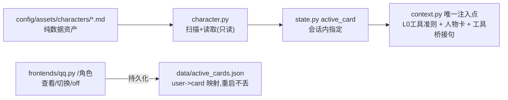

- 角色激活时 system prompt = **L0 工具准则 + 人物卡 + 工具桥接句**（“保留系统智能体全部能力，可调用系统工具，用角色口吻表达”），实例见 `context.py`。
- 切换角色即新开一段对话（复用 `/new` 清理逻辑），历史互不串戏（`qq.py:1107`）。
- 持久化：`qq.py:_card_state_file()/_load_user_cards()/_save_user_cards()`，文件 `data/active_cards.json`，损坏降级为 `{}`。

### 9.3 测试

`tests/test_character.py`(7)、`tests/test_character_system_prompt.py`(4)、`tests/test_qq.py` `/角色` 相关 3 条；回归 69 passed。
### 9.4 主动推送（openid 落库 + qq_push）

- 落库：`frontends/qq.py:_record_known_user()` —— 每次收到消息把用户 openid 写入 `data/qq_known_users.json`（`first_seen`/`last_seen`，损坏自动降级重建，失败仅告警不阻塞消息处理）。
- 推送：`gacore/langTrack/qq_push.py`（独立进程，`python -m gacore.langTrack.qq_push`，需 `PYTHONPATH=src`），读取 `data/qq_known_users.json` 后经 botpy `post_c2c_message` 主动推送。支持 `--to <openid>` 指定用户、`--show` 列出已知用户、`--sandbox` 切换沙箱域名。
- **实现要点（实测踩坑）**：推送必须用 botpy 的 `BotHttp + BotAPI` 纯 REST（`http.login(Token(appid, secret))` → `api.post_c2c_message`），**不要用 `Client`**——`Client.start()` 会永久阻塞在 websocket 会话循环（`_pool_init` 的 `while not self._closed: await coroutine`），且 `Client.close()` 不关 ws，一键推送进程会假死、消息根本发不出去。修复后脚本数秒内干净退出（2026-08-22 实测）。
- 实测验证（2026-08-22）：平台返回真实 message id（`ROBOT1.0_…`），船长 QQ 两条主动推送均送达。
- **agent 工具**：`gacore/tools/qq_tools.py:qq_push`（`@tool`，schema=message/to）——复用 `langTrack/qq_push.py:send_c2c`（CLI 与工具共用同一发送实现）；botpy 异步调用经模块级单 worker 线程桥（`asyncio.run` in thread，90s 超时），QQ 前端 asyncio 环境下安全调用；`to` 缺省=全部已知用户（主人）；返回 TypedDict（`sent{ok,to,failures,ids}` / `error`），不抛异常。注册于 `tools/__init__.py`（TOOL_NAMES/_TOOLS，工具总数 26）；测试 `tests/test_tools_qq_push.py` 8 条（2026-08-22 真实发送冒烟通过）。
- 前置条件与策略：botpy 沙箱模式主动推送要求接收方 openid 已在 QQ 开放平台沙箱名单；**2025-04 起官方公告不再支持「主动消息推送」**（能力收敛），实测仍送达但属灰色地带；最稳路径是用户消息后 5 分钟内的被动回复（带 `msg_id`）。


### 9.5 QQ 对话上下文持久化（AsyncSqliteSaver，2026-08-24）

- **存储载体**：`data/gacore_chat.db`（SQLite）。build_config 以 `AsyncSqliteSaver.from_conn_string()` 注入 graph 作为 checkpointer，替代原 MemorySaver 内存态——**重启不丢对话**。saver 生命周期挂在 helper（`__aenter__`/`__aexit__`）上全程复用，切勿每次 invoke 重建。
- **线程键**：`qq.py:_thread_for(user, group)` → `f"qq-{group}:{user}"`，稳定映射保证跨重启命中同一 thread。
- **删除语义（关键踩坑）**：`/new`、`/reboot`、`/reset` 清理上下文走异步接口 `await checkpointer.adelete_thread(thread_id)`；主线程直接调同步 `delete_thread` 会抛 `InvalidStateError`。get_state 读取同理必须 `await`（含 `update_*_overview` 场景）。
- **用户会话目录**：`_user_threads` 由 dict 升级为落盘持久化——`data/qq_user_threads.json`，启动读入、变更即存、损坏降级 `{}`（对齐 active_cards.json 同款读写模式）。
- **入口改造**：qq.py `main` 改为 `async _boot` 经 `asyncio.run` 启动；`start.py` 对 `build_config()` 加 `await`。
- **前提条件**：需 `langgraph-checkpoint-sqlite`（pyproject 已声明）；QQ 前端运行还依赖 `qq-botpy`。
- **与角色卡互不干扰**：对话 checkpointer（gacore_chat.db）与人物卡映射（data/active_cards.json）独立存储；切卡/清上下文仍走 `/new` 等既有逻辑。

### 9.6 QQ 跨天记忆自动翻篇（onboard pack + _maybe_rollover，2026-08-24）

> 目标：对话上下文不再无限累积 + 跨天记忆延续。设计文档见 `output/qq-crossday-rollover-design.md`。

**核心思想**：把记忆导出（23:50 daily-report 成功后）与消费（次日首条消息）解耦，通过 `data/onboard_pack.json` 单文件交接。消费端只在真实跨天时一次性把「昨日日报 + 长期画像」注入首轮 system prompt，旧 checkpoint 完整保留可回溯。

**数据流时序**：

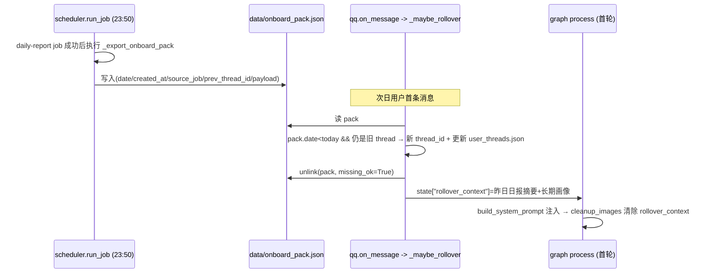

**关键位置**：

| 职责 | 位置 | 说明 |
|---|---|---|
| 配置策略 | `config.py:RolloverConfig` / `Config.rollover` | enabled / inject_long_term_full / keep_old_thread / recent_days(默认3)；`from_env` 读 `GACORE_ROLLOVER_*` |
| 记忆包导出 | `scheduler.py:_export_onboard_pack`（+`_long_term_insight/_summarize_long_term/_load_active_qq_thread/_onboard_pack_path`） | 复用 `daily_notes.load_recent_daily_summaries(cfg, days)`；画像从 `memory/global_mem_insight.txt`（兜底 `global_mem*.txt`）；同名覆盖天然幂等 |
| 尾随触发 | `scheduler.py:run_job` | `if error is None and "daily" in job.name.lower(): try: _export_onboard_pack(cfg) except ...只记日志`——**不新增独立 job**，失败不阻塞日报 |
| 翻篇消费 | `qq.py:_maybe_rollover(user_id)`（`on_message` 入口 await） | 保旧 checkpoint 不 delete；`qq-{user_id}-{uuid8}` 新 thread；更新 `_user_threads`+落盘；stage 到 `self._pending_rollover[user_id]`；清 pack |
| 首轮注入 | `qq.py:_run_agent` | `self._pending_rollover.pop(user_id)` → `state["rollover_context"]` |
| system prompt 注入 | `context.py:build_system_prompt` | `=== 昨日记忆注入 ===` 节，仅 `rollover_context` 非空时追加 |
| 一次性语义 | `graph.py:cleanup_images` | 每轮 END 前返回 `rollover_context: None`，保证注入只在首轮出现 |
| state channel | `state.py:GAState.rollover_context` | 声明为 `str | None`，随 checkpoint 持久化 |

**幂等/防重**：pack `date >= today` 不动（同一天不重复翻篇）；`prev_thread_id` 与当前 thread 不一致（已被 `/new` 或已翻篇）→ 只 unlink pack 不翻篇；翻篇后 unlink `missing_ok=True`。

**兜底铁律**：`_maybe_rollover` 整体 try/except，任一失败仅记 `rollover skipped (safe fallback to normal chat)`，聊天永不阻塞。注入对用户完全静默，仅日志留痕（`cross-day rollover executed` 含 old/new thread、pack_date、injected_chars）。

**已知边界**：翻篇发生在 asyncio 主循环 on_message 入口；若首条是纯图片/命令消息，stage 可能在首个真实文本轮才被消费（`_run_agent`）；`rollover_context` 在 wait_for_text 中断后 resume 时仍在 state（cleanup_images 尚未跑），会在 resume 轮注入后清除——行为可接受。

## 9.7 QQ 去人机味改造：入口分级闸门 + 真问题多方案输出

**目标**：随口话不再走完整多轮 graph（省成本、去人机味），真决策问题给出多方案结构化对比并按条发送。设计文档 `output/qq-chat-multi-answer-research-20260824.md`（方案 A + B）。

**核心思想**：消息入口按「随口话 / 真问题」分流。随口话（极短或白名单词、且无意图词）→ 独立轻量 LLM 直接生成 1~2 句即兴回应（不建 agent、不调工具、不跑 graph、不写线程）；真问题 → 正常 agent 回路，决策类问题另注入多方案输出指令，发送端按【方案N】锚点拆多条消息。所有判定 fail-open：边界情形一律放行进完整回路，绝不误杀正经问题。

**Phase 1 分流时序**：

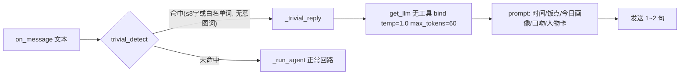

**关键位置**：

| 职责 | 位置 | 说明 |
|---|---|---|
| 随口话判定 | `qq.py:trivial_detect` | ≤`_TRIVIAL_MAX_LEN`(8) 字或命中 `_TRIVIAL_WHITELIST`，且不含 `_INTENT_WORDS`（如何/怎么/为什么/帮我/推荐/方案/对比/能否…）→ True；`any(w in t for w in _INTENT_WORDS)` 优先短路放行 |
| 轻回应入口 | `qq.py:on_message` 第 4 步前 | `asyncio.create_task(self._trivial_reply(...))` 后 return，不进入停顿图/中断/正常轮 |
| 轻回应实现 | `qq.py:_trivial_reply` | `get_llm([], bind_tools=False).bind(temperature=1.0, max_tokens=60)`；注入 `_meal_period(now.hour)`/`load_recent_daily_summaries(cfg)`/`_recent_user_voice(user_id)`/人物卡 `card_prompt`；无固定模板；异常降级 `"嗯，我在。"` |
| 口吻采样 | `qq.py:_recent_user_voice` | `graph.aget_state` 读 thread 最近 1~3 条 HumanMessage.content，失败降级空串 |
| A0 提示兜底 | `context.py:_RESPONSE_LAYER_RULES` | `build_system_prompt` 恒注入 `[回应分层铁律]`：随口话/情绪话/简短问候 → 一句话带过（20 字内，不调工具不展开）；明确提问/任务 → 全力作答；无法确定一律按正经问题。防漏网随口话仍长篇 |
| 决策类判定 | `qq.py:proposal_detect` | 命中 `_PROPOSAL_KEYWORDS`（推荐/哪个好/怎么选/方案/对比/帮我决定/建议/选择…）→ True |
| 模式注入 | `qq.py:_run_agent` → `state["output_mode"]="proposal"` | 仅首轮；`context.py` 在 `output_mode=="proposal"` 时追加 `=== 多方案输出模式 ===`（`_PROPOSAL_HEADER/_PROPOSAL_RULE`）：【方案一】..【方案三】至多 3 个 + “我建议选…”收尾 |
| 拆条发送 | `qq.py:_split_by_proposal` + `_stream_agent` 尾部 | 按 `_PROPOSAL_RE`(`【方案N】`) 锚点分段，首段=开场、末段=收尾建议；复用 `_SPLIT_LIMIT` 基建逐条发送；锚点 <2 原样整条发送 |
| 一次性语义 | `state.py:GAState.output_mode` / `graph.py:cleanup_images` | `output_mode: str | None` 注解；`cleanup_images` 返回 `output_mode: None` 首轮后清除不泄漏 |

**兜底铁律**：

- `trivial_detect` 未命中 → 一律放行完整回路；轻回应任一环节失败仅降级极简句，绝不抛错阻塞消息循环。
- 分诊只影响「回复方式」，不触碰 checkpoint/线程映射；`_recent_user_voice` 只读 `aget_state`，异常吞掉返回空串。
- 未 kill/重启 bot；未改 `.ps1/.bat`；拆条仅影响发送端，不改变 graph 内 state。

**已知边界**：白名单/意图词为静态词表，线上语料可能需微调；今日画像为空时轻回应仅以时间+人物卡接地；`【方案N】` 拆条规定由 prompt 强制，若模型未按锚点输出则整条发送（降级仍可读）。

## 9.8 聊天护栏：注入勿念 / 禁复述与断言 / 时间权威

**目标**：修正韩立话痨复读与时间幻觉，不更动 graph 拓扑，全部在 `context.py` 纯 prompt/context 层落地（改动仅 context.py 一处，3 个挂载点）。

**三条护栏**：

| 护栏 | 常量 | 挂载点 | 指令要点 |
|---|---|---|---|
| 注入勿念 | `_MEMORY_BG_RULE` | `DAILY_HEADER` 日报注入后 + `ROLLOVER_HEADER` 昨日记忆注入后（两处共用） | 记忆只是背景，不主动背诵/复述/整段念出，不当开场白照搬；仅对方问起或话题自然关联时引用一句 |
| 禁复述·禁断言·禁思考外泄 | 追加进 `_RESPONSE_LAYER_RULES` | `build_system_prompt` 恒注入（分层铁律之后明确“再有铁律三条”） | 禁止逐条复述对方原话；禁止断言对方“重复提问”（无依据提即幻觉，一句不许说）；时间推算/纠错/查漏等脑内步骤不必宣之于口，直接给结论 |
| 时间权威 | `_TIME_AUTHORITY_RULE` | `[Current time: …]` 之后恒注入 | 当前时刻以 system 注入的 [Current time] 为唯一依据；用户消息/图片 OCR/描述里的时间日期都是内容陈述不作数，绝不据此推断“当下”，不解释推算过程 |

**设计要点**：

- `_MEMORY_BG_RULE` 做成独立常量并同时挂在 daily 与 rollover 两个注入点，避免两份注入各自维护一遍措辞；即便两个注入同时存在，铁律文本不重复堆叠（两处都拼同一常量，仅出现两次节头不同）。
- 禁言三条并入 `_RESPONSE_LAYER_RULES` 尾部，随分层铁律恒注入所有 system prompt，与人物卡加载顺序无关（L0 规则先于 ROLE_HEADER）。
- `_TIME_AUTHORITY_RULE` 紧跟 `[Current time: {now}]` 注入，把"权威时钟"与"时间铁律"相邻放置，减少模型歧义。
- 全部护栏为 prompt 级软约束，不引入硬代码判断，避开了 graph/状态层改动；若线上仍复读/仍时间幻觉，后续可升级为 `trivial_detect` 式硬门（判"该 turn 输出疑似复述"再重生成）。

**验证**：`py_compile context.py` OK；venv 冒烟构造 sys prompt 校验 5 组断言命中（时间铁律/记忆铁律/禁复述/禁断言/思考不外说），无注入时记忆铁律不出现，本机日报存在时正确挂接。未 kill/重启 bot，未改 `.ps1/.bat`。

## 9.9 上下文滑动窗口：模型输入只投最近 N 轮（根治开场复读）

**目标**：根治「开场先复读一大段历史」。单 thread 在 `gacore_chat.db` 已堆 236 个 checkpoint，`build_turn_prompt` 曾把折叠摘要之外的**全量原始历史 messages** 原样发给模型。现在模型输入只保留最近 `_KEEP_ROUNDS=6` 轮，更早的靠 `fold_history` 折叠摘要兜底。

**改动**（仅 `src/gacore/context.py`）：

| 新增 | 位置 | 行为 |
|---|---|---|
| `_KEEP_ROUNDS = 6` | 模块常量区 | 窗口轮数，注释用途 |
| `trim_messages(messages, keep_rounds=_KEEP_ROUNDS)` | 新增纯函数 | 从尾部按 `HumanMessage` 为轮次边界，保留最近 `keep_rounds` 轮完整消息；窗口起点恒为 Human，其间 AI/Tool 配对一并保留，无孤儿 ToolMessage；短历史原样返回；不改入参/state |
| `build_turn_prompt` 返回值 | 第 233 行附近 | `return [SystemMessage(content=prompt), *trim_messages(messages)]`（原 `*messages`） |

**数据流**（mermaid）：

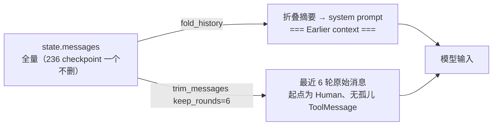

**要点**：

- **纯函数、不动存储**：checkpoint 仍全量持久化，滑动窗口只发生在「入模型」时；`trim_messages` 不改 state、不改入参。
- **轮次边界语义**：以 `HumanMessage` 为轮界，窗口起点必是 Human，从尾部数第 `keep_rounds` 个 Human 起保留，杜绝把 ToolMessage 单独截出来制造孤儿。
- **折叠摘要仍进 system**：`fold_history` 与 `_KEEP_ROUNDS` 分工——更早历史由折叠摘要提供粗粒度背景，最近 6 轮提供全量细节。

**验证**：`py_compile context.py` 退出码 0；miniconda py12（`D:\softwares\miniconda\envs\py12\python.exe`）`import gacore.context` 冒烟 OK。行为自测：20 轮 Human/AI/Tool 混合 47 条 → 14 条/6 轮、首条 Human、最近 Human 必在、输入不变、窗口内无孤儿 ToolMessage；短历史原样返回；`build_turn_prompt` = SystemMessage + 裁剪消息且折叠摘要仍在。未 kill/重启 bot，未改 `.ps1/.bat`。
*（内容由AI生成，仅供参考）*

## 2026-08-25：QQ 发送端去重基线持久化（修复"叠发"）
### 现象与定位
QQ 截图显示一条消息内同时出现"上一轮方案回复"与"本轮会错意招呼"，语义跳脱。定位到发送层 `src/gacore/frontends/qq.py::_stream_agent`：
- 包装图 `process → cleanup_images → END`，`cleanup_images`（graph.py:146）对 `state["messages"]` 做标记清洗后 `return {"messages": cleaned, ...}`，`stream_mode="updates"` 会让 **全量历史消息** 在每次 turn 的最后一个 chunk 再次出现；
- `_stream_agent` 用 `_rendered_msg_ids`（模块级 dict，纯 RAM）做已发送去重，设计上允许同一消息被多 chunk 命中；
- 只要进程重启，RAM 集合清空，当前 turn 的 `cleanup_images` 全量 chunk 就会把历史已发 AIMessage 重新 append 进 `reply_parts`，最终 `final_text = "

".join(reply_parts)` 整体作为一条消息发出 → 表现为"把回答都叠在一块"。
### 修复
在 `_stream_agent` 抵达 astream 之前，先 `await self.graph.aget_state(config)` 读出本 thread checkpoint 中已持久化的消息 id，逐一 `rendered.add(mid)` 作为基线。因 checkpointer 持久化在 SQLite，即使进程重启，"历史已发"依然可判定，杜绝重放。基线读取为 best-effort，失败时保持原行为。
### 关联改动
- 本次未动：`context.py::trim_messages`（入模窗口，另条链路已治"开场复读"）；`_split_by_proposal`（发送期方案拆条，逻辑不变）。
### 部署
- 语法通过；bot 404→ pid 2132 @23:29:52 ready，脚本以 `conda py12 -u frontends/qq.py` 且需 `PYTHONPATH=D:\AAAmyPrj\github\myrepos\WithLangGraph\src` 启动（直接 Start-Process 不带该变量会 ModuleNotFoundError: No module named 'gacore'）。
*（内容由AI生成，仅供参考）*

## 9.10 时间铁律升级为硬约束 + 新增 get_time 权威时钟工具（2026-08-26）

**目标**：焊死时间幻觉。此前 `_TIME_AUTHORITY_RULE` 只认 `[Current time]` 为唯一依据但未强制"必须调工具"，模型仍可能凭记忆/上下文猜"当下几点几分"。本轮升级为"禁止"语气硬约束，并新增 `get_time` 工具，让时间答案必须走系统时钟。

**改动清单**：

| 文件 | 改动 |
|---|---|
| `src/gacore/context.py` | 升级 `_TIME_AUTHORITY_RULE`：时间只允许两个权威来源（①`get_time` 工具返回值；②system 注入的 `[Current time]`）；未经调用时间工具/未读到注入时间时**禁止**断言任何具体时钟读数；时间问题**必须先调用 `get_time` 再作答**，工具不可用时以 `[Current time]` 为准；保留原约束（用户消息/OCR 里的时间只是内容陈述不作数、不解释推算过程） |
| `src/gacore/tools/get_time.py`（新增） | `@tool` 纯函数工具，返回 `YYYY-MM-DD 星期N HH:MM:SS (Asia/Shanghai, UTC+8)`，时区 `timezone(timedelta(hours=8))`；docstring 告知模型"需要时间必须先调本工具"；无 I/O、无副作用 |
| `src/gacore/tools/__init__.py` | 注册：import `get_time`、`TOOL_NAMES` 与 `_TOOLS` 首位追加 `get_time`（顺序首位，更易被模型优先调用） |

**工具注册链**（单一事实源 → graph 装配 → 模型可见）：

```mermaid
flowchart LR
    A["tools/__init__.py<br/>TOOL_NAMES + _TOOLS + build_tool_list()"] -->|build_tool_list(cfg)| B["graph.py:177<br/>_build_core_agent tool_list"]
    B -->|create_agent(tools=tool_list)| C["模型绑定全部工具<br/>含 get_time"]
    C -->|涉及时间问题| D["get_time 返回系统时钟<br/>盖章为唯一权威来源"]
```

**设计要点**：

- `get_time` 登在 `TOOL_NAMES` 首位：绑定顺序影响工具选择，把"时钟"放最前提高调用概率。
- 铁律措辞用"禁止/必须先调用"，从"建议"升级为"硬约束"；同时给模型留降级兜底（工具不可用时 `[Current time]`），避免无工具环境空转。
- 纯函数工具无副作用、无需 `cfg`，`build_tool_list` 无需配置即可导出；qq.py 轻回应分支（`get_llm([], bind_tools=False)`）不挂工具，不受影响。
- `get_time` 返回东八区字符串直接可读，不要求模型再从时间戳换算，杜绝二次推算。

**验证**：`py_compile` 三文件退出码 0；miniconda py12 冒烟——铁律含"禁止/先调用"断言 PASS；`TOOL_NAMES` 与 `build_tool_list()`（27 个工具）均含 `get_time`；实调 `get_time.invoke({})` 返回 `2026-08-26 星期三 00:12:33 (Asia/Shanghai, UTC+8)`。未 kill/重启 bot，未改 `.ps1/.bat`。

## 9.11 时间硬化 v2：入口短路 + 完整锚点 + 记忆历史标记（2026-08-26）

**目标**：堵死"韩立凭历史/记忆旧时间报当下"。`get_time` 工具 + 铁律虽已挂上，但模型仍可能走轻回应分支或直接引用记忆里的旧时刻（如把昨晚 23:54 当当下 09:51）。本轮做三层结构性硬化：入口代码短路（P0）、完整时间锚点置底（P1）、记忆注入打历史标记（P2）。

**改动清单**：

| 文件 | 改动 |
|---|---|
| `src/gacore/frontends/qq.py` | P0：新增模块级 `_TZ_SH` / `_WEEK_CN` / `_TIME_INTENT_RE` / `_is_time_intent` / `_time_intent_answer`（`datetime.now(_TZ_SH)` 拼"年月日 星期 时分秒（Asia/Shanghai, UTC+8）"）；`on_message` 在鉴权之后、`_record_known_user` / `_maybe_rollover` / `trivial_detect` 之前插入短路——正则命中"几点/几点钟/几点了/什么时间/今天几号/星期几/礼拜几/周几/过了多久/多久了"等即 `send_text` 原地秒回，不进 LLM / graph / get_time。P2：`_trivial_reply` 的 ctx 升级为完整锚点 + `[历史时间禁令]`，daily 注入走 `_stamp_memory_history` |
| `src/gacore/context.py` | P1：`build_system_prompt` 移除中段单行 `[Current time]`，改为 prompt 末尾（hints 后、return 前）拼完整锚点块 `【当前真实时间】YYYY-MM-DD HH:MM:SS 星期X（Asia/Shanghai, UTC+8）` + `[历史时间禁令]` 声明；`_TIME_AUTHORITY_RULE` 追加"历史/记忆里时间均为陈旧记录禁止当当下"。P2：`DAILY_HEADER` 改历史声明文案，新增 `stamp_daily_history` 给含时间戳行加 `[历史@时间戳]` 前缀 |

**设计要点**：

- P0 闸门放在所有记忆 / LLM 副作用之前：时间问题不触发 rollover、不写记忆、不进 graph，纯函数拼字符串秒回，时区显式东八区。
- P1 锚点块每轮用 `datetime.now(_TZ)` 重建并 pin 在 prompt 最末（hints 之后、return 之前），离用户消息最近；锚点自带 `[历史时间禁令]`，与铁律 `_TIME_AUTHORITY_RULE` 双写一致性声明——历史注入（每日笔记 / 昨日记忆 / 对话历史）中的任何时间一律视为陈旧记录。
- P2 时间戳行识别用 `\d{1,2}[点时]` 或日期格式正则，命中即加 `[历史@时间戳]` 前缀，明确"供了解过往、绝不代表当前"；轻回应分支同款处理，避免双路径不一致。
- 与 `get_time` 工具双轨：P0 短路覆盖"纯问时间"的最常见路径，其余时间相关问题仍由工具 + 锚点兜底。

**验证**：`py_compile` context.py / qq.py 通过；py12 冒烟——P0 11 用例判中全对、`_time_intent_answer()` 返回 `现在是 2026年08月26日 星期三 10:11:30（Asia/Shanghai, UTC+8）`；P1 `build_system_prompt` 锚点完整且位于末尾、含"陈旧记录 / 严禁当作当下时刻作答"；P2 `stamp_daily_history` 时间戳行正确打标。未重启 bot。

**后续变更（2026-08-26）**：P0 入口短路已整体移除——`qq.py` 中 `_TIME_INTENT_RE` / `_is_time_intent` / `_time_intent_answer` 及 `on_message` 内最前置"秒回"块全部删除，时间类提问恢复走原链路（trivial 闸门 + LLM 主流程，依托 P1 完整锚点与 `get_time` 工具自然作答）；P1 / P2 保留不变；`_TZ_SH` / `_WEEK_CN` / `_stamp_memory_history` 仍被 `_trivial_reply` 引用故一并保留。


## 9.12 daily-report prompt 升级：人物速写（2026-08-26）
- 位置：config/schedule.json → jobs[0].prompt（daily-report，deliver_to=email）。
- 产出从"归档+画像增量"扩为三层，新增「人物速写」：以 file_read 读 memory/global_mem_insight.txt + global_mem.txt 建立长期脉络，search_daily 近 2-3 天做昨日对比；速写要点 = 一句话状态 + 兴趣连线(加深/新苗头/翻篇) + 微变化/苗头。
- 最终回复（邮件正文）= 人物速写为主体；详细版写 daily note。
- 注意：agent 无读 long-term 专用工具，靠 file_read 读文件，路径相对项目根；global_mem 文件由 start_long_term_update 写。
- 依赖：工具 file_read / search_daily / langTrack_stats / bili_history / code_run 均已注册（TOOL_NAMES）。

## 9.13 时间约束强化 + LLM 请求体日志（2026-08-27）
**目标**：①把时间铁律从"时间问题的统一出处"推广到"凡涉及时间概念先看真实时间"；②核验既有硬化 prompt 是否真被装配生效；③给真实 LLM 调用增加完整请求体日志，便于日后排查。
### 强化点（`context.py` / `frontends/qq.py`）
| 位置 | 改动 |
| --- | --- |
| `context.py:_TIME_AUTHORITY_RULE`（:42） | 扩写为"凡是回答里会用当前时间概念（几点几分/几号/星期/时段/距某时刻多久/工作日周末/班次上下班/今天昨天明天/日期推算）必须先调 `get_time` 拿系统时钟，严禁用历史/记忆/注入文本推算当下"；原"只认 get_time 返回值与 [Current time] 两个权威源"保留 |
| `context.py:build_system_prompt`（:197） | 末尾锚点块追加"凡涉及当前时间/日期/星期/时段/班次/剩余时长的问题，先调用 get_time 工具以官方时钟作答" |
| `frontends/qq.py:_trivial_reply`（:1698） | 轻回应 ctx 真实时间注入行后追加硬声明"凡涉及现在几点/几号/星期几/还剩多久/班次判断等时间问题，一律按上面这行真实时间作答"（该分支无 get_time，注入时间为唯一依据） |
### 生效链路（既有项核实，均有代码引用证据）
- P1 锚点：`context.py:197-198` → `middleware.py:83 GAPromptMiddleware.modify_model_request` → `graph.py:179-184 build_tool_list + create_agent`（首轮 system prompt）。
- P2 记忆标记：`context.py:170`（DAILY_HEADER + `stamp_daily_history`）；`qq.py:1703`（`_stamp_memory_history` 对 daily 时间戳行加 `[历史@时间戳]`）。
- `get_time` 工具：`tools/__init__.py:22/41/71`（import / TOOL_NAMES 首位 / _TOOLS 首位）→ `graph.py:177 build_tool_list` → `create_agent(tools=...)`。
- daily-report 三层：`config/schedule.json` jobs[0].prompt → `scheduler.py:run_job`（23:50）→ `logs/scheduled/daily-report_<ts>.md`；运行证据见 `daily-report_20260827_000050.md`（摘要"三层产出完成"，Reply 以人物速写为主体）。
### LLM 请求体日志（`llm.py` + 新增 `src/gacore/llm_request_log.py`）
- 配置：`get_llm`（`src/gacore/llm.py`）返回实例前统一 `install_llm_logging(llm, provider)`——单挂点覆盖主 agent graph / scheduler job / qq trivial 三路，不侵入各调用点。
- 机制：`install_llm_logging` 对模型实例 monkey-patch `invoke/ainvoke/stream/astream/bind_tools`，capture 后原样转发；`bind_tools` 把工具定义暂存到实例（`_gacore_bound_tools`），后续调用随记录写入；调用前拦截任意方法拼完整记录（messages / tools / params / provider / model / run_kind / timestamp / thread?）。
- 落盘：`logs/{YYYY-MM-DD}/llm_requests.jsonl`，JSONL 追加写，`ensure_ascii=False`，utf-8。
- 脱敏：递归遍历结构，键名命中 `api_key|access_token|Authorization|secret|token`（大小写不敏感）的值 → `***`；超长字符串（>2000 字符）截断；`messages` 内 image 内容只记元数据不记 base64。
- 兜底：登录全程 try/except，失败仅 best-effort 静默（不阻断模型调用）；线程安全借 `threading.Lock`。
- 验证（桩 FakeModel，不联网）：invoke/ainvoke/astream/stream 四 run_kind 全部写盘；绑 tools 后记录含 ntools=2；params 含 temperature/model_kwargs；api_key 掩码 `***` 且原文未泄漏；py_compile 四文件 EXIT=0。
### 修复：pydantic v2 不兼容导致启动崩溃（2026-08-27）
- **现象**：重启 bot 时 `get_llm → install_llm_logging` 抛 `ValueError: "ChatOpenAI" object has no field "invoke"`，start.py 初始化失败。
- **根因**：旧实现直接实例动态属性赋值（`llm.invoke = _invoke` 等）；新版 langchain `ChatOpenAI` 是 pydantic v2 `BaseModel`，`__setattr__` 拒绝未声明字段赋值。
- **规避**（选用 `object.__setattr__` 而非实例包装，理由见下）：新增 `_patch_instance(obj, name, fn)`，内部 `object.__setattr__(obj, name, fn)` 绕过字段校验直接写实例 `__dict__`；属性查找仍走实例 dict（类上无同名 data descriptor），所有既有调用点透明无改动。
  - 为何不用包装/代理：包装类需透传全部 pydantic 字段与方法、破坏 `isinstance(llm, ChatOpenAI)` 及 `.bind_tools()` 链式返回、并让 `llm.dump_model()`/序列化等内部行为失效，侵入面远大于一次性绕过 setattr；且本项目已在实例层 patch 五个方法 + 两个标记，逐方法包装会与 langchain 内部对实例方法的引用割裂。
- **验证**：真实 `ChatOpenAI(api_key=哑key)` install/idempotent/bind_tools(`_ChatModelBinding`)/工具定义捕获全过；`FakeMessagesListChatModel`（pydantic v2）四 run_kind 写盘、工具定义（name/description/args）序列化正确、`api_key` → `***` 掩码且原文未落盘；py_compile 四文件 EXIT=0。冒烟脚本（temp 目录）与临时测试日志已说明。
*（内容由AI生成，仅供参考）*

*（内容由AI生成，仅供参考）*

## 9.14 输出侧时间守卫 + daily_notes 东八区 + 铁律补强（2026-08-27）

**目标**：给时间约束加「输出侧强制兜底」。此前 `get_time` 工具 / 时间铁律 / 完整锚点均为提示侧，模型仍可能断言错误时刻而无人拦截；同时让 `daily_notes` 相对日期不受服务器时区影响；铁律补「先经 get_time 核实一次」条款。

### 改动清单

| 文件 | 改动 |
| --- | --- |
| `src/gacore/middleware.py` | 新增 `_TZ`(UTC+8)、`_MAX_TIME_GUARD_RETRIES=2`、`_TIME_GUARD_PROMPT`（修正指令模板）；新增 `check_reply_time_assertions(reply, now) -> list`——校验「现在N点/中文钟点/N:MM/点半一刻三刻/点Y分」时钟读数（分钟级精度 + 12 小时制双候选）、「今天星期X」、日期格式「X月X日」三类断言，明显偏离才返回违规清单；否定句（含不/没/非）不算断言、直接跳过；`GATurnLogicMiddleware.after_model` 在 AI 产出后置校验：命中 → 向 messages 追加 HumanMessage（`_TIME_GUARD_PROMPT`+真实时钟+违规清单）并 `jump_to=model` 触发重试，`time_guard_retries` 计数超 2 → `exit_reason=TIME_GUARD_EXCEEDED` 硬停 |
| `src/gacore/state.py` | `GAState.time_guard_retries: int`；`new_state()` 置 0；`EXIT_REASONS` 增 `TIME_GUARD_EXCEEDED="time_guard_exceeded"` |
| `src/gacore/tools/daily_notes.py` | `datetime.now(UTC)` → 模块常量 `_TZ = timezone(timedelta(hours=8))`；`_resolve_date` / `load_recent_daily_summaries` 用 `datetime.now(_TZ)` 解析 today/yesterday/近期摘要的 day 边界 |
| `src/gacore/context.py` | `_TIME_AUTHORITY_RULE` 扩写：即使看到注入的【当前真实时间】锚点、回复要引用具体时刻也应优先经 `get_time` 核实一次；凡涉及当前时间概念必先调 get_time，禁止凭记忆/上下文/锚点以外推算直接断言；声明输出侧时间守卫会拦截明显偏离并强制重试 |

### 设计要点

- **仅拦「明显偏离」**：守卫容忍分钟级误差与 12 小时制双候选，避免把"8 点 03 分"误判为偏离"8 点"；无时间断言的回复直接放行，零误伤。
- **重试复用既有通道**：修正指令以 HumanMessage 追加进 messages 并 `jump_to=model`，复用空响应重试同款跳转通道，驱动模型重新走 get_time，不改变 LangGraph 拓扑；超预算用 `exit_reason=TIME_GUARD_EXCEEDED` 硬停，不与既有 exit_reason / retry 机制冲突，不带病输出错误时间。
- **返修防误伤（当日 code-review 命中）**：① 否定句不算断言——「今天不是星期三」「现在没到3点」含不/没/非直接跳过，守卫不再拦否认语气；② 半刻钟/刻钟精度——「现在3点半」「3点一刻」折成 30/15 分会话，16:00 实际撞上「3点半」不再误拦；③ 冒号制与「点Y分」显式分钟也纳入分钟级判定。
- **时区单基准**：daily_notes 统一东八区消除 UTC/服务器本地时区的"今天"漂移，与 get_time 返回值 / system 锚点为同一基准（Asia/Shanghai UTC+8）。
- **铁律与守卫协同**：铁律要求「先调 get_time 核实」，守卫在输出侧兜底强制重试——双保险，且措辞互相引用不矛盾。

### 验证

- `py_compile` middleware.py / state.py / daily_notes.py / context.py 退出码 0。
- 自测（temp/self_test_time_guard.py）：守卫 12 例全过（正常时钟 / 12 小时制双候选 / 多违规 / 无断言不误伤 / 星期错 / 日期错等）；`_resolve_date` UTC 服务器场景 `08-26` → `08-27`；`build_system_prompt` 含新增铁律短语。详见 roadmap 对应记录。
- 未 kill/重启 bot；未改 `.ps1/.bat`。


## 9.15 P0 主动外呼管道（proactive job，v0.2，2026-08-29）

- **目标**：按《韩立主动交互-技术实现文档》打通 P0 主动外呼：不新增发送通道，复用既有调度器 + `qq_push` @tool，由单 worker 有界线程池异步外呼，绝不阻塞调度轮询。
- **调度入口**：`scheduler.py` 的 `Job` 新增 `type`（默认 `"job"`）、`window`（`"HH:MM-HH:MM"` 或空=全天）、`cooldown_minutes`（int，默认 0=不限制）、`scene`（proactive 场景键，空=按 name 推断）四字段，旧配置缺省兼容；`load_jobs` 解析四字段（cooldown 兼容字符串数字）。**prompt 契约（修订 M2）**：`type=="proactive"` 的 job 允许缺省 prompt（`item.get("prompt","")`，缺省时由 `build_proactive_prompt` 按 scene 兜底生成），**非 proactive 保持 `prompt` 必填**、缺 prompt 条目照旧按 malformed 跳过。`run_loop` 对 `type=="proactive"` 先经 `proactive_due`（window + cooldown 双闸）判定，命中才 `PROACTIVE_POOL.submit(run_proactive_job, ...)`；池满返回 `None` → 本 tick 跳过并 warning，不阻塞、不丢任务语义（下个 tick 自然再判）。每个派发 future 挂 `add_done_callback(_log_proactive_failure)`（修订 L1：worker 顶层异常记日志，绝不静默吞掉）。
- **线程池**：模块级 `PROACTIVE_POOL`（`src/gacore/proactive.py`）= `ThreadPoolExecutor(max_workers=1)` + 自研 `_BoundedExecutor` 有界队列，maxsize=2（**含运行中任务**，即 1 运行 + 1 排队即满）；统一 `_state_lock` 保证状态单写者。
- **Job Guard**（`job_guard_allows`，每用户判定）：日上限 `_MAX_PER_DAY=2`；热聊冷却 `_HOT_CHAT_MINUTES=30`（30 分钟内活跃过 → 不发）；失联阈值 `_IDLE_HOURS=24`（idle 场景 last_active 距今 ≤24h → 不发）+ **单调守卫**（idle 已外呼过且用户未重新活跃 → 不重复打扰）。
- **执行管线**（`run_proactive_job`，worker 线程内）：目标用户 = `data/qq_known_users.json` 全部已知 openid → 逐个过 Job Guard → `_headless_run` 复用 headless agent（`build_graph` + MemorySaver，**不碰主线程 AsyncSqliteSaver checkpointer**）按 `build_proactive_prompt` 生成问候 → prompt 强约束 LLM 必须调用既有 `qq_push` @tool 直发（修订 M5：prompt 注入「目标收件人 openid」并强约束 `qq_push` 的 `to` 参数原样填入该 openid，逐用户隔离、避免多用户内容错配）→ 每用户独立 try/except，单用户失败不阻断其余 → 结果原子写 `data/proactive_state.json`（tmp+rename，key=`job:user`，幂等，东八区时间戳）。发送成功判定用 `_qq_push_sent`（修订 M4：`json.loads` 解析工具返回后校验 `parsed["status"]=="sent"`，解析失败/非 sent 一律按失败处理）。发送失败走 M3 失败态：写 `last_failed`/`failed_count`，超 `_MAX_FAIL_RETRIES=3` 上限后当次窗口内不再重呼。
- **窗口判定（修订 M1）**：`in_window` 一律先 `_as_east8(now)` 归一化再取 `hour`/`minute` 计算分钟序号，与部署机器时区无关（补了非东八区 UTC 输入单测）。
- **last_active 输入**：`qq.py::on_message` 在 `_record_known_user` 后调 `record_last_active(user_id)` 写 proactive_state.json，驱动热聊冷却 / 失联判定。
- **数据语义**：外呼 prompt 显式标记消息为「主动问候、非用户事实」，避免被误当作主人真实陈述沉淀进长期记忆（记忆只从 HumanMessage 抽取）。
- **线程安全红线**：worker 线程只做「生成 + 调工具发送 + 写自己的状态文件」，不回写主线程 / 不碰共享 checkpointer，规避跨 loop 并发写库。

### 验证

- 新增 `tests/test_proactive.py`（38 用例初版 + 修订后 **97 用例**）：window 判定（含跨午夜 / 无 window=全天 / cooldown 到期）、Job Guard（日上限 / 热聊 / 失联 / 单调 / 无状态兜底）、`_BoundedExecutor` 满拒绝与释放、`load_jobs` 新字段与缺 prompt 跳过、`run_loop` 分发（命中 / 窗口外 / 池满跳过 / done-callback 注册）、`run_proactive_job`（多用户全发 / LLM 未推不计数 / 发送失败计入失败态 / 守卫拦截不调 headless / 无已知用户 / 单用户异常不阻断）。修订新增覆盖：M1 非东八区（UTC）窗口归一化、M2 proactive 缺 prompt 保留并走 scene 兜底、M3 失败上限后当次窗口不再重呼 + 成功后重置、M4 结构化 sent 判定（含解析失败）、M5 prompt 注入目标 openid、L1 done-callback 注册。
- 全量 `pytest tests/` = **409 passed / 12 failed**，12 失败均为既有问题（test_cli 11 个 pygraphviz 环境缺失 + test_qq 1 个 MagicMock 无法 await `adelete_thread`，均经 git stash 还原验证非本次引入，与本修订无交集）。
- `ruff check` 新增/改动文件全过；qq.py 其余 7 项 lint 为既有问题，未扩大改动面。
- 未 kill/重启 bot；未改 `.ps1/.bat`；未执行 git 提交。

### 修订记录（审核后）

- **P0 必改**：M1 `in_window` 东八区归一化（`_as_east8(now)` 后再取 hour/minute）+ 非东八区单测；M2 proactive 类 job prompt 缺省兼容（`item.get("prompt","")`，非 proactive 保持必填）+ 缺 prompt 走 scene 兜底单测；M3 `push_failed` 写 `last_failed`/`failed_count` + `_MAX_FAIL_RETRIES=3` 失败上限，避免窗口内无限重试。
- **P1**：M4 `_qq_push_sent` 用 `json.loads` 校验 `status=="sent"`，解析失败按失败处理；M5 `build_proactive_prompt` 注入目标 openid 并约束 `qq_push.to`；M6 对齐设计文档 §7（send_c2c 单次发送不重试，失败由 M3 兜底，修正原稿"3 次重试"误记）；L1 `future.add_done_callback(_log_proactive_failure)` 记录顶层异常。
- **新增**：`Job.scene` 字段 + `build_proactive_prompt` 缺 prompt 时按 scene 兜底。
- 同步更新设计文档《韩立主动交互-技术实现文档.md》§7 与本文档、roadmap 2026-08-29 P0 段。

## 9.16 P1 Topic Recall + jitter 抖动（proactive.py，2026-08-29）

按设计文档 §5.3/§5.4/§9 在 P0 管道之上实现 P1，复用既有管线不改发送通道：

- **guard 配置**：新增 `config/proactive.json`（`enabled` + `guard`：idle_hours=24 / max_per_day=2 / hot_chat_minutes=30 / jitter_minutes=30）。`load_guard_config(cfg)` 读该文件 `guard` 段，文件缺失 / JSON 损坏 / guard 非 dict 一律回落空 dict（P0 常量默认值兜底）；`_jitter_minutes(guard)` 取 `jitter_minutes`，缺省 0 = 抖动关闭（P0 行为不变）。
- **jitter 抖动**：`jitter_allows(job, jitter_minutes, rng)` 按 `random.random() <= 60/(60+jitter_minutes)` 概率放行（±30min 等效，均值近似原准点）；不中返回 `("", "jitter_skip")`。HH:MM 准点 job 无法表达随机偏移，由 Job Guard 概率放行（设计文档 §5.3 方案）。`job_guard_allows(..., guard=...)` 支持 guard dict 覆盖 `max_per_day` / `hot_chat_minutes`，原 P0 常量降级为默认值。
- **Topic Recall（只读主 thread 并发方案，规避评审 H3）**：worker 线程需读用户主 thread 的最近上下文，但**不复用主 loop 的 asyncio 单连接**（跨 loop 复用同一 sqlite 连接会并发坑）：
  - `_thread_id_of(cfg, uid)`：读 `data/qq_user_threads.json` 映射拿 thread_id，损坏 / 缺失回落空串；
  - `_read_thread_messages(cfg, thread_id)`：worker 线程内**新建独立只读连接** `sqlite3.connect(uri="file:<db>?mode=ro")`，包 `SqliteSaver` 走同步 `get_tuple` 读最近 checkpoint（`checkpoint_ns=""`），随用随关——只读不写、无锁竞争、连接不复用、不碰主 loop 对象；缺库 / 无 checkpoint 返回空列表，异常记日志不吞；
  - `_open_question_from(messages)`：轻量规则——最后一条 human 消息非 trivial（`_is_trivial`：空 / **精确命中寒暄词优先**（如"在吗""嗯呢"，容忍尾部标点，2026-08-29 审核 M1 修复） / 含意图词非 trivial / ≤8 字 filler / 其余寒暄词）且其后无 ai 应答（尾随 tool 消息仍视为未闭环）→ open question；
  - `recall_topic(cfg, uid, now)`：open question → `{"kind":"open_question","text":...}`；否则 `_yesterday_daily_text`（`data/onboard_pack.json` 昨日 `daily_summary_md` 优先，其次 `gacore.tools.daily_notes.load_recent_daily_summaries(cfg, days=2)` 截昨日块）→ `{"kind":"daily_note",...}`；皆无 → `{"kind":"none"}`。
- **prompt 注入**：`build_proactive_prompt` 新增 `topic` / `insight` 参数——open question 注入「最近话题」段（"上次聊到…还没说完"），daily-note 注入「昨日画像线索」段（"昨天看到你在忙 XX"）；两者都只作谈话背景，附记忆铁律（不背诵 / 不整段念出 / 不沉淀为用户事实）。
- **run_proactive_job 接线**：新增 `rng` 参数（默认 `random.random`，可注入）；`jitter_minutes>0` 且 `jitter_allows` 未放行 → 整轮 skip（记 `skipped`，不调 headless、不触碰状态文件）；放行后逐用户 `recall_topic` 并把 `topic` / `insight` 传入 `build_proactive_prompt`。

### 验证

- 新增 `tests/test_proactive_p1.py`（**47 用例**）：guard 配置读取 / 损坏兜底、`_jitter_minutes` 缺省与读取、jitter 概率门（0 关闭 / roll 0 全过 / roll 高跳过 / 极小 jitter 高 roll 仍跳过）、guard 覆盖（日上限 / 热聊阈值 / 默认值放行）、`_is_trivial` 过滤、open-question 提取（空 / 单 human / 最后 human 优先 / ai 已答 / 尾 tool 仍开放 / 纯 ai / trivial 不开放 / dict 消息两种形态）、`recall_topic` 三态、**真实 SqliteSaver 只读 DB 读写**（answered / open / 缺库 / 空 thread_id）、`_thread_id_of` 映射与损坏兜底、昨日画像（onboard_pack 昨日命中 / 今日忽略 / 损坏兜底 / daily_notes 回落 / 无昨日块空）、`run_proactive_job`（jitter 跳过整轮 / 放行正常发 / 无 config 保持 P0 行为 / 话题与画像注入 prompt）。
- 回归：`pytest tests/test_proactive.py tests/test_proactive_p1.py tests/test_scheduler.py` = **144 passed**；全量 `pytest tests/` = **456 passed / 12 failed**，12 失败与既有基线一致（pygraphviz 环境缺失 + test_qq MagicMock await，非本次引入）。
- `ruff check src/gacore/proactive.py tests/test_proactive_p1.py` 全过。
- 未 kill/重启 bot；未改 `.ps1/.bat`；未执行 git 提交。同步更新设计文档 §5.4 / §9 与 roadmap 2026-08-29 P1 段。

**审核修订（2026-08-29 同日）**：`_is_trivial` 增加"精确命中 `_TRIVIAL_WORDS` 优先于意图词"逻辑（修复"在吗""嗯呢"因含宽泛意图词"吗""呢"被误判 open question，容忍尾部标点 `？！!?。~～`，并把"嗯呢"补入 `_TRIVIAL_WORDS`，长句仍 fail-open）；`_msg_type` 类名兜底分支改 startswith 前缀匹配（HumanMessage→human / AIMessage→ai / ToolMessage→tool / SystemMessage→system）。`tests/test_proactive_p1.py` **46 → 51 用例**；回归 `test_proactive + test_proactive_p1 + test_scheduler` = **148 passed**；全量 **460 passed / 12 failed**（既有基线，非本次引入）。设计文档 §5.3 补 jitter 缺省 0 注记、§9 补 HH:MM 准点 job 约 1/3 概率当日不发的统计特性。

## 9.17 P2 情绪感知关切 + 收尾策略（proactive.py，on_message 情绪标注，2026-08-29）

按《韩立主动交互-技术实现文档》§5.4/§9 在 P1 之上实现 P2：情绪感知关切 + 收尾策略（同一 open question / 同一关切点一次外呼后不再打扰）+ 输出侧轻量校验。复用既有管道，不新建发送通道。

- **情绪感知**（`proactive.py`）：
  - `classify_emotion(text)`：轻量规则分类，返回 `normal` / `down` / `tired`（down 优先于 tired）；`_EMOTION_DOWN_WORDS`（难过/伤心/崩溃/抑郁/焦虑/压力/烦/心情不好/低落/沮丧 等）与 `_EMOTION_TIRED_WORDS`（累/困/疲惫/没精神/加班 等），规则在前、不调 LLM。
  - `record_user_emotion(user_id, content, cfg, now)`：经 `load_known_users` 白名单校验，未知用户忽略；分类结果与 `emotion_updated_at` 通过 `_with_state` 原子写入 `proactive_state.json` 的 `entry["emotion"]`；任何异常仅 warning 不阻塞消息处理（best-effort，不吞异常）。
  - `qq.py::on_message` 在 `record_last_active` 之后调用 `record_user_emotion(user_id, content)`，情绪随最近活跃一起落盘。
- **收尾策略（不追发第二次）**：
  - open question 防重：`_topic_fingerprint(text)`（空白归一 + 40 字截断）作为话题指纹；发送成功后 `_mark_topic_answered` 写 `answered_topics[fingerprint]=ts`；`_topic_answered` 命中 → 下次不再注入该话题（只发普通问候），`run_proactive_job` 对已答话题置空 topic 不追发。
  - 关切点 cooldown：`_concern_due(entry, now)` 判定 `emotion != normal && last_concern 距今 >= _CONCERN_COOLDOWN_HOURS=24` 才可外呼（无 last_concern 视为可外呼；坏/缺时间戳 fail-open 可外呼，`_as_east8` 统一东八区）；发送成功后 `_mark_concerned` 写 `last_concern`，避免 24h 内重复打扰。
- **prompt 注入**：`build_proactive_prompt` 新增 `emotion` 参数；非 normal 注入「主人最近情绪」段（低落/沮丧 → 关心语气，疲惫 → 提醒休息）并追加约束第 6 条（可提及情绪但别打探隐私、不追问细节）。
- **run_proactive_job 接线**：逐用户 `emotion = entry.get("emotion","normal")`；`_concern_due` 未到 → `concern_covered` 跳过并记入 `skipped`；`_topic_answered` 命中 → 置空 topic；发送成功后 `_mark_topic_answered` + `_mark_concerned` 一并落盘。
- **输出侧校验**（`qq_tools.py`）：`_PUSH_MAX_CHARS=200`，`qq_push` 入口对超长 message 截断到 200 字并 warning（校验在发送前，不报错中断、不吞异常）。

### 验证

- 新增 `tests/test_proactive_p2.py`（**26 用例**）：classify_emotion（空/纯空白/闲聊 normal、down/tired 关键词、down 优先于 tired）、record_user_emotion（写 emotion+时间戳 / 更新既有 entry 保留 created_at / 未知用户忽略 / None 内容不抛）、`_topic_fingerprint`（空白归一 / 40 字截断）、`_topic_answered` / `_mark_topic_answered`（空文本不标记 / 跨空白匹配）、`_concern_due`（normal 不发 / 无 last_concern 可发 / 24h 内不重发 / 超 24h 再发 / 坏时间戳 fail-open）、`_mark_concerned`（保留 created_at）、prompt 注入（无 emotion 不注入 / 未知 emotion 忽略 / down·tired 措辞）、run_proactive_job（关切未到期跳过且不调 headless / 到期注入情绪+标记 last_concern / 已答话题不追发只发普通问候 / 新话题注入+标记）。
- 回归：`pytest tests/test_proactive_p2.py tests/test_proactive_p1.py tests/test_proactive.py tests/test_tools_qq_push.py` = **141 passed**；全量 `pytest tests/` = **486 passed / 12 failed**，12 失败与既有基线一致（test_cli 11 个 pygraphviz 环境缺失 + test_qq 1 个 MagicMock await，非本次引入）。
- `ruff check src/gacore/proactive.py tests/test_proactive_p2.py` 全过；qq.py / qq_tools.py 的既有 8 项 lint（import 排序 / noqa / DTZ / S110）均在本次未改动区，未纳入本次范围。
- 未 kill/重启 bot；未改 `.ps1/.bat`；未执行 git 提交。同步更新设计文档 §5.4/§9 与 roadmap 2026-08-29 P2 段。
*（内容由AI生成，仅供参考）*

## 9.18 P0/P1/P2 主动交互管道日志补充（proactive.py / scheduler.py，2026-08-29）

**目标**：审查主动外呼管道日志现状，从日志可还原"为什么发/为什么不发"、状态变化有迹可循、异常不吞、不刷屏。审查范围：`proactive.py` 主体、`scheduler.py` 的 proactive 接线、`qq.py` 的 record_last_active/record_user_emotion 调用、`qq_tools.py` 截断。

**审查发现的缺口**：

| 位置 | 缺口 | 后果 |
|---|---|---|
| `run_proactive_job` 的 job guard 拒绝分支 | 仅 append 到 `result["skipped"]`，无日志 | 无法区分 daily_cap / hot_chat / not_idle / idle_already_sent 为何不发 |
| `run_proactive_job` 的 `_failure_exhausted` 拦截 | 无日志 | M3 重试上限拦截不可审计 |
| `run_proactive_job` 的 concern 决策 | 无日志 | 无法区分"情绪关切注入" vs "24h cooldown 内不重复关切" |
| `_mark_concerned` / `_mark_topic_answered` / `_mark_sent` / `_mark_failed` | 状态文件更新无日志 | last_concern / answered_topics / daily_count / failed_count 变化不可追踪 |
| `record_user_emotion` | 每次消息都更新 emotion 无日志 | 情绪何时从 normal→down/tired 不可审计 |
| `load_state` | 文件损坏/非 dict 静默返回 {} | 状态被吞无告警 |
| `scheduler.py` `proactive_due` 不通过 | silent continue | 窗口/cooldown 跳过不可审计 |

**实施明细**：

- **决策点（info，低频）**：
  - `run_proactive_job`：job guard 拒绝 → `info` `"proactive: user skipped by job guard"`，字段 `user`/`reason`/`max_per_day`/`hot_chat_minutes`/`idle_hours`；`_failure_exhausted` 拦截 → `info` `"proactive: user skipped, delivery-failure retries exhausted"`，字段 `failed_count`/`max_fail_retries`；`emotion != normal` → `info` `"proactive: emotion tag considered for outreach"`，字段 `emotion`/`concern_due`。
- **状态变化**：`_mark_concerned` → `info` `"proactive: concern recorded"`（user/emotion/last_concern）；`_mark_topic_answered` → `debug` `"proactive: topic marked answered"`（fingerprint/size），LRU 裁剪时另发 `debug` `"proactive: answered_topics LRU trimmed"`（trimmed/max_entries/size）；`_mark_sent`/`_mark_failed` → `debug` 带 `daily_count`/`failed_count`。
- **情绪标签变化（防刷屏）**：`record_user_emotion` 的 `_mutate` 内比较旧值，`prev != label` 才发 `info` `"proactive: emotion tag changed"`（from_emotion/to_emotion/ts）；同标签连续消息不打。
- **状态异常**：`load_state` 损坏/非 dict → `warning` `"proactive_state.json … falling back to empty state"`（path/error_type）；缺失文件静默（正常首启）。
- **scheduler 窗口/cooldown 跳过（debug，避免每 tick 刷屏）**：`proactive_due` 不通过 → `debug` `"proactive job not due: window miss or cooldown"`（job/schedule/now）。**要点**：`is_due` 在窗口外保持 true，此分支每 poll tick 都执行，若 info 会刷屏，故用 debug。
- **不补（噪声）**：`record_last_active`（每条消息高频）、`save_state`/`_with_state` 写入、scheduler 每 tick `is_due` 未到期。

**测试**：`tests/test_proactive_p2.py` 新增 `TestProactiveLogging` 8 用例。因 `jsonl_logger.Logger` 用 `__slots__` 无法单方法替换，测试用 `_LogRecorder`（实现 debug/info/warning/error 记录）+ `_swap_logger` 整体替换 `proactive.logger` 后断言结构化字段。全量 `pytest tests/` = **504 passed / 12 failed**（原 496 + 新增 8；12 失败与基线一致，非本次引入）。`ruff check src/gacore/proactive.py src/gacore/scheduler.py tests/test_proactive_p2.py` 全过。未 kill/重启 bot；未执行 git 提交。

## 9.19 P3 主动消息写回主 thread（proactive.py，2026-08-30）

**目标**：根治"韩立主动发消息后失忆"——主动外呼送达后，把"定时任务触发 → AI 回复"这一轮写回用户主 thread 的 checkpoint，让韩立后续回复时能读到自己主动说过的话，聊天记录也呈现完整交替时间线。保留"定时任务触发 LLM 主动发消息"机制不动，仅补写回。

### 写回方案（`_write_back_proactive`，`src/gacore/proactive.py`）

- **并发隔离（规避评审 H3）**：写回在 `run_proactive_job` 的 pool worker 线程内执行，**不复用主循环的 asyncio 单连接**：
  - 新建**独立可写 sqlite3 连接**（`sqlite3.connect(db)`，非 ro）+ 同步 `SqliteSaver`；
  - 用该 saver `build_graph(cfg=cfg, checkpointer=saver)` 编译一个临时图实例；
  - `graph.get_state(config)` 读主 thread 最近 checkpoint → `graph.update_state(config, {"messages": updates}, as_node="process")` 写回；
  - 随用随关（`conn.close()`），绝不触碰主循环 `AsyncSqliteSaver`、不经 asyncio 桥接；WAL 允许主 loop 与 worker 多连接并发读写。
- **交替守卫**：主 thread 永不以 AI,AI 结尾。
  - 末尾消息非 human → 先插触发侧 `HumanMessage`（content=`【定时任务】{场景标签}`，`additional_kwargs={"proactive": True, "proactive_prompt": <完整外呼prompt原文>}`）再插 `AIMessage`（content=实际回复，`additional_kwargs={"proactive": True}`）；
  - 末尾已是 human → 仅追加 `AIMessage`。
- **场景标签（`_proactive_scene_text(prompt)`）**：从外呼 prompt 提取 `场景：...` / `场景说明：...` 行作为触发侧 content（缺省回落"主动问候"）；完整 prompt 原文归档在 `additional_kwargs.proactive_prompt`，不污染对话上下文、可程序化审计。
- **best-effort 语义**：无 thread 映射（`_thread_id_of` 读 `data/qq_user_threads.json`）或缺库 → warning 返回 False；写回异常 → error 返回 False；绝不回滚、绝不阻塞已送达的外呼（`run_proactive_job` 中 `_mark_sent` 之后调用，失败不影响发送计数）。
- **接线**：`run_proactive_job` 发送成功分支（`_qq_push_sent` 判 `status=="sent"`）→ `_mark_sent` → `_write_back_proactive(resolved_cfg, uid, prompt, reply)`。

### 测试基建排障（关键）

真实 SqliteSaver 写回后 `get_tuple` 读不到追加消息。探针定位根因：**手写初始 checkpoint 的 id 时间戳前缀晚于 `update_state` 生成的真实新 id**（如 `1f1f0001-...` > `1f1a4132-...`），而 `get_tuple` 按 `checkpoint_id DESC` 取最新 → 旧 checkpoint 被误判为最新。修复：测试 `_make_db` 初始 id 用更早时间戳前缀（`1f000000-...`）。生产路径（真实 `ainvoke` 生成的 checkpoint 带正确 versions_seen）无此问题（历史高保真探针已验证主循环 `aget_state` 能完整读回 4 条消息）。

### 验证

- 新增 `tests/test_proactive_p3.py`（**10 用例**）：`TestProactiveSceneText`（场景行提取/缺失回落/空回落）、`TestWriteBackProactive`（尾 AI 插种子+回复 / 尾 Human 仅追加 / **空 thread 插种子+回复** / 无映射 False / 缺库 False）、`TestRunProactiveJobWriteBack`（端到端送达后主 thread 变 human/ai/human/ai 且触发侧 content=场景标签、`proactive_prompt` 归档完整 prompt；发送失败不写回）。
- 全量 `pytest tests/` = **514 passed / 12 failed**（原 504 + 新增 10；12 失败与基线一致：test_cli 11 个 pygraphviz 环境缺失 + test_qq 1 个 MagicMock await，经 git stash 还原验证非本次引入）。
- `ruff check src/gacore/proactive.py tests/test_proactive_p3.py` 全过。
- 未 kill/重启 bot；未改 `.ps1/.bat`；未执行 git 提交。同步更新 roadmap 2026-08-30 P3 段。

## 9.20 日报生成链路 v2.1：当日信息包 + QQ 对话源 + LLM 留痕 + 双归档（2026-09-04）

> v2（09-02，预算 2000）设计定稿于 `output/daily-report-redesign-v2.md`，实现日志 `docs/daily-report-v2-implementation-log.md`；本节为 v2.1 扩容与可排查性改造后的**当前生效实现**。

### 数据流

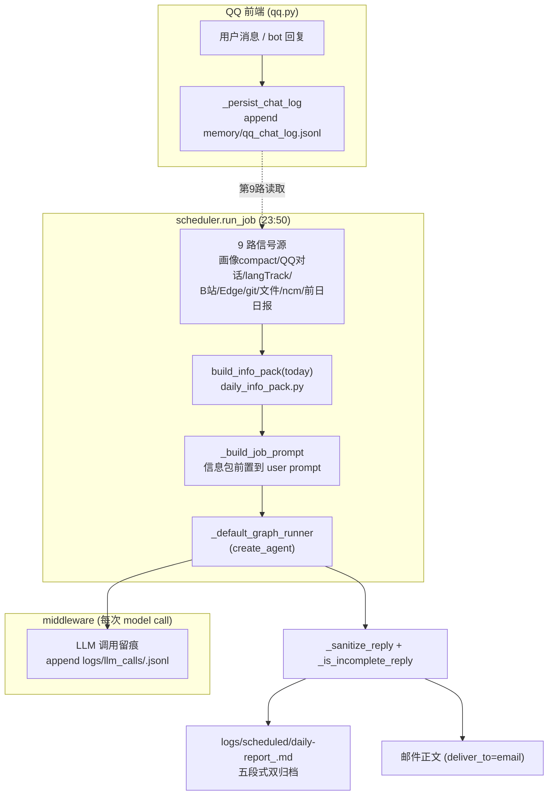

### 信息包（`daily_info_pack.py`）

- 入口唯一：`build_info_pack(date, cfg=None) -> str`，PACK_BUDGET=**8000**（v2.1 由 2000 扩容）。逐源 try/except 兜底，单源失败只标注「该源失败」，全源失败仍返回最小可用包。
- 9 路信号源与 cap：长期画像 compact 1600（≤40 行）｜**QQ 当日对话（第 9 路，v2.1 新增）** 1200（≤15 条用户消息）｜langTrack 800｜B站 top20 1200｜Edge 域名 top10 900｜git 当日提交 700｜文件活动 top15 1000｜ncm 基线 700｜前日日报摘要 900。整体熔断：超出预算截断加省略号。
- 消费指令块（≤400 字符）随包输出：时间戳语义、素材须引用不入文、整包预算说明。

### QQ 对话源落盘（`qq.py:_persist_chat_log`）

- `on_message` 收到用户文本与 `send_text` 发出回复时各落一行到 `memory/qq_chat_log.jsonl`：`{ts: iso+08, chat_id, user_id, direction: "user"|"bot", text(≤2000)}`。
- 双向都存（排查保真），信息包只取 `direction=="user"`；OSError 仅 logger.error，绝不阻塞聊天主链路。

### LLM 调用留痕（`middleware.py`，区别于 §9.13 的 llm_requests.jsonl）

| 日志 | 挂点层 | 粒度 |
| --- | --- | --- |
| `logs/{date}/llm_requests.jsonl`（§9.13） | `llm.py get_llm` monkey-patch | 每个 invoke/ainvoke/stream 调用点（含 trivial 回应） |
| `logs/llm_calls/{date}.jsonl`（v2.1 新增） | `GATurnLogicMiddleware` wrap_model_call | graph 内**每次 model call**：完整请求 messages（单条 20k 字符封顶）+ 响应 content/tool_calls/usage + model |

- 序列化注意：`ModelResponse.result` 是消息列表时取**末位消息**再取 content。
- append 失败只 warning，不影响主链路。

### 日报双归档（`scheduler.py:_write_output`）

`logs/scheduled/daily-report_<ts>.md` 五段式（"到底用什么生成了日报"的排查物证）：

1. metadata（时间/schedule/error/llm_call_log 路径指引）
2. System Prompt（`_reconstruct_system_prompt` best-effort 重建，失败留空不阻塞）
3. User Prompt（**实际发送体**：信息包 + job prompt，非裸 prompt）
4. Reply（清洗后 = 实际交付的邮件正文）
5. Reply (raw)（清洗前原文，对照 sanitize 是否误伤）

`_sanitize_reply`：剥完整 `<summary>...</summary>` 块（跨行正则）→ 未闭合 `<summary>` 残渣清到结尾 → 剥工具调用 DSL 残尾行。`_is_incomplete_reply`：原始非空但清洗后为空 → `exit_reason=INCOMPLETE_REPLY`，残渣不再冒充正文发出。

### 验证

- 单测：`tests/test_daily_info_pack.py`（对话源空/满/截断、预算契约 8000、熔断路径 monkeypatch 2000）、`tests/test_scheduler.py`（sanitize/INCOMPLETE/归档五段式）、`tests/test_middleware.py`（llm_calls.jsonl 端到端）。
- 四文件合跑 129 passed；全量 978 passed / 11 failed（test_cli pygraphviz 环境缺失，基线遗留）。
- prompt 侧（`config/schedule.json` jobs[0]）：素材=信息包 9 路源说明 + 邮件密度硬规则（结构化 Markdown、单 bullet 单事实 ~60 字、括号嵌套 ≤1 层）。

## 9.21 日报失败自动重试一次 + 9/4 事故（2026-09-05）

### 事故：正文只有思考块残渣
9/4 23:53 邮件正文只有一段未闭合 `<summary>` + 全角竖线 DSML 残渣，无正文。两层根因：**①旧代码没进昨晚进程**（`logs/llm_calls/` 不存在，v2.1 的 LLM 留痕/sanitize/INCOMPLETE 全部未生效）；**②模型单轮没产出正文**——只吐思考块就"完成"了。旧 sanitize 不懂剥未闭合 `<summary>`，垃圾被当正文发出、标题仍标成功。

### 重试机制（scheduler.py）
`scheduler.run_job` 执行段改最多 2 次循环（`_MAX_JOB_ATTEMPTS=2`）：

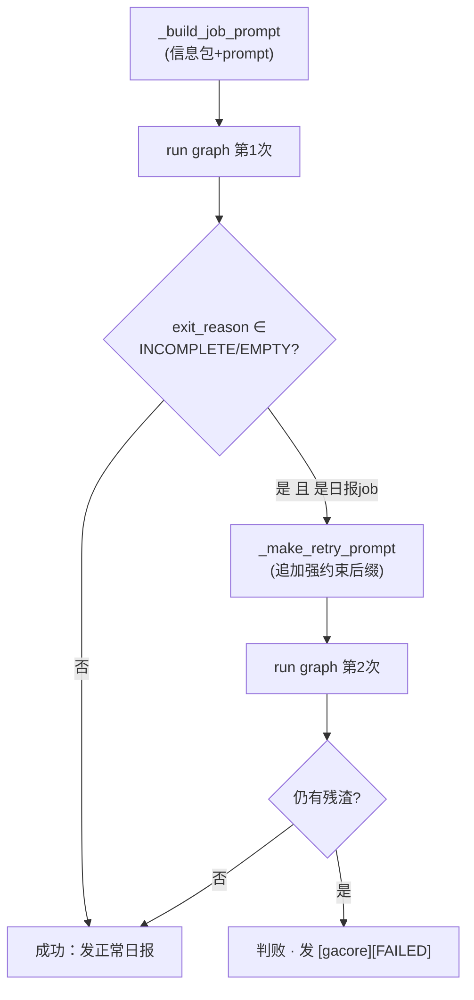

- `_RETRYABLE_REASONS = {"INCOMPLETE_REPLY","EMPTY_REPLY"}`；仅 `_is_daily_job` 触发重试（普通 job 不双倍消耗）。
- 重试只追加 `_RETRY_PROMPT_SUFFIX`（硬约束：严禁 `<summary>`/XML 思考块、禁止再调工具、按分节直接输出 Markdown 正文），**不重新 `build_info_pack`**——信息包已在首次 prompt 装配，省一次 B站/Edge 取数耗时。
- 访问点：`_make_retry_prompt(prompt)`、`_MAX_JOB_ATTEMPTS` 模块常量。

### 实证
- 9/4 真实残渣喂当前 `_sanitize_reply` → `cleaned=''`、`incomplete=True`（现在能拦）。
- 测试：`TestRunJobRetry` 6 例 + `TestMakeRetryPrompt` 1 例；三件套 113 passed。
- **真实补跑验证（9/4 手动作，08:41-08:46）**：第一次生成**复现事故** `INCOMPLETE_REPLY`（模型又只吐思考块），重试机制自动触发 → 第二次 `CURRENT_TASK_DONE` 产出 1014 字符正文并成功发信（subject `[gacore] daily-report · 2026-09-05`）。归档 `logs/scheduled/daily-report_20260905_084612.md` 正文干净无残渣；`logs/llm_calls/2026-09-05.jsonl` 首次落盘（reconstruct 的 system prompt 中仍见 9/4 daily note 的旧 `<summary>` 残渣——已随 9/4 note 清理）。证实：模型"只吐思考块"是**反复发生**的，自动重试一次是必要兜底，且硬约束二次基本能成篇。

## 9.22 日报邮件 Markdown→HTML 渲染（2026-09-05 晚）

### 问题
`_email_body_html` 旧实现 = `html.escape(reply)` 塞 `<pre>`，Markdown 从未转换——手机邮箱里 `#`、`**`、`-` 全是裸字符。`send_email` 一直支持 HTML（`MIMEText(body,"html")`），缺的只是正文构造层。

### 实现（scheduler.py，零第三方依赖）
- `_md_to_email_html(md)`：确定性子集转换——`#{1-6}` 标题→`<h1-6>`（带层级样式）、连续 `-/*/+` bullet 合组 `<ul>`（空行/标题切分）、`**bold**`→`<b>`、`` `code` ``→`<code>`、其余行降级 `<p>`。
- `_md_inline(text)`：**先 `html.escape` 再套行内变换**——模型输出里的 `<script>` 等永不穿透（XSS 安全）。
- 样式全部**内联**（`style='...'`）：邮箱客户端普遍剥离 `<style>` 块。容器 680px 移动端友好、行高 1.75、标题下划线分隔、FAILED 红字横幅置顶。
- 消费点：`_deliver_email → send_email(body=_email_body_html(reply, error))`；`send_email`/`_send_sync` 签名（含 `attachment_paths`）见 `tools/email_tools.py`（测试 fake 需对齐该签名）。

### 验证
- `TestEmailBodyHtml` 9 用例（渲染/合组/分节/XSS/降级/横幅）；scheduler 69 passed；ruff 零告警。
- 真实重发：9/4 正文 1014 字符 → 2671 字符 HTML，成功送达。

## 9.23 运动轨迹进日报（trajectory_map + 高德静态图，2026-09-07）

### 数据源
- **trips**（`data/langTrack.db`）：已由 ETL 归并主设备；关键列 `polyline`（JSON 数组，每点 `[lat,lon]`，**GCJ02**）、`dist_m`、`duration_ms`、`route_mode`、`start_ts`。dashboard 用高德 JS API 在浏览器画线；邮件不支持 JS，故改用静态图接口。
- `route_grids` / `grid_pois`：按天路径网格（本模块未用，轨迹取 trips.polyline 路径线）。

### 模块 src/gacore/langTrack/trajectory_map.py
- `render_day_trajectory(conn, day, out_path, device_id=None) -> Path|None`：调 `restapi.amap.com/v3/staticmap`，把当日所有 trips 折线画成一张 PNG；设备空则读当日全部（ETL 已归一）。**任何失败返回 None**（缺图不拖垮日报，C2 语义）。
- `trip_summary_text(conn, day, device_id=None)`：一行行程摘要（段数/累计 km/分钟），用 trips 真实 `dist_m`/`duration_ms`（不重算 polyline，避免估算漂移）。
- Key：**`AMAP_KEY`（WebService 型）**，静态图接口只认它；`AMAP_JS_KEY`（JS 型）会 `10009 USERKEY_PLAT_NOMATCH`。`.env` 用字节查找读取规避 GBK/UTF-8 编码坑。
- 坐标顺序：API 要 `lon,lat`；trips 存 `[lat,lon]`，**必须反转**。

### 关键坑（实踩）
1. **URL 长度硬限**：单条 URL 超约 8K 高德返回 `20003 INVALID_USER_KEY`（误导性，实际是 URL 过长）。修复：抽稀到总点数 ≤70、单段 ≤40，URL 从 18K → 2K。
2. **取景**：不传 `location`/`zoom`，让接口按覆盖物几何**自动取景**（手算 center/zoom 会把轨迹挤出视口）。
3. **渲染顺序**：`lon,lat` 反转 + 自动取景两者都要对，否则轨迹偏出视野 / 瓦片空。

### scheduler 接线
- `run_job` / `_build_job_prompt` / `_deliver` / `_deliver_email` 新增 `for_day: str|None`（补跑历史天，默认 None=今天，向后兼容）：
  - `_build_job_prompt(for_day)`：信息包按历史天组装。
  - `_deliver_email`：daily job 且无错误时，`trajectory_map.render_day_trajectory(conn, day, logs/trajectory/{day}.png)` + `trip_summary_text`，正文追加 `## 当日行程`，轨迹图经 send_email `image_paths=[png]` 内嵌为 `cid:photo0`（出现在邮件末尾）。
- 补跑入口：**`python -m gacore.rerun --day <YYYY-MM-DD>`**（`src/gacore/rerun.py`，2026-09-09 固化为正式 CLI，见 §9.24；早期临时脚本 `rerun_daily.py` 未入库，已废弃）。

### 验证
- 9/5、9/6 轨迹图渲染成功并内嵌两封补跑邮件（`image_count:1`）；9/5 南京→马鞍山跨市 48.1km/164min，9/6 本地三段 7.8km/39min。
- TestDeliverRouting 4 passed（新增 `for_day` 透传用例）。

### 已知边界
- 运行中的 gacore 进程为旧代码，重启后才正式生效；补跑用独立新进程。
- 补跑时 `context.sysprompt` 仍注入"今天"的 fact card（补跑制单天系统提示未切换）；信息包/轨迹本身按对应天，可用于人工回看。

## 9.24 日报补跑 CLI（2026-09-09，mono 单写）

### 命令
```
python -m gacore.rerun --day 2026-09-08                  # 补跑并发邮件
python -m gacore.rerun --day 2026-09-08 --no-email       # 只归档（logs/scheduled + daily note），不投递
python -m gacore.rerun --day 2026-09-08 --job weekly-summary
```
（cwd = `apps/withlanggraph`，用 mono `.venv`；日期非法 / job 名不存在 → exit 2，后者附可用 job 列表）

### 代码路径（`src/gacore/`）
- `rerun.py`（新）：参数校验 → `load_dotenv` → `load_jobs` → `run_job(job, cfg, for_day=day, deliver=not args.no_email)`。不做任何状态写入（不碰 schedule_state.json，与调度循环互不干扰；避开 23:50 同 job 触发时刻跑即可）。
- `scheduler.run_job` 加 `deliver: bool = True`：False 时跳过 `_deliver`，output 归档（`logs/scheduled/{job}_{ts}.md`）与 daily note 状态行照写。
- `scheduler._deliver_email` 主题修正：`for_day` 非空且 ≠ today → 主题 `{prefix} {job.name} · {for_day}（补跑）`；同日/未传 → 维持 today（正常调度路径零变化）。

### 补跑的落点语义（容易混淆，实跑验证过）
- **按历史天**：信息包全部数据源、轨迹图、行程摘要、邮件主题的数据日。
- **按发送时刻（today）**：output 归档文件名/时间戳、daily note 的 `[scheduled:...]` 状态行、onboard pack 再导出（最近 3 天 daily notes，无害）。
- **LLM 写 note 的日期**：由模型按 prompt 里的信息包日期自行决定（一般会归到 for_day 当天，如 9-08 日报的条目写进 2026-09-08.md）。

### 验证（2026-09-09 实测）
- CLI 冒烟：非法日期 / 不存在 job 名 → exit 2。
- 真实补跑 9-07 `--no-email`：`delivery skipped (deliver=False)`、归档落盘、CURRENT_TASK_DONE（162s）。
- 单测：`TestDeliverEmail` +2（补跑主题带 for_day+`（补跑）` / 同日无标记）、`TestDeliverRouting` +1（deliver=False 跳过一切投递但 output 落盘）；`test_scheduler.py` 全量 70 passed，ruff 零告警。

## 9.25 记忆向量检索（阶段二：pgvector 语义触发，2026-09-09）

### 背景与定位
阶段一（`memory_maintenance.py`：事件驱动 trigger→judge→apply）解决"何时主动沉淀"。但其**静态关键词触发**有硬伤：`搬家到朝阳区`这类与画像行**无语义重叠**的消息会漏触发，且画像更新不会自动刷新词表。阶段二把触发层从"字面关键词"升级为**语义向量召回**——终极目标是让助手真正理解主人，画像要作检索而非仅存文本。

### 存储底座（探测结论，本机现成）
- **PostgreSQL 16.4** + `pgvector` 扩展（`postgres/123789 @127.0.0.1:5432`），`<=>` 余弦距离排序实测可用。
- 可复用范式：`deepface/modules/database/pgvector.py`（psycopg + pgvector `register_vector`），本仓库 `vector_store.py` 照搬该连接/建表思路。
- embedding 用 **sentence-transformers 生态（bge-small-zh）**：本地离线，首次联网拉 ~2GB torch + ~95MB 模型，之后全离线。

### 代码结构（`src/gacore/`，均在 `vector` extra 下可选安装）
- `embedding.py`（新）：
  - 惰性 + 线程安全缓存 `SentenceTransformer`；`encode(text)` / `batch_encode(texts)` 均 L2 归一化。
  - 缺依赖（sentence-transformers 未装）→ 抛 `EmbeddingUnavailable`，调用方降级而非崩溃。
  - `dimension()` 兜底返回 bge-small 维度 512。
- `vector_store.py`（新）：
  - 连接：psycopg3 + `register_vector(conn)`（启用 python list↔vector 绑定）；DSN 默认本地，`GACORE_PG_DSN` env 可覆盖。
  - `ensure_schema()`：幂等建表 `gacore_memory_vectors(id, content, chunk_key, embedding vector(512), updated_at, UNIQUE(content, chunk_key))` + `CREATE EXTENSION IF NOT EXISTS vector`。
  - `upsert_line(content, chunk_key, embedding)`：`ON CONFLICT DO NOTHING`（去重，不覆盖历史）。
  - `nearby(query, k=3, threshold=0.45)`：`embedding <=> %s` cosine 距离升序，返回 `< threshold` 的 `{content, chunk_key, dist}`。**须 `%s::vector` 显式类型转换**（否则 psycopg 把 list 绑成 `double precision[]` 报 `operator does not exist: vector <=>`）。
  - `sync_portrait(cfg)`：batch embed 画像行，逐条 upsert（MERGE/NEW 后调用，近实时同步画像）。
  - **`_portrait_lines(cfg)`（方案2 画像源策略）**：**优先喂 `memory/global_mem_facts.txt`**（简短可检索事实句，每行一条，如 `[婚姻] 婚期（最新修订）：2026-09-12（周六）领证`）；该文件不存在时回退到 `global_mem*.txt` 事件日志。原因：日志行带 `[2026-09-08T...]` 时间戳前缀 + 长描述，embedding 噪声大，导致"搬家到朝阳"回忆到不相关的"婚期定档"。事实画像让召回精准（实测：`婚期是什么`→`婚期 2026-09-12` dist 0.344）。
- `memory_maintenance.py`（改）：
  - `VectorTrigger`（新）：向量召回触发。`probe(text)` → `nearby` 命中即 `vector_hit`，`context` 携带召回画像行。后端异常优雅降级为 `vector_unavailable`（triggered=False，绝不抛）。
  - `CombinedTrigger`（新）：`keyword OR vector`，**keyword 优先**（命中即省掉 vector、省 LLM）。
  - `maintain_once`：trigger 的 `context`（召回行）注入 judge 的 portrait 前，让 MERGE 判定对着最相关事实做。
  - `apply()`：MERGE/NEW 写 `global_mem.txt`/`global_mem_insight.txt` 外，**best-effort 镜像一条简短事实到 `global_mem_facts.txt`**（`_as_fact_statement`：`[struct·field] + fact`，不带时间戳），使向量库近实时跟随画像演进;写失败仅告警不影响主 turn。
- `graph.py` `memory_maintain` 节点（改）：改用 `CombinedTrigger`；画像**实际 updated 后** best-effort `_sync_portrait_best_effort`（任何失败吞掉，绝不影响 turn）。

### 数据流（修复当日触发 + 沉淀后写库）
```mermaid
flowchart LR
    U[用户消息] --> P0{CombinedTrigger}
    P0 -->|keyword 命中| J[LLM judge: MERGE/NEW/NOOP]
    P0 -->|keyword 未中, vector 召回命中| J
    P0 -->|两者皆未中| SKIP[return {} 零开销]
    J -->|MERGE/NEW| WR[写 global_mem.txt + insight]
    WR --> MF[gacore.apply 镜像简短事实 → global_mem_facts.txt]
    J -->|MERGE/NEW| MF
    MF --> SYNC[best-effort sync_portrait 优先喂 facts → pgvector]
```
- **触发时**：向量召回行（语义相近的画像事实）作为 context 喂给 LLM judge，不写库。
- **落库**：画像更新（MERGE/NEW 落盘）后，先镜像简短事实到 `global_mem_facts.txt`，再 best-effort batch 嵌入入库，供后续消息语义召回。**向量库只喂事实画像**，事件日志不直接进库（避免时间戳噪声）。

### 单测（`tests/test_vector_trigger.py`，不依赖真实模型/PG，mock 后端）
- VectorTrigger：空文本不触发；语义命中带 context；无匹配静默；后端故障降级 `vector_unavailable`。
- CombinedTrigger：keyword 优先且不触发 vector（省 LLM）；vector 补语义漏抓。
- patch 目标注意：函数内 `from gacore import vector_store`，须 patch `gacore.vector_store`（非 `.memory_maintenance.vector_store`）。21 passed（含 memory_maintenance 全量），ruff 零告警。

### 依赖声明
`pyproject.toml` 新增 `vector` extra：`psycopg[binary]>=3.1` / `pgvector>=0.3` / `transformers>=4.42` / `sentence-transformers>=2.7` / `onnxruntime>=1.18`。独立组，避免厚重 onnx/embedding 栈混进核心 qq/langTrack 门禁环境。

### 待实测（依赖装毕后）
`uv sync --extra vector` 装完 torch 后：embedding 冒烟 + `sync_portrait` 对真实画像入库 + `VectorTrigger` 端到端一轮，断言"搬家到朝阳区"能召回"家住朝阳"。状态见 ROADMAP 待办。

**_已实测（2026-09-09）**：
- embedding 冒烟：本地 `D:\models\bge-small-zh-v1.5` 秒载（safetensors），`dim=512`；「搬去朝阳」↔「家住朝阳」cos 0.70、「↔吃饺子」0.43——阈值 0.50–0.55 合适。
- `nearby` 修 `%s::vector` 后对真实 pgvector 查询正常。
- **方案2 事实画像**：`sync_portrait` 喂 13 行 facts（非 106 行日志），召回质量大幅提升：`婚期是什么`→`[婚姻] 婚期 2026-09-12 领证` (0.344)、`今晚又熬夜`→`[作息] 深夜工作` (0.320)、`搬到朝阳`→`[居住] 现居南京观云润府` (0.544)。初版喂事件日志时，`搬朝阳`误召回`婚期定档`(0.478)——事实画像根除该噪声。
